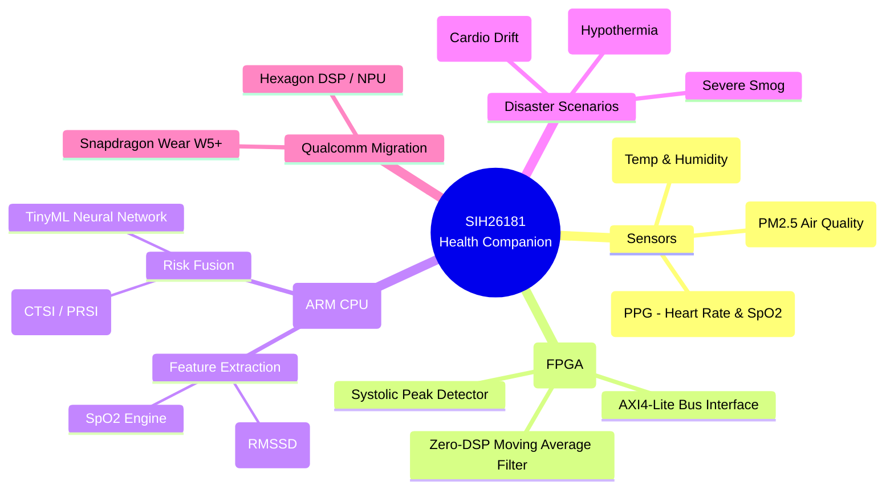
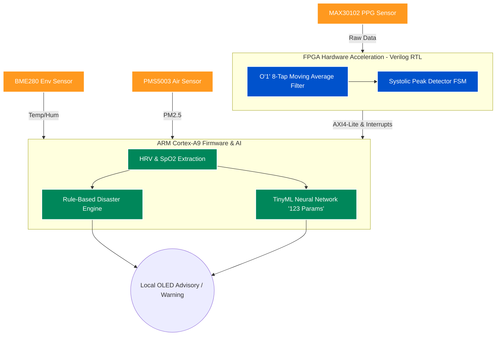

# System Architecture & Mindmap

This document provides a high-level visual overview of the **SIH26181 Health Companion** hardware and software architecture. These diagrams are generated using Mermaid.js and render directly in GitHub.

## 🧠 Project Mindmap
This mindmap illustrates the core features, technologies, and disaster scenarios covered by the project.

---

## 🔀 System Data Flow
This flowchart traces the path of physiological and environmental data from the physical sensors, through the custom FPGA RTL pipeline, into the ARM CPU for AI processing and risk assessment.

