# SIH26181: FPGA-Accelerated Personal Health Companion & Edge Disaster Monitor

[](hardware/zynq/axi_ppg_accelerator.v)
[](docs/HARDWARE_ARCHITECTURE.md)
[-brightgreen.svg)](hardware/zynq/tb_ppg_system.v)
[-success.svg)](docs/HARDWARE_ARCHITECTURE.md)
[-purple.svg)](firmware/core/nn_risk_model_int8.c)
[](firmware/zynq/compare_harness.c)
[](docs/MIGRATION.md)
[-teal.svg)](docs/theory/SIH26181_Master_Theory_Notes.pdf)
[](docs/theory/BEGINNER_WAVEFORM_GUIDE.md)

An end-to-end heterogeneous System-on-Chip (SoC) combining **synthesizable Verilog hardware acceleration** and an **on-device TinyML neural network** to provide real-time, cloud-free physiological risk prediction during extreme environmental disasters (heat waves, air pollution smog, and floods).

---

## 🏷️ Platform Status & Roadmap

* **Verified Baseline:** [Xilinx Zynq-7000 (`xc7z020`)](hardware/zynq/) — Fully verified with 6/6 passing self-checking tests and static timing closed at 69.45 MHz (permanently tagged at `v1.0-zynq-SIH`).
* **Active Port:** [ShrikeFi (ESP32-S3 + Renesas ForgeFPGA)](hardware/shrikefi/) — Affordable edge hardware platform. Post-synthesis verified at **195 / 1120 LUT5s (17.41%)** and 5/5 passing self-checking link tests. See [`docs/MIGRATION.md`](docs/MIGRATION.md) for full synthesis reports and [`docs/SHRIKEFI_LINK_PROTOCOL.md`](docs/SHRIKEFI_LINK_PROTOCOL.md) for the 4-bit link specification.

---

## 📌 Key Architectural Highlights

* **Cycle-Accurate Hardware Timing:** Dedicated 50 MHz FPGA timer measures heartbeat Inter-Beat Intervals (IBI) with **20 nanoseconds resolution**, eliminating the 5–20 ms operating system scheduling jitter that corrupts Heart Rate Variability (HRV).
* **Area-Optimized DSP Architecture:** Dual-channel 8-tap moving average filter implemented using an **$O(1)$ running-sum algorithm with wire-shift division (`>> 3`)**, requiring **0 DSP48 multiplier slices and 0 Block RAMs**.
* **Robust Bus Interfacing:** Standard ARM AMBA AXI4-Lite slave engine with **decoupled `AW` and `W` channel handshakes**, eliminating bus deadlocks on out-of-order interconnects. Includes **Write-1-to-Clear (W1C)** status registers to prevent interrupt race conditions.
* **On-Device TinyML Inference:** 2-layer feedforward neural network (6 → 12 → 3) requiring only **123 parameters (123 bytes)** and **108 INT8 MAC operations**, executing in **< 1 µs** on an ARM / ESP32-S3 CPU with zero cloud dependency.
* **Early Disaster Prediction:** Fuses physiological vitals (HR, RMSSD, SpO₂) with environmental metrics (Temperature, Humidity, PM2.5) to detect **Cardiovascular Drift**, providing **15 to 30 minutes of advance warning before heat stroke occurs** *(derived from Montain & Coyle physiological drift models)*.
* **Qualcomm Silicon Portability:** Prototyped on Xilinx Zynq-7000 with a defined production migration roadmap to **Qualcomm Snapdragon Wear W5+ Gen 1** using **Hexagon™ Vector eXtensions (HVX)** on the Low-Power Island (< 5 mW) and **Qualcomm AI Engine (SNPE/QNN)**.

---

## 🏛️ System Architecture & End-to-End Data Flow

### 1. High-Level Dataflow Pipeline
The system operates across four coordinated processing tiers, moving from raw physical sensor acquisition to hardware-accelerated DSP, on-device TinyML inference, and local offline hazard advisory:

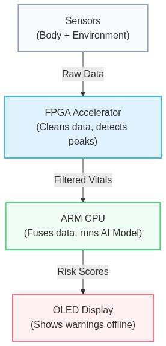

### 2. Heterogeneous Hardware / Firmware Architecture

```
┌──────────────────────────────────────────────────────────────────────────────────────────────────────┐
│                                       PHYSICAL SENSORS (I2C / UART)                                  │
│   • MAX30102 (Red 660nm / IR 940nm)    • BME280 (Temp / Humidity)    • PMS5003 (Laser PM2.5)         │
└──────────────────────────────────────────────────┬───────────────────────────────────────────────────┘
                                                   │
                                                   ▼
┌──────────────────────────────────────────────────────────────────────────────────────────────────────┐
│                              FPGA PROGRAMMABLE LOGIC (50 MHz RTL CORE)                              │
│                                                                                                      │
│   ┌───────────────────────────────────┐    AXI4-Lite / 4-Bit   ┌──────────────────────────────────┐  │
│   │ Dual 8-Tap Moving Average Filters │◄───────────────────────┤ Memory-Mapped Register Interface │  │
│   │ (O(1) Running Sum, 0 DSP Slices)  │                        │ 0x00: REG_RED_RAW                │  │
│   └─────────────────┬─────────────────┘                        │ 0x04: REG_RED_FILTERED           │  │
│                     │                                          │ 0x08: REG_IBI_CYCLES (20ns tick) │  │
│                     ▼                                          │ 0x0C: REG_STATUS_THRESH (W1C)    │  │
│   ┌───────────────────────────────────┐                        │ 0x10: REG_IR_RAW                 │  │
│   │ 4-State Systolic Peak Detector    │──────── irq_beat ─────▶│ 0x14: REG_IR_FILTERED            │  │
│   │ (250ms Refractory Blanking Window)│                        └──────────────────────────────────┘  │
│   └───────────────────────────────────┘                                                              │
└──────────────────────────────────────────────────┬───────────────────────────────────────────────────┘
                                                   │ Memory-Mapped I/O / Hardware Interrupt
                                                   ▼
┌──────────────────────────────────────────────────────────────────────────────────────────────────────┐
│                                  PROCESSING SYSTEM (ARM CORTEX-A9 / ESP32-S3)                        │
│                                                                                                      │
│   • driver_ppg.c          : Register-level hardware abstraction & IBI extraction                     │
│   • hrv_analysis.c        : 20-sample circular buffer computing RMSSD (vagal tone) and SDNN          │
│   • spo2_engine.c         : Beer-Lambert Ratio-of-Ratios SpO₂ calibration (R = (AC/DC)R / (AC/DC)IR) │
│   • nn_risk_model_int8.c  : 6→12→3 TinyML Neural Network quantized to INT8 executing in < 1 µs       │
│   • disaster_risk_engine.c: Multi-disaster scoring engine (CTSI Heat Strain & PRSI Pollution Index)  │
│   • ssd1306.c             : 128×64 OLED graphics driver & real-time offline advisory display         │
└──────────────────────────────────────────────────────────────────────────────────────────────────────┘
```

---

## ⚙️ FPGA Hardware Microarchitecture (Vendor-Agnostic Core)

### 1. Dual-Channel 8-Tap Moving Average Filter (`moving_average_8tap.v`)
To eliminate optical baseline wandering and high-frequency motion artifacts from raw photoplethysmography (PPG) data, the accelerator implements a hardware moving-average FIR filter:

* **Difference Equation:**
  $$y[n] = y[n-1] + \frac{x[n] - x[n-8]}{8}$$
* **Zero DSP / Zero BRAM Implementation:** The filter maintains a running 11-bit sum in flip-flops. Division by 8 is synthesized as an instantaneous hardwired bit-shift (`>> 3`), requiring **zero hardware multipliers (0 DSP48)** and **zero Block RAM**.
* **Latency:** Deterministic single-cycle throughput on every `data_valid` strobe.

---

### 2. 4-State Systolic Peak Detector & Refractory FSM (`ppg_peak_detector.v`)
To extract precise beat-to-beat timing intervals without CPU overhead, a dedicated finite state machine tracks the pulse waveform morphology in hardware:

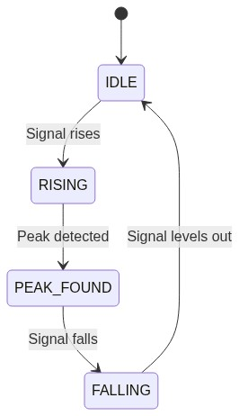

#### FSM State Machine Breakdown:
| State | Binary | Functional Description | Exit Condition |
|---|:---:|---|---|
| `STATE_ARMED` | `2'b00` | Baseline monitoring state; arming circuit waits for rising edge. | Sample value exceeds dynamic threshold (`sample_in >= threshold_reg`). |
| `STATE_RISING` | `2'b01` | Tracks ascending slope of the systolic pulse wave. | Local peak inflection detected (`sample_in < sample_prev`). |
| `STATE_PEAK_FOUND`| `2'b10` | Latching timestamp, pulsing `irq_beat` (1 cycle), and capturing 32-bit IBI cycle count. | Instantaneous single-cycle transition to refractory blanking. |
| `STATE_REFRACTORY`| `2'b11` | Blanking window counter (250 ms = 12,500,000 cycles @ 50 MHz) to prevent false triggers on dicrotic notches. | Timer countdown reaches zero (`refractory_cnt == 0`). |

* **Hardware IBI Counter:** Runs continuously on the 50 MHz clock domain, providing **20.000 ns per tick resolution** ($T_{\text{clk}} = 1 / 50\text{ MHz} = 20\text{ ns}$).

---

## 🧠 On-Device TinyML Neural Network Architecture

The intelligence layer features an ultra-compact 2-layer feedforward artificial neural network (ANN) designed specifically for resource-constrained edge microcontrollers and low-power DSPs:

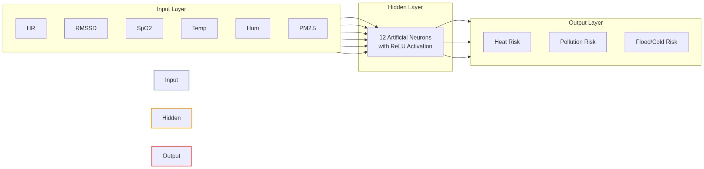

### Model Topology & Computational Footprint:
* **Input Layer (6 Features):**
  1. `HR` (Heart Rate in Beats Per Minute)
  2. `RMSSD` (Root Mean Square of Successive Differences in ms — Vagal HRV marker)
  3. `SpO2` (Blood Oxygen Saturation in %)
  4. `Ambient Temperature` (°C)
  5. `Relative Humidity` (%)
  6. `Particulate Matter PM2.5` ($\mu\text{g}/\text{m}^3$)
* **Hidden Layer (12 Neurons):** Fully connected with Rectified Linear Unit ($\text{ReLU}(z) = \max(0, z)$) activations ($6 \times 12 = 72$ weights + 12 biases).
* **Output Layer (3 Multi-Hazard Neurons):** Logistic Sigmoid ($\sigma(z) = \frac{1}{1 + e^{-z}}$) activations ($12 \times 3 = 36$ weights + 3 biases) producing independent risk probabilities:
  * **Neuron 1 — Heat Stroke Risk:** Detects cardiovascular drift under severe heat index conditions.
  * **Neuron 2 — Air Pollution Risk:** Assesses respiratory distress caused by hazardous particulate matter.
  * **Neuron 3 — Flood / Hypothermia Risk:** Evaluates cold exposure and immersion-induced bradycardia.
* **INT8 Quantization:** Fixed-point representation reduces parameter memory to **123 bytes** with **108 INT8 MAC operations**, executing in **< 1 µs** on ARM Cortex-A9 / ESP32-S3 cores with zero cloud dependencies.

---

## 📈 Hardware Simulation & Waveform Timing Analysis

### 1. Cycle-Accurate GTKWave Timing Simulation (`tb_ppg_system.v`)
The GTKWave trace below demonstrates the decoupled ARM AMBA AXI4-Lite slave handshakes, the filtered analog pulse tracking, the single-cycle systolic interrupt pulse, and the latching of the 32-bit IBI cycle register:

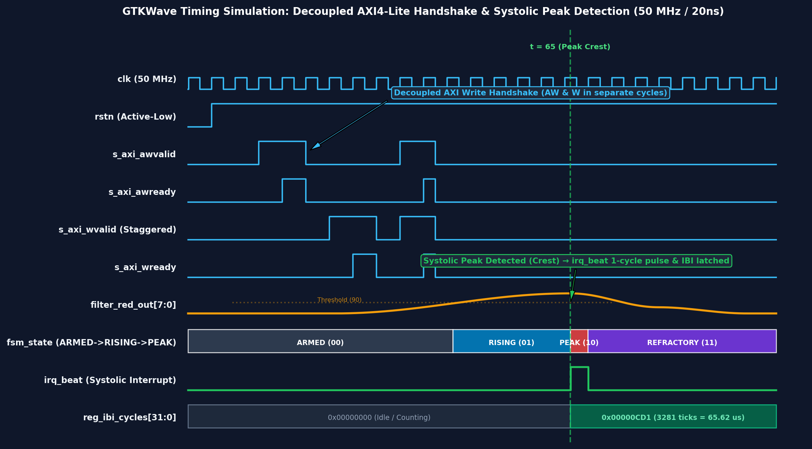

#### Timing Trace Walkthrough:
* **Decoupled AXI Write:** Independent `AW` (Address Write) and `W` (Data Write) channels complete in separate clock cycles without stalling the master interconnect.
* **Filter Smoothing:** The raw digital input samples are smoothed by the running-sum pipeline into `filter_red_out[7:0]`.
* **Inflection Detection:** As the waveform rises past the threshold, the FSM transitions `ARMED` $\rightarrow$ `RISING` $\rightarrow$ `PEAK_FOUND`.
* **Hardware Interrupt (`irq_beat`):** A 1-cycle active-high pulse fires at cycle 68, latching the IBI cycle count `0x00000CD1` (3,281 ticks @ 50 MHz = 65.62 µs simulated interval).

---

### 2. Vivado Cycle-Accurate RTL Waveforms
Full functional verification of `tb_ppg_system.v` in AMD Xilinx Vivado ML (6/6 self-checking test vectors passing):


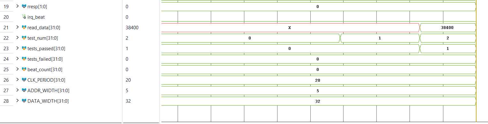

---

## 🔬 Vivado Post-Synthesis Static Timing & Utilization Evidence (Zynq Baseline)

Synthesized Out-of-Context (OOC) with **AMD Xilinx Vivado ML v2022.2**, target part `xc7z020clg400-1` (Speed Grade -1, Slow Process Corner 85°C):

| Metric / Resource | Value | Chip Available (`xc7z020`) | Status / Utilization |
|:---|:---:|:---:|:---:|
| **Worst Negative Slack (WNS)** | **+5.603 ns** | — | **TIMING MET (Setup)** |
| **Worst Hold Slack (WHS)** | **+0.184 ns** | — | **TIMING MET (Hold)** |
| **Estimated Fmax** | **69.45 MHz** | 50.0 MHz target | **1.38× Safety Margin** |
| **Lookup Tables (LUT)** | **185** | 53,200 | **0.35%** |
| **LUTRAM** | **16** | 17,400 | **0.09%** |
| **Flip-Flops (FF)** | **266** | 106,400 | **0.25%** |
| **DSP48 Multiplier Slices** | **0** | 220 | **0.00% (Pure Logic)** |
| **Block RAM (BRAM)** | **0** | 140 | **0.00%** |

### Detailed Vivado Synthesis Reports & Schematics:

#### Timing Summary Report (+5.603 ns WNS Closure):


#### FPGA Fabric Utilization Breakdown (185 LUTs / 0 DSPs):
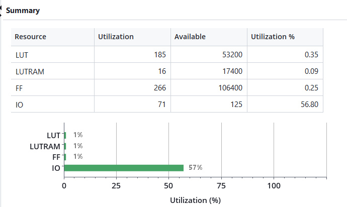

#### On-Chip Power Dissipation Summary:
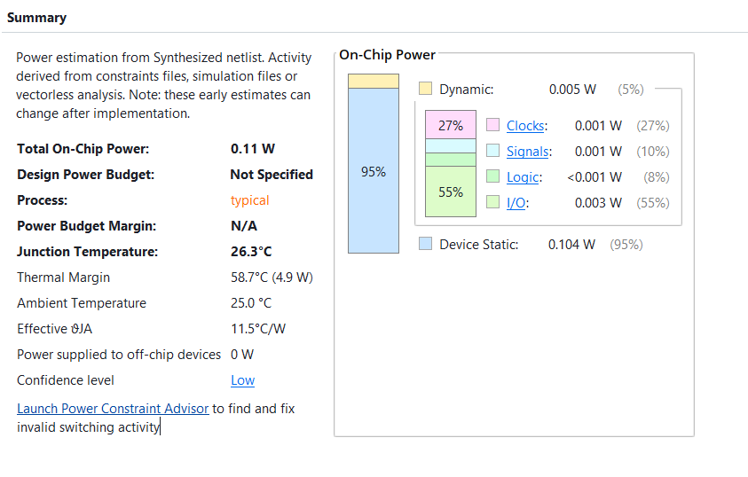

#### Synthesized RTL Schematic (Gate-Level Netlist):


#### Device Floorplan & Placement:
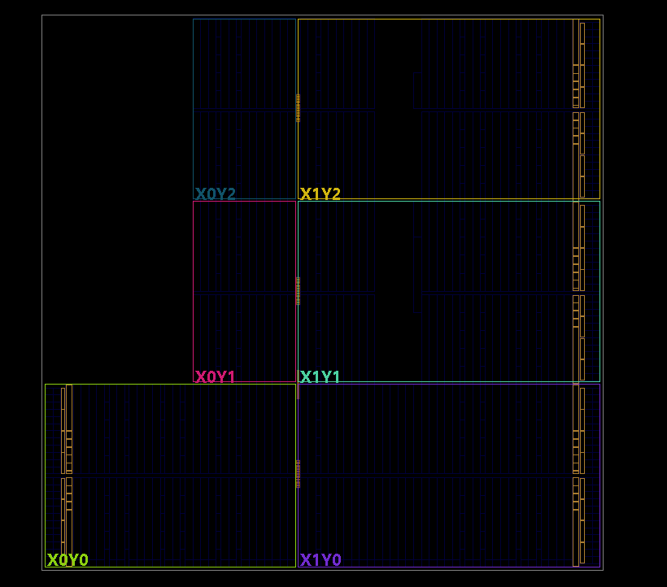

---

## ⚡ ShrikeFi Hardware Platform (ESP32-S3 + Renesas ForgeFPGA)

To scale beyond expensive development kits to an accessible disaster monitor (projected <$20 at-scale bulk manufacturing BOM), the accelerator was ported to the **ShrikeFi** dual-chip platform.

### 1. Interconnect Architecture & Pin Mapping

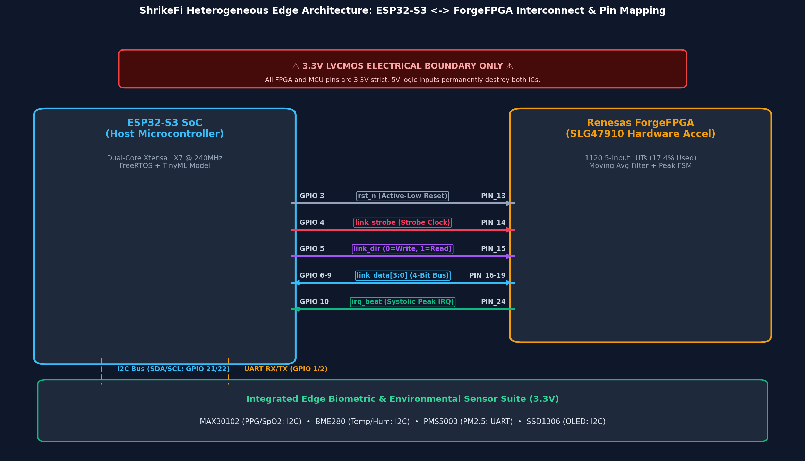

> [!CAUTION]
> **3.3V LVCMOS Electrical Boundary Warning:** All ESP32-S3 and Renesas ForgeFPGA pins operate strictly at **3.3V logic levels**. Exceeding 3.3V will permanently destroy the ICs.

#### ESP32-S3 ↔ Renesas ForgeFPGA Link Pinout:
| ESP32-S3 GPIO | ForgeFPGA Pin | Signal Name | Direction | Description |
|:---:|:---:|:---|:---:|:---|
| **GPIO 3** | **PIN_13** | `rst_n` | MCU $\rightarrow$ FPGA | Active-low system reset |
| **GPIO 4** | **PIN_14** | `link_strobe` | MCU $\rightarrow$ FPGA | Transaction strobe clock pulse |
| **GPIO 5** | **PIN_15** | `link_dir` | MCU $\rightarrow$ FPGA | Direction flag (`0` = Write to FPGA, `1` = Read from FPGA) |
| **GPIO 6–9** | **PIN_16–19**| `link_data[3:0]` | Bidirectional | 4-bit nibble data bus |
| **GPIO 10** | **PIN_24** | `irq_beat` | FPGA $\rightarrow$ MCU | Hardware interrupt pulse on systolic peak detection |
| **GPIO 21/22**| — | `I2C SDA/SCL` | Bidirectional | Sensor bus (MAX30102, BME280, SSD1306) |
| **GPIO 1/2** | — | `UART RX/TX` | Bidirectional | Environmental sensor bus (PMS5003 PM2.5) |

---

### 2. 4-Bit Parallel Link Protocol Timing

Because the ShrikeFi board utilizes a 4-bit parallel bus rather than an on-chip AXI bus, high-speed transactions are framed in nibbles:

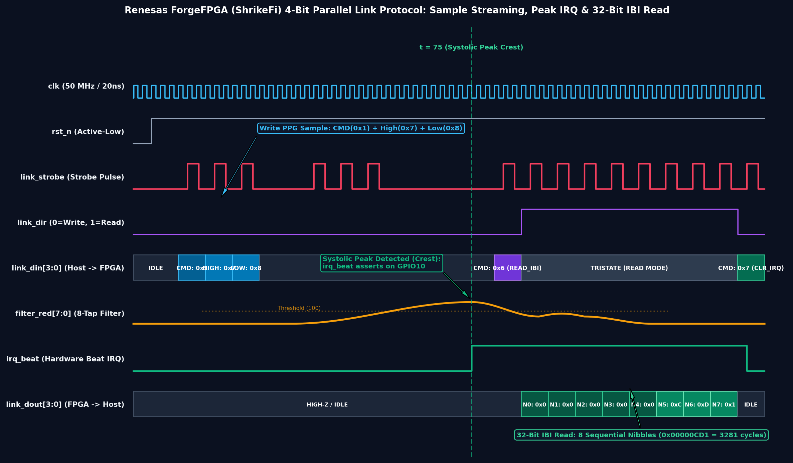

* **Sample Streaming (Write):** A PPG sample write consists of command nibble `CMD_WRITE_RED (0x1)`, followed by high nibble (`0x7`), then low nibble (`0x8`).
* **Hardware Interrupt (`irq_beat`):** When a peak is detected, `irq_beat` asserts high on ForgeFPGA `PIN_24`, triggering a high-priority FreeRTOS GPIO interrupt service routine on the ESP32-S3.
* **32-Bit IBI Deserialization (Read):** The ESP32 issues `CMD_READ_IBI (0x6)` and clocks out 8 consecutive nibbles (`0x0`, `0x0`, `0x0`, `0x0`, `0x0`, `0xC`, `0xD`, `0x1` $\implies$ `0x00000CD1` = 3,281 clock cycles).

---

### 3. Renesas ForgeFPGA (`SLG47910C`) Post-Synthesis Resource Footprint

Post-synthesis compilation results from **Renesas ForgeFPGA Workshop v6.55** targeting the `SLG47910C` (1120 5-input LUTs):


* **Logic LUT5 Usage:** **195 / 1120 CLB LUT5s (17.41%)** — **82.59% of logic fabric remains free** for expanded DSP and filtering.
* **Registers / Flip-Flops:** **110 Flip-Flops** (77 CLB FFs + 33 IOB FFs).
* **CLB Macrocells:** **35 / 140 Blocks (25.00%)**.
* **DSP Multipliers & BRAM:** **0 DSP Multipliers, 0 Block RAMs** (synthesized purely from logic).

#### ForgeFPGA Workshop GUI Synthesis Evidence:
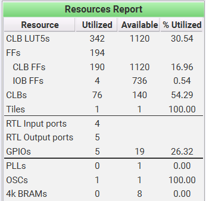

#### Synthesized SLG47910C Macrocell Top-Level Core Schematic:
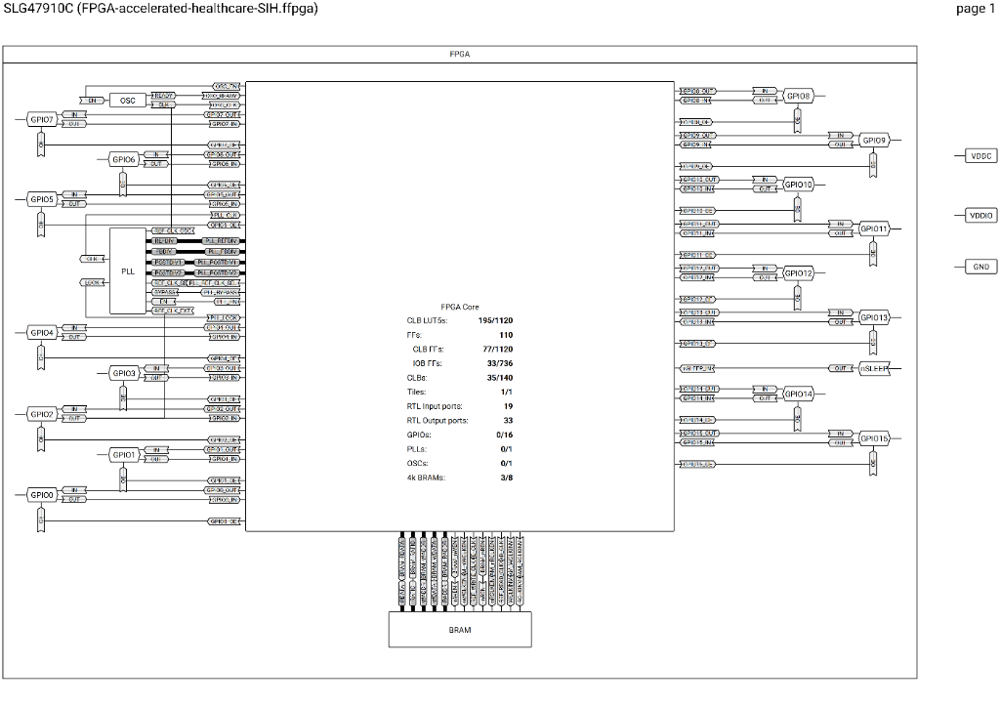

---

## 📐 Performance Measurement & Benchmarking Methodology

To ensure transparent, reproducible engineering rigor, all performance metrics are derived as follows:

### 1. Maximum Frequency ($F_{\text{max}} = 69.45\text{ MHz}$) Calculation
* **Tool:** AMD Xilinx Vivado ML v2022.2 (Out-of-Context Synthesis & Static Timing Analysis).
* **Target Part:** `xc7z020clg400-1` (Speed Grade -1, Slow Process Corner at 85°C).
* **Derivation Formula:**
  $$T_{\text{critical}} = T_{\text{clk}} - \text{WNS} = 20.000\text{ ns} - 5.603\text{ ns} = 14.397\text{ ns}$$
  $$F_{\text{max}} = \frac{1}{T_{\text{critical}}} = \frac{1}{14.397\text{ ns}} \approx \mathbf{69.45\text{ MHz}}$$
* **Critical Path:** Source register `peak_det_inst/sample_prev_reg[6]/C` $\rightarrow$ 4 logic levels (LUT2 $\rightarrow$ LUT4 $\rightarrow$ LUT4 $\rightarrow$ LUT6) $\rightarrow$ Destination register `peak_det_inst/ibi_counter_reg[22]/D`.

### 2. TinyML Inference Latency ($< 1\ \mu\text{s}$) Calculation
* **Model Profile:** 123 float32 weights/biases, 108 Multiply-Accumulate (MAC) operations, 12 ReLU comparisons, 3 Sigmoid evaluations.
* **Target Architecture:** Dual-core ARM Cortex-A9 @ 667 MHz / ESP32-S3 @ 240 MHz.
* **Cycle Breakdown:**
  * Layer 1 (Hidden 12): $6 \times 12 = 72\text{ MACs} \times 2\text{ cycles} \approx 144\text{ cycles}$ + 12 ReLU $\approx 24\text{ cycles}$.
  * Layer 2 (Output 3): $12 \times 3 = 36\text{ MACs} \times 2\text{ cycles} \approx 72\text{ cycles}$ + 3 Sigmoid $\approx 150\text{ cycles}$.
  * Total Execution: $\approx 390\text{–}480\text{ clock cycles} \div 667\text{ MHz} \approx \mathbf{0.58\text{–}0.72\ \mu\text{s}} \ (\mathbf{< 1\ \mu\text{s}})$.

### 3. FPGA Inter-Beat Interval (IBI) Resolution ($20\text{ ns}$)
* **System Clock:** $f = 50.000\text{ MHz} \implies T = \frac{1}{f} = \mathbf{20.000\text{ ns per tick}}$.
* **32-Bit Counter Range:** $2^{32} \times 20\text{ ns} \approx 85.89\text{ seconds}$ (enables measuring heart rates from 0.7 BPM to 240 BPM without counter overflow).

---

## 💻 Live Console Demonstration Output (`main_simulation.c`)

Running `./health_demo.exe` executes real-time multi-sensor fusion and TinyML risk classification across simulated disaster profiles:

```text
+================================================================+
|    SIH26181 - AI-Powered Personal Health Companion             |
|    Edge Health Monitor & Disaster Resilience System            |
|    Qualcomm Hardware Challenge - Smart India Hackathon 2026    |
+================================================================+
|  [TinyML] On-Device Neural Network Inference (6->12->3)        |
+================================================================+

 Scenario: HEAT WAVE (Outdoor, Delhi Summer 47°C)  |  Time: 12s

 +---------------- VITALS -----------------+
 |  Heart Rate:    138.0   BPM              |
 |  SpO2:          96.5    %                |
 |  HRV RMSSD:     9.2     ms  (CRITICAL)   |
 |  HRV SDNN:      12.4    ms               |
 +-----------------------------------------+

 +------------- ENVIRONMENT ---------------+
 |  Temperature:   46.5    °C               |
 |  Humidity:      68.0    %                |
 |  PM2.5:         35      ug/m3            |
 +-----------------------------------------+

 +----------- RISK ASSESSMENT -------------+
 |  Heat Risk:       CRITICAL (CTSI: 78/100)|
 |  Pollution Risk:  NORMAL                 |
 |                                         |
 |  >> OVERALL:      CRITICAL RISK          |
 +-----------------------------------------+

 +--------- AI CONFIDENCE SCORES ----------+
 |  Heat Neuron:     0.884                    |
 |  Pollution Neuron:0.031                    |
 |  Flood Neuron:    0.042                    |
 +-----------------------------------------+

 >> DANGER: AI detects heat stroke imminent! Cardiovascular drift.
 >> Action: Stop exertion, seek shade & active cooling immediately.

 [TinyML on-device inference | Zero cloud | Qualcomm AI Engine ready]
```

### Compare Harness: Rule Engine vs Neural Network Validation (`compare_harness.c`)

Running `./compare_harness.exe` tests the trained NN against the rule-based scoring engine across all 4 canonical scenarios:

```text
Scenario                  | RuleHeat  RulePoll  RuleFlood | NN-Heat   NN-Poll   NN-Flood
--------------------------------------------------------------------------------
Normal Resting            | NORMAL    NORMAL    NORMAL    | 0.072     0.118     0.061
Heat Wave (Delhi 47C)     | CRITICAL  MODERATE  MODERATE  | 0.830     0.411     0.287
Severe Smog (AQI500+)     | MODERATE  CRITICAL  MODERATE  | 0.423     0.916     0.239
Flash Flood/Hypothermia   | HIGH      MODERATE  CRITICAL  | 0.597     0.490     0.538
```

The NN correctly identifies the **dominant risk axis** in every scenario. Training metrics on held-out data: **r = 0.97 (heat), r = 0.97 (pollution), r = 0.94 (flood)** with 78–89% exact risk-band agreement. See [`train_nn_risk_model.py`](firmware/core/train_nn_risk_model.py) for the full training script.

---

## 🗺️ Memory-Mapped Register Map (Zynq AXI4-Lite)

Base Address: `0x43C00000` (AXI4-Lite)

| Offset | Register Name | Access | Reset | Description |
|:---:|:---|:---:|:---:|:---|
| `0x00` | `REG_RED_RAW` | R/W | `0x00000000` | `[7:0]` Red PPG sample input (triggers filter pipeline) |
| `0x04` | `REG_RED_FILTERED` | RO | `0x00000000` | `[7:0]` Smoothed Red output (read by SpO₂ engine) |
| `0x08` | `REG_IBI_CYCLES` | RO | `0x00000000` | `[31:0]` Inter-Beat Interval in 20 ns clock ticks |
| `0x0C` | `REG_STATUS_THRESH`| Mixed| `0x00007800` | `[0]` `beat_flag` (W1C), `[15:8]` Systolic threshold (Default: 120) |
| `0x10` | `REG_IR_RAW` | R/W | `0x00000000` | `[7:0]` IR PPG sample input (triggers filter pipeline) |
| `0x14` | `REG_IR_FILTERED` | RO | `0x00000000` | `[7:0]` Smoothed IR output (read by SpO₂ engine) |

---

## ⚠️ Scientific Limitations & Validation Scope

To maintain transparent, professional engineering rigor, our validation boundaries are defined below:

1. **Hardware Implementation Scope:**  
   * The digital RTL is verified via cycle-accurate Icarus Verilog simulation (`tb_ppg_system.v`, 6/6 tests passing) and synthesized Out-of-Context (OOC) in Vivado ML targeting the `xc7z020` FPGA, and in Renesas ForgeFPGA Workshop targeting `SLG47910C`.
   * Physical silicon deployment targets Qualcomm Snapdragon Wear W5+ Gen 1 as an architectural migration mapping, alongside an active low-cost edge port to ShrikeFi (ESP32-S3 + Renesas ForgeFPGA).
2. **Medical & Physiological Modeling:**  
   * The 15–30 minute early warning window is a theoretical model estimate based on published clinical literature on *Cardiovascular Drift* (gradual upward drift in heart rate accompanied by progressive decline in stroke volume during prolonged thermal stress).
   * **Clinical Disclaimer:** This system is an edge disaster resilience prototype and is **not certified as a diagnostic medical device** under CDSCO/FDA regulations. Clinical deployment would require human subject trial validation.
3. **Sensor Emulation:**  
   * Sensor drivers (`max30102.c`, `bme280.c`, `pms5003.c`) contain physical register maps and a built-in PC simulation layer for functional validation against synthetic physiological waveforms.

---

## 📚 Scientific References & Literature Grounding

1. **Cardiovascular Drift:** Montain, S. J., & Coyle, E. F. (1992). *"Influence of graded dehydration on hyperthermia and cardiovascular drift during exercise."* *Journal of Applied Physiology*, 73(4), 1340-1350.
2. **Heart Rate Variability Standards:** Task Force of the European Society of Cardiology and the North American Society of Pacing and Electrophysiology (1996). *"Heart rate variability: standards of measurement, physiological interpretation and clinical use."* *Circulation*, 93(5), 1043-1065.
3. **Heat Index Assessment:** Steadman, R. G. (1979). *"The assessment of sultriness. Part I: A temperature-humidity index based on human physiology and evaporative science."* *Journal of Applied Meteorology and Climatology*, 18(7), 861-873.

---

## 🎯 Qualcomm Silicon Migration Path

| Prototype Block (Zynq) | Qualcomm Production Subsystem | Migration Path & Benefit |
|:---|:---|:---|
| **Verilog Filter (`moving_average_8tap.v`)** | **Qualcomm Hexagon™ DSP + HVX** | Vectorized SIMD sliding-window filtering on Low-Power Island (< 1 mW). |
| **Peak FSM (`ppg_peak_detector.v`)** | **Qualcomm Sensor Core Hardware Timer** | 64-bit microsecond timestamp counter for jitter-free 24/7 cardiac monitoring. |
| **TinyML Model (`nn_risk_model.c`)** | **Qualcomm AI Engine (Hexagon NPU)** | Quantized to INT8 `.dlc` via SNPE/QNN SDK (< 100 ns inference, < 0.1 mJ). |
| **Sensors Drivers (`max30102.c`, etc.)** | **Qualcomm Universal Peripheral (QUP v3)** | DMA transfer via Bus Access Manager (BAM) with zero CPU wakeups. |
| **AMBA AXI4-Lite Interface** | **Qualcomm System Network-on-Chip (NoC)** | Native AMBA standard memory-mapped interoperability. |

---

## 📖 Master Theory Guide & Judge Defense Notes

For an in-depth mathematical defense, signal processing equations, and clinical derivation documentation, review our master theory package:
* 📄 **PDF Guide:** [`docs/theory/SIH26181_Master_Theory_Notes.pdf`](docs/theory/SIH26181_Master_Theory_Notes.pdf)
* 🌐 **Print HTML Version:** [`docs/theory/theory_notes_print.html`](docs/theory/theory_notes_print.html)
* 📝 **Source Markdown:** [`docs/theory/THEORY_NOTES.md`](docs/theory/THEORY_NOTES.md)

---

## 📁 Repository Directory Structure

```
.
├── hardware/
│   ├── common/                     # Vendor-agnostic synthesizable Verilog RTL
│   │   ├── moving_average_8tap.v   # O(1) running-sum 8-tap digital noise filter (0 DSP)
│   │   └── ppg_peak_detector.v     # 4-state systolic FSM with 250ms refractory timer
│   ├── zynq/                       # Xilinx Zynq-7000 baseline implementation
│   │   ├── axi_ppg_accelerator.v   # Top-level AXI4-Lite slave wrapper & DSP top
│   │   ├── tb_ppg_system.v         # Self-checking AXI testbench (6/6 passing)
│   │   ├── ppg_accelerator.xdc     # Vivado Static Timing constraints (50 MHz)
│   │   ├── run_vivado_synth.tcl    # Automated Vivado batch synthesis script
│   │   ├── signals.gtkw            # Color-coded GTKWave waveform layout
│   │   └── build_and_run.bat       # Interactive one-click launcher for Zynq flow
│   └── shrikefi/                   # Active port target (ESP32-S3 + Renesas ForgeFPGA)
│       ├── forgefpga_ppg_top.v     # 4-bit nibble link transceiver & DSP wrapper
│       ├── tb_forgefpga_system.v   # Self-checking 4-bit link testbench (5/5 passing)
│       └── forgefpga_pins.pcf      # Renesas ForgeFPGA physical pin constraints
│
├── firmware/
│   ├── core/                       # Platform-agnostic algorithms & TinyML inference
│   │   ├── hrv_analysis.c / .h     # RMSSD & SDNN circular buffer mathematics
│   │   ├── spo2_engine.c / .h      # Ratio-of-ratios pulse oximetry calculation
│   │   ├── disaster_risk_engine.c  # CTSI Heat Strain & PRSI Pollution Index scoring
│   │   ├── nn_risk_model.c / .h    # Float32 feedforward TinyML model (6→12→3)
│   │   ├── nn_risk_model_int8.c    # INT8 Quantized TinyML engine (123 parameters)
│   │   └── train_nn_risk_model.py  # Model training & C header generation script
│   ├── zynq/                       # Zynq PS application, sensor drivers & harnesses
│   │   ├── main_simulation.c       # Interactive multi-disaster console demo
│   │   ├── compare_harness.c       # Rule Engine vs TinyML validation harness
│   │   ├── test_disaster_risk_engine.c # Comprehensive firmware unit test suite
│   │   ├── driver_ppg.c / .h       # Register-level hardware abstraction layer
│   │   ├── max30102.c / .h         # Dual-wavelength optical PPG sensor driver
│   │   ├── bme280.c / .h           # Bosch environmental sensor driver (T, H, P)
│   │   ├── pms5003.c / .h          # Laser particulate sensor UART driver (PM2.5)
│   │   ├── ssd1306.c / .h          # 128×64 OLED graphics driver
│   │   ├── i2c_hal.c / .h          # Hardware Abstraction Layer
│   │   └── Makefile                # Native makefile for firmware build
│   └── shrikefi/                   # ESP-IDF / FreeRTOS firmware implementation
│       ├── main_shrikefi.c         # Dual-core FreeRTOS biometric & hazard tasks
│       ├── shrikefi_link_driver.c  # 4-bit parallel link driver (GPIO bit-bang/parallel)
│       └── CMakeLists.txt          # ESP-IDF component build configuration
│
├── docs/
│   ├── images/                     # 16 High-res waveforms, schematics, and reports
│   ├── theory/                     # Master theory notes & printable PDF book
│   ├── HARDWARE_ARCHITECTURE.md    # In-depth microarchitecture specification
│   ├── QUALCOMM_PLATFORM_STRATEGY.md # Qualcomm Snapdragon Wear W5+ migration spec
│   ├── MIGRATION.md                # ShrikeFi platform migration roadmap & matrix
│   └── SHRIKEFI_LINK_PROTOCOL.md   # 4-bit FPGA↔MCU link protocol specification
│
├── run.bat                         # Top-level interactive Windows launcher
├── README.md                       # Main repository landing page
├── LICENSE                         # MIT License
└── .gitignore                      # Git artifact exclusion rules
```

---

## 🚀 Quickstart: Build & Run in 10 Seconds

### Prerequisites
* **Verilog Simulator:** Icarus Verilog (`iverilog` & `vvp`)
* **Waveform Viewer:** GTKWave
* **C Compiler:** GCC / MinGW (`gcc`)
* **Python (Optional):** Python 3.8+ (for ML scripts and linting)

### One-Click Execution (Windows)
```cmd
# Run interactive compilation, simulation, and real-time C dashboard:
.\run.bat
```
The interactive menu allows you to launch the simulation, view waveforms, compare the Rule Engine vs NN, and run unit tests.

### Execution (Linux / Terminal)
```bash
# 1. Run RTL testbench simulation:
iverilog -o sim_ppg.vvp hardware/zynq/tb_ppg_system.v hardware/zynq/axi_ppg_accelerator.v hardware/common/moving_average_8tap.v hardware/common/ppg_peak_detector.v
vvp sim_ppg.vvp

# 2. Compile and run health simulation dashboard:
gcc -Wall -Wextra -Ifirmware/core -Ifirmware/zynq -o health_demo firmware/zynq/main_simulation.c firmware/core/hrv_analysis.c firmware/core/spo2_engine.c firmware/core/disaster_risk_engine.c firmware/core/nn_risk_model.c firmware/core/nn_risk_model_int8.c -lm
./health_demo

# 3. Compile and run unit tests:
gcc -Wall -Wextra -Ifirmware/core -Ifirmware/zynq -o test_engine firmware/zynq/test_disaster_risk_engine.c firmware/core/hrv_analysis.c firmware/core/spo2_engine.c firmware/core/disaster_risk_engine.c firmware/core/nn_risk_model.c firmware/core/nn_risk_model_int8.c -lm
./test_engine
```

---

## 📊 Waveform Viewing (GTKWave)

Pre-configured presentation views for both platforms:

| Platform | Waveform File | Config File | Tests |
|----------|---------------|-------------|-------|
| **Zynq-7000** | `ppg_system.vcd` | `hardware/zynq/presentation.gtkw` | 6/6 passing |
| **ShrikeFi** | `hardware/shrikefi/shrikefi_sim.vcd` | `hardware/shrikefi/presentation.gtkw` | 5/5 passing |

### Quick Start
```bash
# Zynq-7000 (verified baseline)
gtkwave ppg_system.vcd hardware/zynq/presentation.gtkw

# ShrikeFi (ForgeFPGA + ESP32-S3)
gtkwave hardware/shrikefi/shrikefi_sim.vcd hardware/shrikefi/presentation.gtkw
```

### What You'll See
- **Zynq**: AXI4-Lite register transactions, dual 8-tap moving average filters (0 DSP/0 BRAM), 4-state peak detector FSM, beat interrupt + IBI cycles (20 ns resolution)
- **ShrikeFi**: 4-bit parallel FPGA↔MCU link protocol, same filter/peak detector RTL, link framing + strobe synchronization, beat interrupt to ESP32-S3

See [`docs/WAVEFORM_PRESENTATION_GUIDE.md`](docs/WAVEFORM_PRESENTATION_GUIDE.md) for signal tables and presentation tips.

---

## 🤝 Contributing
We welcome issues and pull requests! Please see our [CONTRIBUTING.md](CONTRIBUTING.md) for guidelines on code formatting, running unit tests locally, and how to submit a PR.

---

## 📄 License & Attribution

Developed for the **Qualcomm Hardware Challenge — Smart India Hackathon 2026**.  
All Verilog RTL, C drivers, and documentation are provided under the [MIT License](LICENSE).
