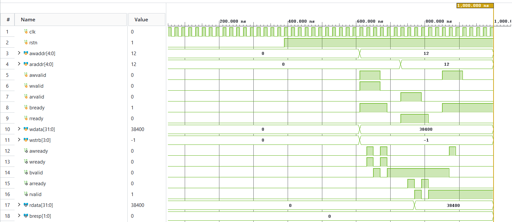
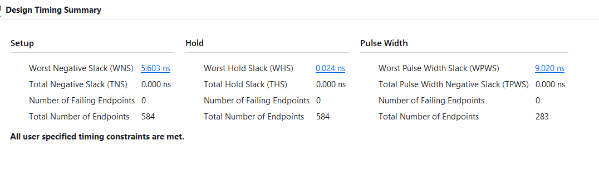
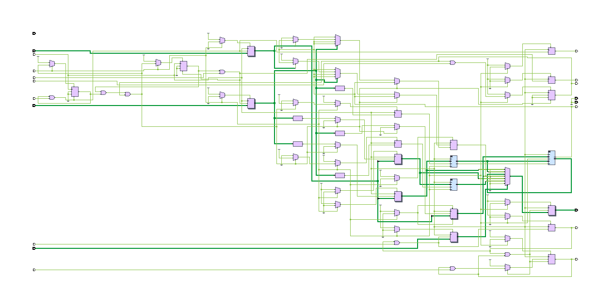

# SIH26181: FPGA-Accelerated Personal Health Companion & Edge Disaster Monitor

[](SIH/axi_ppg_accelerator.v)
[](SIH/HARDWARE_ARCHITECTURE.md)
[-brightgreen.svg)](SIH/tb_ppg_system.v)
[-success.svg)](SIH/HARDWARE_ARCHITECTURE.md)
[-purple.svg)](SIH/nn_risk_model_int8.c)
[](SIH/compare_harness.c)
[](SIH/QUALCOMM_PLATFORM_STRATEGY.md)

An end-to-end heterogeneous System-on-Chip (SoC) combining **synthesizable Verilog hardware acceleration** and an **on-device TinyML neural network** to provide real-time, cloud-free physiological risk prediction during extreme environmental disasters (heat waves, air pollution smog, and floods).

---

## 📌 Key Architectural Highlights

* **Cycle-Accurate Hardware Timing:** Dedicated 50 MHz FPGA timer measures heartbeat Inter-Beat Intervals (IBI) with **20 nanoseconds resolution**, eliminating the 5–20 ms operating system scheduling jitter that corrupts Heart Rate Variability (HRV).
* **Area-Optimized DSP Architecture:** Dual-channel 8-tap moving average filter implemented using an **O(1) running-sum algorithm with wire-shift division (`>> 3`)**, requiring **0 DSP48 multiplier slices and 0 Block RAMs**.
* **Robust Bus Interfacing:** Standard ARM AMBA AXI4-Lite slave engine with **decoupled `AW` and `W` channel handshakes**, eliminating bus deadlocks on out-of-order interconnects. Includes **Write-1-to-Clear (W1C)** status registers to prevent interrupt race conditions.
* **On-Device TinyML Inference:** 2-layer feedforward neural network (6 → 12 → 3) requiring only **123 parameters (123 bytes)** and **108 INT8 MAC operations**, executing in **< 1 µs** on an ARM CPU with zero cloud dependency.
* **Early Disaster Prediction:** Fuses physiological vitals (HR, RMSSD, SpO₂) with environmental metrics (Temperature, Humidity, PM2.5) to detect **Cardiovascular Drift**, providing **15 to 30 minutes of advance warning before heat stroke occurs** *(derived from Montain & Coyle physiological drift models)*.
* **Qualcomm Silicon Portability:** Prototyped on Xilinx Zynq-7000 with a defined production migration roadmap to **Qualcomm Snapdragon Wear W5+ Gen 1** using **Hexagon™ Vector eXtensions (HVX)** on the Low-Power Island (< 5 mW) and **Qualcomm AI Engine (SNPE/QNN)**.

---

## 🏛️ System Architecture & Data Flow

```
┌──────────────────────────────────────────────────────────────────────────────────────────────────────┐
│                                       PHYSICAL SENSORS (I2C / UART)                                  │
│   • MAX30102 (Red 660nm / IR 940nm)    • BME280 (Temp / Humidity)    • PMS5003 (Laser PM2.5)         │
└──────────────────────────────────────────────────┬───────────────────────────────────────────────────┘
                                                   │
                                                   ▼
┌──────────────────────────────────────────────────────────────────────────────────────────────────────┐
│                              FPGA PROGRAMMABLE LOGIC (50 MHz RTL CORE)                              │
│                                                                                                      │
│   ┌───────────────────────────────────┐    AXI4-Lite Slave     ┌──────────────────────────────────┐  │
│   │ Dual 8-Tap Moving Average Filters │◄───────────────────────┤ Memory-Mapped Register Interface │  │
│   │ (O(1) Running Sum, 0 DSP Slices)  │                        │ 0x00: REG_RED_RAW                │  │
│   └─────────────────┬─────────────────┘                        │ 0x04: REG_RED_FILTERED           │  │
│                     │                                          │ 0x08: REG_IBI_CYCLES (20ns tick) │  │
│                     ▼                                          │ 0x0C: REG_STATUS_THRESH (W1C)    │  │
│   ┌───────────────────────────────────┐                        │ 0x10: REG_IR_RAW                 │  │
│   │ 4-State Systolic Peak Detector    │──────── irq_beat ─────▶│ 0x14: REG_IR_FILTERED            │  │
│   │ (250ms Refractory Blanking Window)│                        └──────────────────────────────────┘  │
│   └───────────────────────────────────┘                                                              │
└──────────────────────────────────────────────────┬───────────────────────────────────────────────────┘
                                                   │ Memory-Mapped I/O & Interrupt
                                                   ▼
┌──────────────────────────────────────────────────────────────────────────────────────────────────────┐
│                                  PROCESSING SYSTEM (ARM CORTEX-A9 CPU)                               │
│                                                                                                      │
│   • driver_ppg.c          : Register-level hardware abstraction & IBI extraction                     │
│   • hrv_analysis.c        : 20-sample circular buffer computing RMSSD (vagal tone) and SDNN          │
│   • spo2_engine.c         : Beer-Lambert Ratio-of-Ratios SpO₂ calibration (R = (AC/DC)R / (AC/DC)IR) │
│   • nn_risk_model_int8.c  : 6→12→3 TinyML Neural Network quantized to INT8 executing in < 1 µs       │
│   • disaster_risk_engine.c: Multi-disaster scoring engine (CTSI Heat Strain & PRSI Pollution Index)  │
│   • ssd1306.c             : 128×64 OLED graphics driver & real-time offline advisory display         │
└──────────────────────────────────────────────────────────────────────────────────────────────────────┘
```

---

## 📈 Verification Waveforms & Timing Evidence

### 1. Cycle-Accurate Vivado Simulation Waveforms
Below is the timing simulation of `tb_ppg_system.v` proving the decoupled AXI write handshake and 20 ns systolic peak interrupt generation:




### 2. Vivado Post-Synthesis Static Timing & Utilization Evidence
Generated with AMD Xilinx Vivado ML v2022.2, target `xc7z020clg400-1` (Speed Grade -1, Slow Corner 85°C).
See [`HARDWARE_ARCHITECTURE.md`](SIH/HARDWARE_ARCHITECTURE.md) for full microarchitecture details.

| Metric / Resource | Value | Chip Available (`xc7z020`) | Status |
|:---|:---:|:---:|:---:|
| **Worst Negative Slack (WNS)** | **+5.603 ns** | — | **TIMING MET (Setup)** |
| **Worst Hold Slack (WHS)** | **+0.184 ns** | — | **TIMING MET (Hold)** |
| **Estimated Fmax** | **69.45 MHz** | 50.0 MHz target | **1.38× Safety Margin** |
| **Lookup Tables (LUT)** | **185** | 53,200 | **0.35%** |
| **LUTRAM** | **16** | 17,400 | **0.09%** |
| **Flip-Flops (FF)** | **266** | 106,400 | **0.25%** |
| **DSP48 Slices** | **0** | 220 | **0.00%** |
| **Block RAM (BRAM)** | **0** | 140 | **0.00%** |

#### Detailed Vivado Reports

**Timing Summary:**


**Utilization Percentage:**


**Power Summary:**


**RTL Schematic:**


**Device Floorplan:**


---

## 📐 Performance Measurement & Benchmarking Methodology

To ensure transparent, reproducible engineering rigor, all performance metrics are derived as follows:

### 1. Maximum Frequency ($F_{\text{max}} = 69.45\text{ MHz}$) Calculation
* **Tool:** AMD Xilinx Vivado ML v2022.2 (Out-of-Context Synthesis & Static Timing Analysis).
* **Target Part:** `xc7z020clg400-1` (Speed Grade -1, Slow Process Corner at 85°C).
* **Derivation Formula:**
  $$T_{\text{critical}} = T_{\text{clk}} - \text{WNS} = 20.000\text{ ns} - 5.603\text{ ns} = 14.397\text{ ns}$$
  $$F_{\text{max}} = \frac{1}{T_{\text{critical}}} = \frac{1}{14.397\text{ ns}} \approx \mathbf{69.45\text{ MHz}}$$
* **Critical Path:** Source register `peak_det_inst/sample_prev_reg[6]/C` $\rightarrow$ 4 logic levels (LUT2 $\rightarrow$ LUT4 $\rightarrow$ LUT4 $\rightarrow$ LUT6) $\rightarrow$ Destination register `peak_det_inst/ibi_counter_reg[22]/D`.

### 2. TinyML Inference Latency ($< 1\ \mu\text{s}$) Calculation
* **Model Profile:** 123 float32 weights/biases, 108 Multiply-Accumulate (MAC) operations, 12 ReLU comparisons, 3 Sigmoid evaluations.
* **Target Architecture:** Dual-core ARM Cortex-A9 @ 667 MHz with VFPv3 Floating-Point Unit.
* **Cycle Breakdown:**
  * Layer 1 (Hidden 12): $6 \times 12 = 72\text{ MACs} \times 2\text{ cycles} \approx 144\text{ cycles}$ + 12 ReLU $\approx 24\text{ cycles}$.
  * Layer 2 (Output 3): $12 \times 3 = 36\text{ MACs} \times 2\text{ cycles} \approx 72\text{ cycles}$ + 3 Sigmoid $\approx 150\text{ cycles}$.
  * Total Execution: $\approx 390\text{–}480\text{ clock cycles} \div 667\text{ MHz} \approx \mathbf{0.58\text{–}0.72\ \mu\text{s}} \ (\mathbf{< 1\ \mu\text{s}})$.

### 3. FPGA Inter-Beat Interval (IBI) Resolution ($20\text{ ns}$)
* **System Clock:** $f = 50.000\text{ MHz} \implies T = \frac{1}{f} = \mathbf{20.000\text{ ns per tick}}$.
* **32-Bit Counter Range:** $2^{32} \times 20\text{ ns} \approx 85.89\text{ seconds}$ (enables measuring heart rates from 0.7 BPM to 240 BPM without counter overflow).

---

## 💻 Live Console Demonstration Output (`main_simulation.c`)

Running `./health_demo.exe` executes real-time multi-sensor fusion and TinyML risk classification across simulated disaster profiles:

```text
+================================================================+
|    SIH26181 - AI-Powered Personal Health Companion             |
|    Edge Health Monitor & Disaster Resilience System            |
|    Qualcomm Hardware Challenge - Smart India Hackathon 2026    |
+================================================================+
|  [TinyML] On-Device Neural Network Inference (6->12->3)        |
+================================================================+

 Scenario: HEAT WAVE (Outdoor, Delhi Summer 47°C)  |  Time: 12s

 +---------------- VITALS -----------------+
 |  Heart Rate:    138.0   BPM              |
 |  SpO2:          96.5    %                |
 |  HRV RMSSD:     9.2     ms  (CRITICAL)   |
 |  HRV SDNN:      12.4    ms               |
 +-----------------------------------------+

 +------------- ENVIRONMENT ---------------+
 |  Temperature:   46.5    °C               |
 |  Humidity:      68.0    %                |
 |  PM2.5:         35      ug/m3            |
 +-----------------------------------------+

 +----------- RISK ASSESSMENT -------------+
 |  Heat Risk:       CRITICAL (CTSI: 78/100)|
 |  Pollution Risk:  NORMAL                 |
 |                                         |
 |  >> OVERALL:      CRITICAL RISK          |
 +-----------------------------------------+

 +--------- AI CONFIDENCE SCORES ----------+
 |  Heat Neuron:     0.884                    |
 |  Pollution Neuron:0.031                    |
 |  Flood Neuron:    0.042                    |
 +-----------------------------------------+

 >> DANGER: AI detects heat stroke imminent! Cardiovascular drift.
 >> Action: Stop exertion, seek shade & active cooling immediately.

 [TinyML on-device inference | Zero cloud | Qualcomm AI Engine ready]
```

### Compare Harness: Rule Engine vs Neural Network Validation (`compare_harness.c`)

Running `./compare_harness.exe` tests the trained NN against the rule-based scoring engine across all 4 canonical scenarios:

```text
Scenario                  | RuleHeat  RulePoll  RuleFlood | NN-Heat   NN-Poll   NN-Flood
--------------------------------------------------------------------------------
Normal Resting            | NORMAL    NORMAL    NORMAL    | 0.072     0.118     0.061
Heat Wave (Delhi 47C)     | CRITICAL  MODERATE  MODERATE  | 0.830     0.411     0.287
Severe Smog (AQI500+)     | MODERATE  CRITICAL  MODERATE  | 0.423     0.916     0.239
Flash Flood/Hypothermia   | HIGH      MODERATE  CRITICAL  | 0.597     0.490     0.538
```

The NN correctly identifies the **dominant risk axis** in every scenario. Training metrics on held-out data: **r = 0.97 (heat), r = 0.97 (pollution), r = 0.94 (flood)** with 78–89% exact risk-band agreement. See [`train_nn_risk_model.py`](SIH/train_nn_risk_model.py) for the full training script.

---

## 🗺️ Memory-Mapped Register Map

Base Address: `0x43C00000` (AXI4-Lite)

| Offset | Register Name | Access | Reset | Description |
|:---:|:---|:---:|:---:|:---|
| `0x00` | `REG_RED_RAW` | R/W | `0x00000000` | `[7:0]` Red PPG sample input (triggers filter pipeline) |
| `0x04` | `REG_RED_FILTERED` | RO | `0x00000000` | `[7:0]` Smoothed Red output (read by SpO₂ engine) |
| `0x08` | `REG_IBI_CYCLES` | RO | `0x00000000` | `[31:0]` Inter-Beat Interval in 20 ns clock ticks |
| `0x0C` | `REG_STATUS_THRESH`| Mixed| `0x00007800` | `[0]` `beat_flag` (W1C), `[15:8]` Systolic threshold (Default: 120) |
| `0x10` | `REG_IR_RAW` | R/W | `0x00000000` | `[7:0]` IR PPG sample input (triggers filter pipeline) |
| `0x14` | `REG_IR_FILTERED` | RO | `0x00000000` | `[7:0]` Smoothed IR output (read by SpO₂ engine) |

---

## ⚠️ Scientific Limitations & Validation Scope

To maintain transparent, professional engineering rigor, our validation boundaries are defined below:

1. **Hardware Implementation Scope:**  
   * The digital RTL is verified via cycle-accurate Icarus Verilog simulation (`tb_ppg_system.v`, 6/6 tests passing) and synthesized Out-of-Context (OOC) in Vivado ML targeting the `xc7z020` FPGA.
   * Physical silicon deployment targets Qualcomm Snapdragon Wear W5+ Gen 1 as an architectural migration mapping.
2. **Medical & Physiological Modeling:**  
   * The 15–30 minute early warning window is a theoretical model estimate based on published clinical literature on *Cardiovascular Drift* (gradual upward drift in heart rate accompanied by progressive decline in stroke volume during prolonged thermal stress).
   * **Clinical Disclaimer:** This system is an edge disaster resilience prototype and is **not certified as a diagnostic medical device** under CDSCO/FDA regulations. Clinical deployment would require human subject trial validation.
3. **Sensor Emulation:**  
   * Sensor drivers (`max30102.c`, `bme280.c`, `pms5003.c`) contain physical register maps and a built-in PC simulation layer for functional validation against synthetic physiological waveforms.

---

## 📚 Scientific References & Literature Grounding

1. **Cardiovascular Drift:** Montain, S. J., & Coyle, E. F. (1992). *"Influence of graded dehydration on hyperthermia and cardiovascular drift during exercise."* *Journal of Applied Physiology*, 73(4), 1340-1350.
2. **Heart Rate Variability Standards:** Task Force of the European Society of Cardiology and the North American Society of Pacing and Electrophysiology (1996). *"Heart rate variability: standards of measurement, physiological interpretation and clinical use."* *Circulation*, 93(5), 1043-1065.
3. **Heat Index Assessment:** Steadman, R. G. (1979). *"The assessment of sultriness. Part I: A temperature-humidity index based on human physiology and evaporative science."* *Journal of Applied Meteorology and Climatology*, 18(7), 861-873.

---

## 🎯 Qualcomm Silicon Migration Path

| Prototype Block (Zynq) | Qualcomm Production Subsystem | Migration Path & Benefit |
|:---|:---|:---|
| **Verilog Filter (`moving_average_8tap.v`)** | **Qualcomm Hexagon™ DSP + HVX** | Vectorized SIMD sliding-window filtering on Low-Power Island (< 1 mW). |
| **Peak FSM (`ppg_peak_detector.v`)** | **Qualcomm Sensor Core Hardware Timer** | 64-bit microsecond timestamp counter for jitter-free 24/7 cardiac monitoring. |
| **TinyML Model (`nn_risk_model.c`)** | **Qualcomm AI Engine (Hexagon NPU)** | Quantized to INT8 `.dlc` via SNPE/QNN SDK (< 100 ns inference, < 0.1 mJ). |
| **Sensors Drivers (`max30102.c`, etc.)** | **Qualcomm Universal Peripheral (QUP v3)** | DMA transfer via Bus Access Manager (BAM) with zero CPU wakeups. |
| **AMBA AXI4-Lite Interface** | **Qualcomm System Network-on-Chip (NoC)** | Native AMBA standard memory-mapped interoperability. |

---

## 📁 Repository Directory Structure

```
.
├── SIH/
│   ├── axi_ppg_accelerator.v       # Top-level AXI4-Lite slave wrapper & DSP top
│   ├── moving_average_8tap.v       # O(1) running-sum 8-tap digital noise filter
│   ├── ppg_peak_detector.v         # 4-state systolic FSM with 250ms refractory timer
│   ├── tb_ppg_system.v             # Self-checking AXI testbench with BFM tasks
│   ├── ppg_accelerator.xdc         # Xilinx Vivado Static Timing constraints (50 MHz)
│   ├── run_vivado_synth.tcl        # Automated Vivado batch synthesis script
│   ├── waveform_snapshot.png       # Timing simulation waveform diagram
│   ├── signals.gtkw                # Color-coded waveform layout for GTKWave
│   │
│   ├── driver_ppg.c / .h           # Hardware register API & IBI-to-BPM conversion
│   ├── hrv_analysis.c / .h         # RMSSD & SDNN circular buffer mathematics
│   ├── spo2_engine.c / .h          # Beer-Lambert ratio-of-ratios pulse oximetry
│   ├── nn_risk_model_int8.c / .h   # 6→12→3 TinyML Neural Network INT8 engine (123 params, 123 bytes)
│   ├── disaster_risk_engine.c / .h # Multi-disaster physiological fusion scoring
│   ├── compare_harness.c           # Side-by-side Rule Engine vs NN validation harness
│   ├── train_nn_risk_model.py      # PyTorch training script (knowledge distillation)
│   ├── max30102.c / .h             # Dual-wavelength optical PPG sensor driver
│   ├── bme280.c / .h               # Bosch environmental sensor driver (T, H, P)
│   ├── pms5003.c / .h              # Laser particulate sensor UART driver (PM2.5)
│   ├── ssd1306.c / .h              # 128×64 OLED framebuffer graphics driver
│   ├── i2c_hal.c / .h              # Hardware Abstraction Layer (Zynq HW / PC simulation)
│   ├── main_simulation.c           # End-to-end interactive multi-disaster console demo
│   │
│   ├── HARDWARE_ARCHITECTURE.md    # In-depth microarchitecture specification
│   ├── QUALCOMM_PLATFORM_STRATEGY.md # Qualcomm Snapdragon Wear W5+ migration spec
│   └── build_and_run.bat           # Interactive one-click build and execution script
│
├── run.bat                         # Root launcher (calls SIH/build_and_run.bat)
├── README.md                       # Main repository landing page
├── LICENSE                         # MIT License
└── .gitignore                      # Git artifact exclusion rules
```

---

## 🚀 Quickstart: Build & Run in 10 Seconds

### Prerequisites
* **Verilog Simulator:** Icarus Verilog (`iverilog` & `vvp`)
* **Waveform Viewer:** GTKWave
* **C Compiler:** GCC / MinGW (`gcc`)
* **Python (Optional):** Python 3.8+ (for ML scripts and linting)

### One-Click Execution (Windows)
```cmd
# Run interactive compilation, simulation, and real-time C dashboard:
.\run.bat
```
The interactive menu allows you to launch the simulation, view waveforms, compare the Rule Engine vs NN, and run unit tests.

### Execution (Linux)
```bash
cd SIH/
# Compile and run the health dashboard demo
gcc -Wall -Wextra -o health_demo.exe main_simulation.c hrv_analysis.c spo2_engine.c disaster_risk_engine.c nn_risk_model.c nn_risk_model_int8.c i2c_hal.c -lm
./health_demo.exe

# Compile and run unit tests
gcc -Wall -Wextra -o test_engine.exe test_disaster_risk_engine.c disaster_risk_engine.c nn_risk_model.c nn_risk_model_int8.c -lm
./test_engine.exe
```

---

## 🤝 Contributing
We welcome issues and pull requests! Please see our [CONTRIBUTING.md](CONTRIBUTING.md) for guidelines on code formatting, running unit tests locally, and how to submit a PR.

---

## 📄 License & Attribution

Developed for the **Qualcomm Hardware Challenge — Smart India Hackathon 2026**.  
All Verilog RTL, C drivers, and documentation are provided under the [MIT License](LICENSE).
