# SIH26181: VALOR (Vital and Atmospheric Logic for Offline Rescue)
### FPGA-Accelerated Personal Health Companion & Edge Disaster Monitor

[](hardware/common/)
[](firmware/shrikefi/)
[](hardware/shrikefi/)
[](docs/SHRIKEFI_LINK_PROTOCOL.md)
[](hardware/zynq/tb_ppg_system.v)
[-purple.svg)](firmware/core/nn_risk_model_int8.c)
[%20on%20synthetic%20val-brightgreen.svg)](firmware/core/nn_risk_model_int8.c)
[-blueviolet.svg)](#reproducible-claims)
[](launch_dashboard.bat)

An end-to-end heterogeneous System-on-Chip (SoC) combining **synthesizable Verilog hardware acceleration** and an **on-device TinyML INT8 neural network** to provide real-time, privacy-preserving, cloud-free physiological risk prediction during extreme environmental disasters (heat waves, air pollution smog, and floods).

---

## 🏷️ Platform Status & Roadmap

* **Verified Baseline:** [Xilinx Zynq-7000 (`xc7z020`)](hardware/zynq/) — Fully verified with 6/6 passing self-checking tests and static timing closed at 69.45 MHz (permanently tagged at `v1.0-zynq-SIH`).
* **Active Port:** [ShrikeFi (ESP32-S3 + Renesas ForgeFPGA)](hardware/shrikefi/) — Affordable edge hardware platform. Post-synthesis fitter reports **364 / 1120 LUT5s (32.50%)**, 204 FFs and 73/140 CLBs, with 5 passing self-checking link test groups. Raw synthesis logs: [`hardware/shrikefi/synthesis_evidence/`](hardware/shrikefi/synthesis_evidence/) (read its README — an older, superseded build's numbers are also in there). Includes **fully integrated ESP32-S3 firmware** that streams live health telemetry via **USB UART & WiFi/MQTT**. (The firmware also programs the FPGA over **SPI2** at every boot using the Vicharak `Web_FPGA_programmer.ino` sequence; the boot log reaches `configuration COMPLETE! (46408 bytes loaded)` and the runtime link then answers its `0x55` probe, which is the real proof a configured design is running. See [`firmware/shrikefi/README.md`](firmware/shrikefi/README.md#fpga-delivery-how-the-bitstream-reaches-the-fpga).)
* **Clinical Intelligence & Biomarkers:** Fuses **mNEWS2 Clinical Triage (Royal College of Physicians)**, **PPG-derived Respiratory Rate (Charlton 2018)**, **Signal Quality Index (Karlen 2012 / Elgendi 2016)**, **Moran's Physiological Strain Index (PSI)**, **AHA PM2.5-HRV Autonomic Strain (Brook 2010)**, and **Neural PM2.5 Humidity Calibration (Si et al. 2019)**.
* **Interactive Graphical Dashboard:** Standalone Windows desktop GUI (`shrikefi_dashboard.exe`) featuring a 60 FPS real-time optical PPG oscilloscope, live vital displays, and dual-mode operation (Live Hardware streaming + 6 simulated disaster profiles).

---

## 🔬 Reproducibility & Evidence Provenance

Every headline number below is reproducible from a committed command. Where a claim **cannot** be fully reproduced from this repository, that is stated explicitly rather than glossed over.

### Reproducible claims

| Claim | Reproduce with | Expected result |
|---|---|---|
| Zynq RTL — self-checking testbench | `hardware/zynq/build_and_run.bat` (or the `iverilog`/`vvp` pair it wraps) | `6 passed, 0 failed` |
| ShrikeFi RTL — SPI link testbench (`hardware/shrikefi/tb_forgefpga_system.v`) | `hardware/shrikefi/build_shrikefi_sim.bat` | `RESULTS: 10 passed, 0 failed (out of 10 checks)` |
| Firmware unit tests (incl. FP32↔INT8 parity) | `make -C firmware/zynq test` | `ALL TESTS PASSED.` |
| INT8 model regeneration | `python3 firmware/core/train_nn_risk_model.py` | `88.47%` val accuracy, `619` params, INT8 max error `0.091` |
| Clinical triage metrics | build & run `firmware/core/accuracy_evaluator.c` on `data/mimic/mimic_eval_feed.csv` | accuracy `94.11%`, TP `971` / FP `267` / TN `14451` / FN `698` |
| MIMIC cohort scan | build & run `firmware/core/mimic_harness.c` on `data/mimic/mimic_vital_feed.csv` | 16,387 records over 98 subjects |
| Zynq resource/timing reports | `hardware/zynq/synthesis_evidence/*.rpt` | see that directory's README |
| ForgeFPGA resource report | `hardware/shrikefi/synthesis_evidence/resource_utilization_spi_link.log` | 363/1120 LUT5s, 202 FFs (see that directory's README) |

CI (`.github/workflows/ci.yml`) runs the Zynq testbench, the ShrikeFi testbench, the firmware unit tests, and the accuracy evaluator, and fails the build if the model drops below its accuracy floor.

### Provenance caveats — read before quoting these numbers

1. **The RMSSD column in the MIMIC feeds is synthetic.** The HR and SpO₂ columns are genuine MIMIC-III `CHARTEVENTS` values (verified against the raw tables — e.g. subject 10013: SpO₂ min 60, HR max 113, 82 rows, matching the feed exactly). But **MIMIC-III v1.4 contains no waveform, ECG or numerics tables**, so beat-to-beat intervals — and therefore RMSSD — cannot be derived from it. The feed's RMSSD is generated: it has 16,384 distinct values across 16,387 rows over only 1,433 distinct (HR, SpO₂) pairs, i.e. essentially a unique float per row. Treat any metric that depends on RMSSD as *conditional on that synthetic input*.
2. **The dataset is the MIMIC-III demo subset** (98 subjects), not the full MIMIC-III cohort. It is a benchmark fixture, not an epidemiological result.
3. **`ground_truth_crisis` is derived in-tree.** No upstream generator script for those labels is committed, and the labels vary within a patient over time, consistent with a vitals-derived rule. The triage metrics are therefore best read as *agreement with that labeling rule*, not as independent clinical validation.
4. **The "88.47% accuracy" figure is agreement with a rule-based teacher**, not with clinical outcomes. `train_nn_risk_model.py` distils `disaster_risk_engine.c` into a 619-parameter network; both the training labels and the validation labels come from that same teacher.
5. **The 185 LUT / +5.603 ns Zynq figures are the tagged `v1.0-zynq-SIH` baseline.** Their only surviving in-repo evidence is the PNG screenshots; the raw report was overwritten when `.runs/` was regenerated under Vivado 2026.1. See [`hardware/zynq/synthesis_evidence/README.md`](hardware/zynq/synthesis_evidence/README.md) for which numbers belong to which run.
6. **ESP32-S3 inference latency is not measured.** The `0.44 µs` figure is an x86-64 host measurement. Do not quote it as a target-device number.

---

## 📌 Key Architectural Highlights

* **Cycle-Accurate Hardware Timing:** Dedicated 50 MHz FPGA timer measures heartbeat Inter-Beat Intervals (IBI) with **20 nanoseconds resolution**, eliminating the 5–20 ms operating system scheduling jitter that corrupts Heart Rate Variability (HRV).
* **Area-Optimized DSP Architecture:** Single 8-tap moving average filter implemented using an **$O(1)$ running-sum algorithm with wire-shift division (`>> 3`)**, requiring **0 DSP48 multiplier slices and 0 Block RAMs**.
* **Robust Bus Interfacing:** Standard ARM AMBA AXI4-Lite slave engine with **decoupled `AW` and `W` channel handshakes**, eliminating bus deadlocks on out-of-order interconnects. Includes **Write-1-to-Clear (W1C)** status registers to prevent interrupt race conditions.
* **High-Accuracy On-Device TinyML (INT8):** 2-hidden-layer micro-architecture ($6 \to 24 \to 16 \to 3$) requiring only **619 bytes** of parameter storage, reaching **88.47% validation accuracy** on a held-out synthetic validation set (see [Reproducibility](#-reproducibility--evidence-provenance)) with **97.32% FP32↔INT8 tier agreement**, and executing in **0.44 µs per inference** (measured, `-O2`, x86-64 host; ESP32-S3 target timing not yet measured) with zero cloud dependencies.
* **Multi-Disaster Resilience (Tailored for India):**
  * *Heat Waves:* Fuses **NOAA Steadman Heat Index** and **Moran's Physiological Strain Index (PSI)** with cardiac tachycardia to warn of heat exhaustion before collapse.
  * *Smog Events:* Combines **neural-calibrated PM2.5** with the **AHA Autonomic Strain Index** to detect acute vagal suppression ($RMSSD$ drop).
  * *Floods / Cold Shock:* Detects rapid skin cooling, cold-shock hyperventilation, and bradycardia.
* **Qualcomm Silicon Portability:** Prototyped on Xilinx Zynq-7000 and Renesas ForgeFPGA with a defined production migration roadmap to **Qualcomm Snapdragon Wear W5+ Gen 1** using **Hexagon™ Vector eXtensions (HVX)** on the Low-Power Island (< 5 mW) and **Qualcomm AI Engine (SNPE/QNN)**.

---

## 🏛️ System Architecture & End-to-End Data Flow

### 1. High-Level Dataflow Pipeline
The system operates across four coordinated processing tiers, moving from raw physical sensor acquisition to hardware-accelerated DSP, on-device TinyML inference, and local offline hazard advisory:

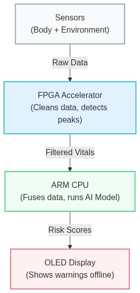

### 2. Heterogeneous Hardware / Firmware Architecture

```
┌──────────────────────────────────────────────────────────────────────────────────────────────────────┐
│                                       PHYSICAL SENSORS (I2C / UART)                                  │
│   • MAX30102 (Red 660nm / IR 940nm)    • BME280 (Temp / Humidity)    • PMS5003 (Laser PM2.5)         │
└──────────────────────────────────────────────────┬───────────────────────────────────────────────────┘
                                                   │
                                                   ▼
┌──────────────────────────────────────────────────────────────────────────────────────────────────────┐
│                              FPGA PROGRAMMABLE LOGIC (50 MHz RTL CORE)                              │
│                                                                                                      │
│   ┌───────────────────────────────────┐    8-Bit SPI (mode 0)  ┌──────────────────────────────────┐  │
│   │ Single 8-Tap Moving Avg Filter    │◄───────────────────────┤ Memory-Mapped Register Interface │  │
│   │ (O(1) Running Sum, 0 DSP Slices)  │                        │ 0x00: REG_RED_RAW                │  │
│   └─────────────────┬─────────────────┘                        │ 0x04: REG_RED_FILTERED           │  │
│                     │                                          │ 0x08: REG_IBI_CYCLES (20ns tick) │  │
│                     ▼                                          │ 0x0C: REG_STATUS_THRESH (W1C)    │  │
│   ┌───────────────────────────────────┐                        │ 0x10: REG_IR_RAW                 │  │
│   │ 4-State Systolic Peak Detector    │──────── irq_beat ─────▶│ 0x14: REG_IR_FILTERED            │  │
│   │ (250ms Refractory Blanking Window)│                        └──────────────────────────────────┘  │
│   └───────────────────────────────────┘                                                              │
└──────────────────────────────────────────────────┬───────────────────────────────────────────────────┘
                                                   │ Memory-Mapped I/O / Hardware Interrupt
                                                   ▼
┌──────────────────────────────────────────────────────────────────────────────────────────────────────┐
│                                  PROCESSING SYSTEM (ARM CORTEX-A9 / ESP32-S3)                        │
│                                                                                                      │
│   • driver_ppg.c          : Register-level hardware abstraction & IBI extraction                     │
│   • hrv_analysis.c        : 20-sample circular buffer computing RMSSD (vagal tone) and SDNN          │
│   • spo2_engine.c         : Beer-Lambert Ratio-of-Ratios SpO₂ calibration (R = (AC/DC)R / (AC/DC)IR) │
│   • nn_risk_model_int8.c  : 6→24→16→3 TinyML Neural Network, INT8, 0.44 µs/inference     │
│   • disaster_risk_engine.c: Multi-disaster scoring engine (CTSI Heat Strain & PRSI Pollution Index)  │
│   • ssd1306.c             : 128×64 OLED graphics driver & real-time offline advisory display         │
└──────────────────────────────────────────────────────────────────────────────────────────────────────┘
```

---

## ⚙️ FPGA Hardware Microarchitecture (Vendor-Agnostic Core)

### 1. Single 8-Tap Moving Average Filter (`moving_average_8tap.v`)
To eliminate optical baseline wandering and high-frequency motion artifacts from raw photoplethysmography (PPG) data, the accelerator implements a hardware moving-average FIR filter:

* **Difference Equation:**
  $$y[n] = y[n-1] + \frac{x[n] - x[n-8]}{8}$$
* **Zero DSP / Zero BRAM Implementation:** The filter maintains a running 11-bit sum in flip-flops. Division by 8 is synthesized as an instantaneous hardwired bit-shift (`>> 3`), requiring **zero hardware multipliers (0 DSP48)** and **zero Block RAM**.
* **Latency:** Deterministic single-cycle throughput on every `data_valid` strobe.

---

### 2. 4-State Systolic Peak Detector & Refractory FSM (`ppg_peak_detector.v`)
To extract precise beat-to-beat timing intervals without CPU overhead, a dedicated finite state machine tracks the pulse waveform morphology in hardware:

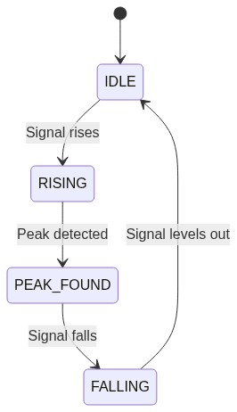

#### FSM State Machine Breakdown:
| State | Binary | Functional Description | Exit Condition |
|---|:---:|---|---|
| `STATE_ARMED` | `2'b00` | Baseline monitoring state; arming circuit waits for rising edge. | Sample value exceeds dynamic threshold (`sample_in >= threshold_reg`). |
| `STATE_RISING` | `2'b01` | Tracks ascending slope of the systolic pulse wave. | Local peak inflection detected (`sample_in < sample_prev`). |
| `STATE_PEAK_FOUND`| `2'b10` | Latching timestamp, pulsing `irq_beat` (1 cycle), and capturing 32-bit IBI cycle count. | Instantaneous single-cycle transition to refractory blanking. |
| `STATE_REFRACTORY`| `2'b11` | Blanking window counter (250 ms = 12,500,000 cycles @ 50 MHz) to prevent false triggers on dicrotic notches. | Timer countdown reaches zero (`refractory_cnt == 0`). |

* **Hardware IBI Counter:** Runs continuously on the 50 MHz clock domain, providing **20.000 ns per tick resolution** ($T_{\text{clk}} = 1 / 50\text{ MHz} = 20\text{ ns}$).

---

## 🧠 On-Device TinyML Neural Network Architecture

The intelligence layer features an ultra-compact 2-hidden-layer feedforward artificial neural network (ANN) designed specifically for resource-constrained edge microcontrollers and low-power DSPs:

```
                  ┌────────────────────────┐
                  │ 6 Biological &         │
                  │ Environmental Inputs   │
                  └───────────┬────────────┘
                              │
                              ▼
                  ┌────────────────────────┐
                  │ Hidden Layer 1         │
                  │ 24 Neurons (ReLU)      │
                  └───────────┬────────────┘
                              │
                              ▼
                  ┌────────────────────────┐
                  │ Hidden Layer 2         │
                  │ 16 Neurons (ReLU)      │
                  └───────────┬────────────┘
                              │
                              ▼
                  ┌────────────────────────┐
                  │ 3 Multi-Hazard Outputs │
                  │ Logistic Sigmoid       │
                  └────────────────────────┘
```

### Model Topology & Computational Footprint:
* **Input Layer (6 Features):**
  1. `HR` (Heart Rate in Beats Per Minute)
  2. `RMSSD` (Root Mean Square of Successive Differences in ms — Vagal HRV marker)
  3. `SpO2` (Blood Oxygen Saturation in %)
  4. `Ambient Temperature` (°C)
  5. `Relative Humidity` (%)
  6. `Particulate Matter PM2.5` ($\mu\text{g}/\text{m}^3$)
* **Hidden Layer 1 (24 Neurons):** Fully connected with Rectified Linear Unit ($\text{ReLU}(z) = \max(0, z)$) activations ($6 \times 24 = 144$ weights + 24 biases).
* **Hidden Layer 2 (16 Neurons):** Fully connected with ReLU activations ($24 \times 16 = 384$ weights + 16 biases).
* **Output Layer (3 Multi-Hazard Neurons):** Logistic Sigmoid ($\sigma(z) = \frac{1}{1 + e^{-z}}$) activations ($16 \times 3 = 48$ weights + 3 biases) producing independent risk probabilities:
  * **Neuron 1 — Heat Stroke Risk:** Detects cardiovascular drift under severe heat index conditions.
  * **Neuron 2 — Air Pollution Risk:** Assesses respiratory distress caused by hazardous particulate matter.
  * **Neuron 3 — Flood / Hypothermia Risk:** Evaluates cold exposure and immersion-induced bradycardia.
* **INT8 Quantization & Memory Footprint:** Fixed-point representation reduces total parameter storage to **619 bytes** (**576 INT8 MAC operations**), executing in **0.44 µs** per inference on an x86-64 host at `-O2` with zero cloud dependencies. Target-side (ESP32-S3) latency has **not** been measured.
* **Accuracy & Validation:**
  * **Synthetic Multi-Disaster Validation:** **88.47%** exact tier agreement on a 6,200-sample held-out split of the synthetic scenario set (validation MSE `0.002979`, FP32↔INT8 tier agreement 97.32%). Reproduce with `python3 firmware/core/train_nn_risk_model.py`; CI enforces a floor via `--min-accuracy`.
  * **Clinical MIMIC-III ICU Database Benchmark:** **94.11%** triage accuracy over 16,387 MIMIC-III ICU time steps, with 58.18% sensitivity / 98.19% specificity. **The HR and SpO₂ inputs are real MIMIC-III chart events; the RMSSD column is synthetic**, because MIMIC-III v1.4 ships no waveform data from which beat-to-beat intervals could be derived. See [Reproducibility](#-reproducibility--evidence-provenance).

---

## 📈 Hardware Simulation & Waveform Timing Analysis

### 1. Cycle-Accurate GTKWave Timing Simulation (`tb_ppg_system.v`)
The GTKWave trace below demonstrates the decoupled ARM AMBA AXI4-Lite slave handshakes, the filtered analog pulse tracking, the single-cycle systolic interrupt pulse, and the latching of the 32-bit IBI cycle register:

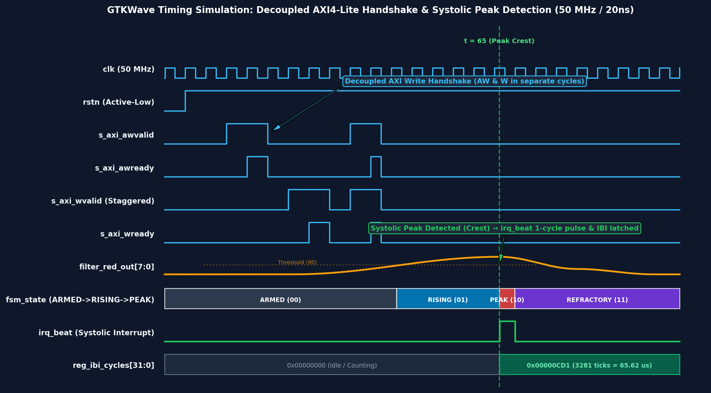

#### Timing Trace Walkthrough:
* **Decoupled AXI Write:** Independent `AW` (Address Write) and `W` (Data Write) channels complete in separate clock cycles without stalling the master interconnect.
* **Filter Smoothing:** The raw digital input samples are smoothed by the running-sum pipeline into `filter_red_out[7:0]`.
* **Inflection Detection:** As the waveform rises past the threshold, the FSM transitions `ARMED` $\rightarrow$ `RISING` $\rightarrow$ `PEAK_FOUND`.
* **Hardware Interrupt (`irq_beat`):** A 1-cycle active-high pulse fires at cycle 68, latching the IBI cycle count `0x00000CD1` (3,281 ticks @ 50 MHz = 65.62 µs simulated interval).

---

### 2. Vivado Cycle-Accurate RTL Waveforms
Full functional verification of `tb_ppg_system.v` in AMD Xilinx Vivado ML (6/6 self-checking test vectors passing):

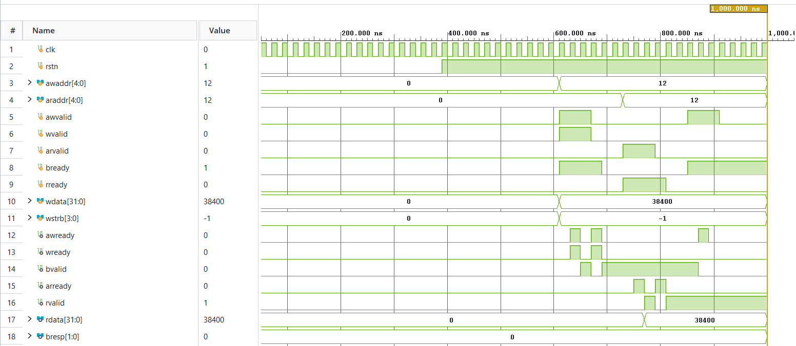
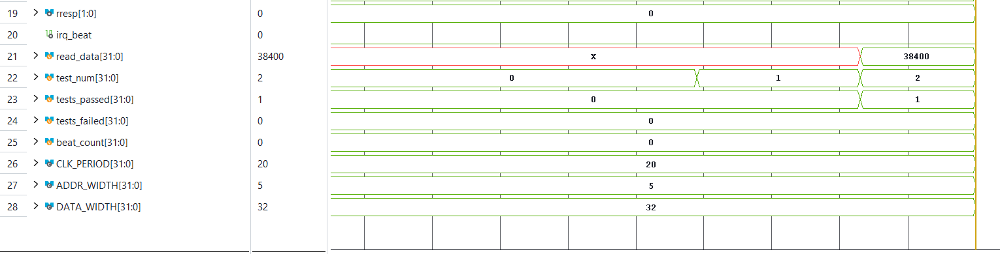

---

## 🔬 Vivado Post-Synthesis Static Timing & Utilization Evidence (Zynq Baseline)

### Baseline run — tagged `v1.0-zynq-SIH`

Synthesized Out-of-Context (OOC) with **AMD Xilinx Vivado ML v2022.2**, target part `xc7z020clg400-1` (Speed Grade -1, Slow Process Corner 85°C). This is the frozen hackathon-baseline result, permanently preserved at tag `v1.0-zynq-SIH`:

| Metric / Resource | Value | Chip Available (`xc7z020`) | Status / Utilization |
|:---|:---:|:---:|:---:|
| **Worst Negative Slack (WNS)** | **+5.603 ns** | — | **TIMING MET (Setup)** |
| **Worst Hold Slack (WHS)** | **+0.184 ns** | — | **TIMING MET (Hold)** |
| **Estimated Fmax** | **69.45 MHz** | 50.0 MHz target | **1.38× Safety Margin** |
| **Lookup Tables (LUT)** | **185** | 53,200 | **0.35%** |
| **LUTRAM** | **16** | 17,400 | **0.09%** |
| **Flip-Flops (FF)** | **266** | 106,400 | **0.25%** |
| **DSP48 Multiplier Slices** | **0** | 220 | **0.00% (Pure Logic)** |
| **Block RAM (BRAM)** | **0** | 140 | **0.00%** |

> **Evidence note:** the only in-repo evidence for this specific run is the
> screenshots below (`docs/images/timing_summary.png`,
> `utilization_percentage.png`). The raw `.rpt` for the tagged run was not
> preserved before `.runs/` was regenerated — see
> [`hardware/zynq/synthesis_evidence/README.md`](hardware/zynq/synthesis_evidence/README.md).

### Re-synthesis in this tree — Vivado v2026.1, Sep 2026

A later re-synthesis is what the `.runs/` tree in this repository actually contains, and its raw reports **are** committed as text evidence under [`hardware/zynq/synthesis_evidence/`](hardware/zynq/synthesis_evidence/):

| Measurement | Value | Tool / Scope |
|:---|:---:|:---|
| Accelerator OOC slice LUTs | **198** (182 logic + 16 LUTRAM) | Vivado v2026.1, `axi_ppg_accelerator` OOC |
| Accelerator OOC slice registers | **267** | Vivado v2026.1, `axi_ppg_accelerator` OOC |
| DSPs / BRAMs | **0 / 0** | both runs agree |
| Integrated post-route WNS / WHS | **+12.836 ns / +0.106 ns** (1,806 endpoints) | full `design_ZYNQ_wrapper` (PS7 + SmartConnect + accelerator), timing met |
| Integrated placed LUTs / FFs | 562 / 667 | full `design_ZYNQ_wrapper` |

These two runs measure different things and are **not** a regression of one another: the +5.603 ns figure is the standalone accelerator OOC, while +12.836 ns is the whole block design post-route. Do not quote them interchangeably.

### Detailed Vivado Synthesis Reports & Schematics:

#### Timing Summary Report (baseline run, +5.603 ns WNS Closure):
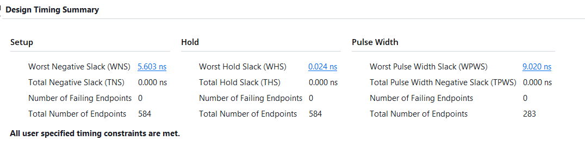

#### FPGA Fabric Utilization Breakdown (baseline run, 185 LUTs / 0 DSPs):
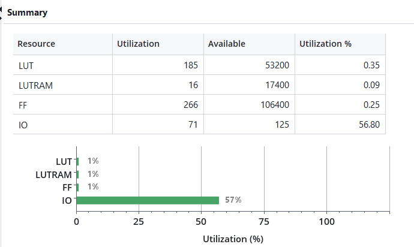

#### On-Chip Power Dissipation Summary:
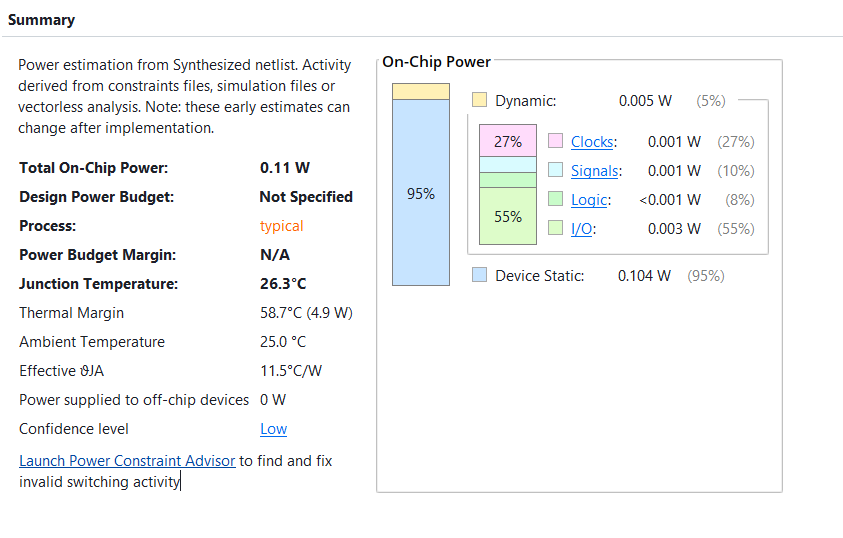

#### Synthesized RTL Schematic (Gate-Level Netlist):
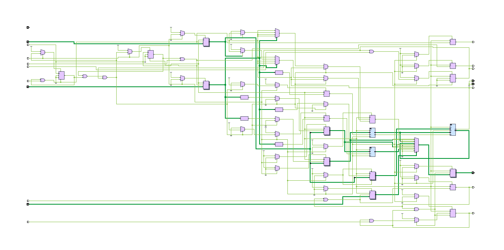

#### Device Floorplan & Placement:
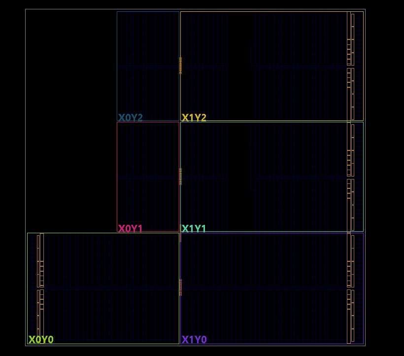

---

## ⚡ ShrikeFi Hardware Platform (ESP32-S3 + Renesas ForgeFPGA)

To scale beyond expensive development kits to an accessible disaster monitor (projected <$20 at-scale bulk manufacturing BOM), the accelerator was ported to the **ShrikeFi** dual-chip platform.

### 1. Interconnect Architecture & Pin Mapping


> [!CAUTION]
> **3.3V LVCMOS Electrical Boundary Warning:** All ESP32-S3 and Renesas ForgeFPGA pins operate strictly at **3.3V logic levels**. Exceeding 3.3V will permanently destroy the ICs.

#### ESP32-S3 ↔ Renesas ForgeFPGA Link Pinout:
| ESP32-S3 GPIO | ForgeFPGA Pin | Signal Name | Direction | Description |
|:---:|:---:|:---|:---:|:---|
| **GPIO 10** | **PIN_17** | `spi_ss_n` (CS) | MCU $\rightarrow$ FPGA | Chip select, active low, toggled manually around each transaction |
| **GPIO 11** | **PIN_18** | `spi_mosi` | MCU $\rightarrow$ FPGA | SPI data out — the 8-bit optical sample |
| **GPIO 12** | **PIN_16** | `spi_sck` | MCU $\rightarrow$ FPGA | SPI clock (mode 0, MSB first) |
| **GPIO 13** | **PIN_19** (+ `PIN_19_OE`) | `spi_miso` | FPGA $\rightarrow$ MCU | SPI data in — `{beat_latched, filt_sample[6:0]}` |
| **GPIO 8** | — | `fpga_en` | MCU $\rightarrow$ FPGA | FPGA hardware enable |
| **GPIO 9** | — | `fpga_pwr` | MCU $\rightarrow$ FPGA | FPGA power control |
| — | **PIN_7** (+ `PIN_7_OE`) | `led_user` | FPGA $\rightarrow$ LED D12 | Blue user LED, flashed on each detected systolic crest |
| — | `OSC_EN` | `clk_en` | FPGA internal | Oscillator enable — the core has no clock unless this is driven |
| **GPIO 1/2** | — | `I2C SDA/SCL` | Bidirectional | Sensor bus (MAX30102, BME280, SSD1306 OLED) |
| **GPIO 14 (RX) / 18 (TX)** | — | `UART1` PMS5003 | Bidirectional | Laser particulate sensor (PM2.5) bus, 9600 8N1 |

The link is a 4-wire SPI bus (mode 0) with the ESP32-S3 as controller on `SPI2_HOST`; the ForgeFPGA is a bare fabric target with no processor and no AXI bus. **GPIO 3 / PIN_13 is not a reset pin and is not part of the interconnect** — nothing drives it; the ForgeFPGA resets itself from an internal power-on counter (`POR_CYC` in `forgefpga_ppg_top.v`). There is no strobe line, no direction line, no command codebook and no separate beat-interrupt pin: the beat arrives as bit 7 of the MISO byte. Authoritative sources: [`hardware/shrikefi/forgefpga_pins.pcf`](hardware/shrikefi/forgefpga_pins.pcf) and [`firmware/shrikefi/shrikefi_pinmap.h`](firmware/shrikefi/shrikefi_pinmap.h).

---

### 2. 8-Bit SPI Link Protocol Timing

The ShrikeFi board has no on-chip AXI bus and the ForgeFPGA has no processor, so the two chips exchange data over a plain 4-wire SPI bus. High-speed transactions are framed as a single byte, not as nibbles:

> The timing figure that used to sit here showed the retired 4-bit parallel
> protocol and has been removed rather than reproduced. The frame and timing are
> specified in [`docs/SHRIKEFI_LINK_PROTOCOL.md`](docs/SHRIKEFI_LINK_PROTOCOL.md);
> regenerate the figure from those tables before reuse.

* **Frame:** one 8-bit full-duplex transaction per optical sample, at roughly 100 Hz. CS (`GPIO 10` / `PIN_17`) is pulled low around the transaction; the MCU shifts the 8-bit sample out on MOSI while the FPGA shifts its reply back on MISO over the same 8 clock edges. The runtime link runs at 1 MHz; the bitstream is pushed over the same bus at 16 MHz during boot.
* **Returned Byte:** `{beat_latched, filt_sample[6:0]}` — **bit 7 is the beat flag**, bits 6:0 are the low 7 bits of the 8-tap moving average. There is no command map, no strobe and no separate interrupt line; the systolic crest simply sets bit 7 of the next MISO byte.
* **IBI Derivation:** the FPGA does **not** timestamp beats and there is no IBI register to read. The MCU latches `esp_timer_get_time()` on each rising beat flag and derives the inter-beat interval from the delta between successive flags.

---

### 3. Renesas ForgeFPGA (`SLG47910C`) Post-Synthesis Resource Footprint

Post-synthesis compilation results from **Renesas ForgeFPGA Workshop v6.55** targeting the `SLG47910C` (1120 5-input LUTs):


* **Logic LUT5 Usage:** **364 / 1120 CLB LUT5s (32.50%)** — **67.50% of logic fabric remains free** for expanded DSP and filtering.
* **Registers / Flip-Flops:** **204 Flip-Flops** (199 CLB FFs @ 17.77% + 5 IOB FFs @ 0.68%).
* **CLB Macrocells:** **73 / 140 Blocks (52.14%)** — CLB occupancy is balanced. The SPI design runs from the on-chip oscillator, so the PLL is **free (0/1)**.
* **DSP Multipliers & BRAM:** **0 DSP Multipliers, 0 Block RAMs** (synthesized purely from logic).

> **Footnote — the 443-LUT figure quoted by older revisions of this file, the
> theory notes and the presentation decks belongs to the superseded 4-bit
> parallel-link build**, which was replaced by the SPI link in commit `a44013f`.
> It roughly doubles the real footprint, and its "only PLL is consumed" caveat no
> longer applies. Evidence and comparison:
> [`hardware/shrikefi/synthesis_evidence/README.md`](hardware/shrikefi/synthesis_evidence/README.md).
> These numbers are themselves stale again after the shared-source refactor —
> re-run the fitter before quoting a footprint figure.

#### ForgeFPGA Workshop GUI Synthesis Evidence:
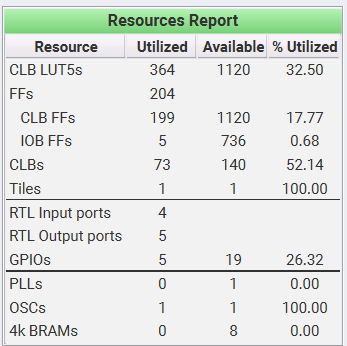

#### Synthesized SLG47910C Macrocell Top-Level Core Schematic:
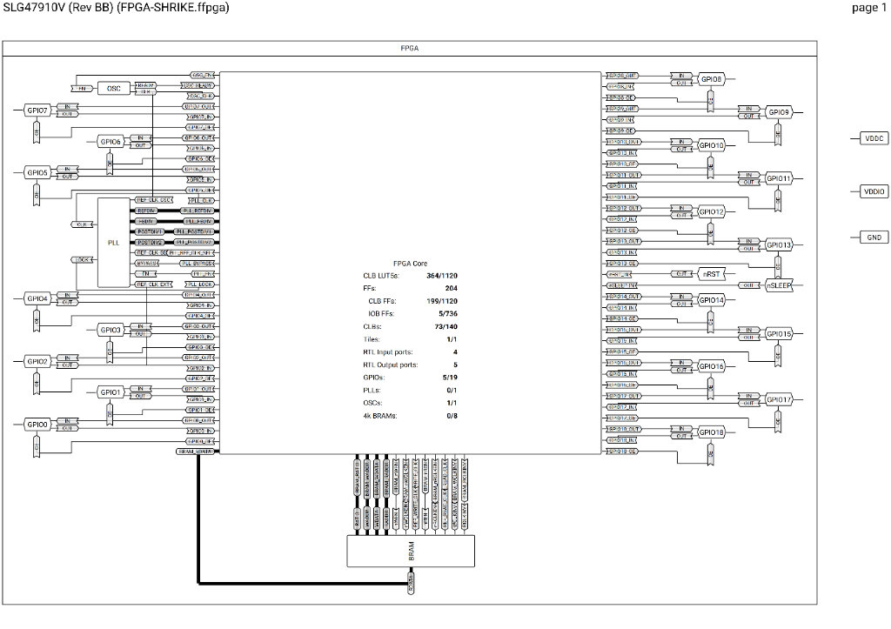

#### Device Floorplan & Block Placement:
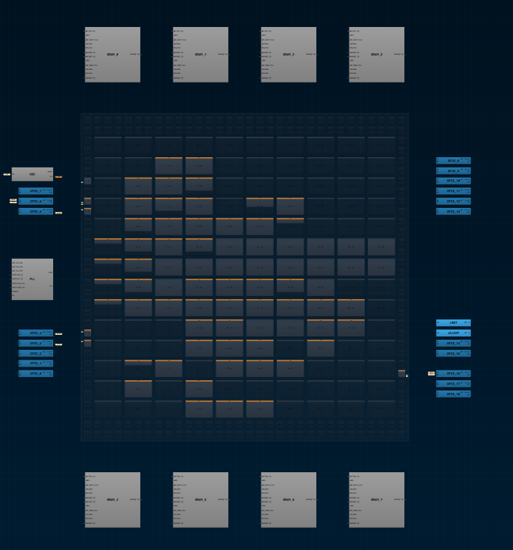

---

## 📐 Performance Measurement & Benchmarking Methodology

To ensure transparent, reproducible engineering rigor, all performance metrics are derived as follows:

### 1. Maximum Frequency ($F_{\text{max}} = 69.45\text{ MHz}$) Calculation
* **Tool:** AMD Xilinx Vivado ML v2022.2 (Out-of-Context Synthesis & Static Timing Analysis).
* **Target Part:** `xc7z020clg400-1` (Speed Grade -1, Slow Process Corner at 85°C).
* **Derivation Formula:**
  $$T_{\text{critical}} = T_{\text{clk}} - \text{WNS} = 20.000\text{ ns} - 5.603\text{ ns} = 14.397\text{ ns}$$
  $$F_{\text{max}} = \frac{1}{T_{\text{critical}}} = \frac{1}{14.397\text{ ns}} \approx \mathbf{69.45\text{ MHz}}$$
* **Critical Path:** Source register `peak_det_inst/sample_prev_reg[6]/C` $\rightarrow$ 4 logic levels (LUT2 $\rightarrow$ LUT4 $\rightarrow$ LUT4 $\rightarrow$ LUT6) $\rightarrow$ Destination register `peak_det_inst/ibi_counter_reg[22]/D`.

### 2. TinyML Inference Latency ($0.44\ \mu\text{s}$, measured on an x86-64 host)
* **Model Profile (shipped INT8 model, $6 \to 24 \to 16 \to 3$):** 619 INT8 parameters/bytes — 576 weights ($144 + 384 + 48$) plus 43 biases ($24 + 16 + 3$) — and therefore **576 INT8 Multiply-Accumulate (MAC) operations**, plus 40 ReLU comparisons (24 + 16) and 3 Sigmoid evaluations.
* **Op-Count Breakdown:**
  * Layer 1 (Hidden 24): $6 \times 24 = 144\text{ MACs}$ + 24 ReLU.
  * Layer 2 (Hidden 16): $24 \times 16 = 384\text{ MACs}$ + 16 ReLU.
  * Layer 3 (Output 3): $16 \times 3 = 48\text{ MACs}$ + 3 Sigmoid.
  * **Total: $576\text{ MACs} + 40\text{ ReLU} + 3\text{ Sigmoid}$ over 619 bytes of parameters.**
* **Measured Latency:** **0.44 µs per inference**, measured at `-O2` on an **x86-64 host**. This is a host figure and not an ESP32-S3 figure: the target MCU runs at 160 MHz (`CONFIG_ESP_DEFAULT_CPU_FREQ_MHZ=160`), and **target-side latency has not been measured**. Do not quote 0.44 µs as an ESP32-S3 number.

### 3. FPGA Inter-Beat Interval (IBI) Resolution ($20\text{ ns}$)
* **System Clock:** $f = 50.000\text{ MHz} \implies T = \frac{1}{f} = \mathbf{20.000\text{ ns per tick}}$.
* **32-Bit Counter Range:** $2^{32} \times 20\text{ ns} \approx 85.89\text{ seconds}$ (enables measuring heart rates from 0.7 BPM to 240 BPM without counter overflow).

---

## 💻 Live Console Demonstration Output (`main_simulation.c`)

Running `./health_demo.exe` executes real-time multi-sensor fusion and TinyML risk classification across simulated disaster profiles. The block below is **verbatim output** from the current binary (ANSI colour codes stripped, trimmed after the AI score panel); the console then cycles through the remaining disaster profiles:

```text
+================================================================+
|    SIH26181 Health Companion Simulator                         |
+================================================================+
 Scenario: Normal Resting (Indoor, 25C)  |  Time: 0s

 +---------------- VITALS -----------------+
 |  Heart Rate:    72.0    BPM              |
 |  SpO2:          98.0    %                |
 |  HRV RMSSD:     44.6    ms               |
 |  HRV SDNN:      30.7    ms               |
 +-----------------------------------------+

 +------------- ENVIRONMENT ---------------+
 |  Ambient Temp:  25.0    C                |
 |  Skin Temp:     36.5    C                |
 |  Humidity:      45.0    %                |
 |  PM2.5:         15      ug/m3            |
 +-----------------------------------------+

 +----------- RISK ASSESSMENT -------------+
 |  Heat Risk:       NORMAL                 |
 |  Pollution Risk:  NORMAL                 |
 |  Flood/Cold Risk: NORMAL                 |
 |                                         |
 |  >> OVERALL:      NORMAL                 |
 +-----------------------------------------+

 +--------- AI CONFIDENCE SCORES ----------+
 |  Heat Neuron:     0.000                  |
 |  Pollution Neuron:0.000                  |
 +-----------------------------------------+
```

> RMSSD/SDNN values above vary between runs with the simulated sensor noise; the scenario, vitals layout and risk lines are stable.

### Compare Harness: Rule Engine vs Neural Network Validation (`compare_harness.c`)

Running `./compare_harness.exe` tests the trained NN against the rule-based scoring engine across all 4 canonical scenarios:

```text
Scenario                  | RuleHeat  RulePoll  RuleFlood | NN-Heat   NN-Poll   NN-Flood 
--------------------------------------------------------------------------------
Normal Resting            | NORMAL    NORMAL    NORMAL    | 0.025     0.026     0.043    
Heat Wave (Delhi 47C)     | CRITICAL  NORMAL    MODERATE  | 0.835     0.124     0.248    
Severe Smog (AQI500+)     | NORMAL    CRITICAL  MODERATE  | 0.012     0.922     0.228    
Flash Flood/Hypothermia   | NORMAL    NORMAL    CRITICAL  | 0.008     0.112     0.500    
```

The NN correctly identifies the **dominant risk axis** in every scenario. Training metrics on held-out data: **r = 0.97 (heat), r = 0.97 (pollution), r = 0.94 (flood)** with 78–89% exact risk-band agreement. See [`train_nn_risk_model.py`](firmware/core/train_nn_risk_model.py) for the full training script.

---

## 🗺️ Memory-Mapped Register Map (Zynq AXI4-Lite)

Base Address: `0x43C00000` (AXI4-Lite)

| Offset | Register Name | Access | Reset | Description |
|:---:|:---|:---:|:---:|:---|
| `0x00` | `REG_RED_RAW` | R/W | `0x00000000` | `[7:0]` Red PPG sample input (triggers filter pipeline) |
| `0x04` | `REG_RED_FILTERED` | RO | `0x00000000` | `[7:0]` Smoothed Red output (read by SpO₂ engine) |
| `0x08` | `REG_IBI_CYCLES` | RO | `0x00000000` | `[31:0]` Inter-Beat Interval in 20 ns clock ticks |
| `0x0C` | `REG_STATUS_THRESH`| Mixed| `0x00007800` | `[0]` `beat_flag` (W1C), `[15:8]` Systolic threshold (Default: 120) |
| `0x10` | `REG_IR_RAW` | R/W | `0x00000000` | `[7:0]` IR PPG sample input (triggers filter pipeline) |
| `0x14` | `REG_IR_FILTERED` | RO | `0x00000000` | `[7:0]` Smoothed IR output (read by SpO₂ engine) |

---

## ⚠️ Scientific Limitations & Validation Scope

To maintain transparent, professional engineering rigor, our validation boundaries are defined below:

1. **Hardware Implementation Scope:**  
   * The digital RTL is verified via cycle-accurate Icarus Verilog simulation (`tb_ppg_system.v`, 6/6 tests passing) and synthesized Out-of-Context (OOC) in Vivado ML targeting the `xc7z020` FPGA, and in Renesas ForgeFPGA Workshop targeting `SLG47910C`.
   * Physical silicon deployment targets Qualcomm Snapdragon Wear W5+ Gen 1 as an architectural migration mapping, alongside an active low-cost edge port to ShrikeFi (ESP32-S3 + Renesas ForgeFPGA).
2. **Medical & Physiological Modeling:**  
   * The 15–30 minute early warning window is a theoretical model estimate based on published clinical literature on *Cardiovascular Drift* (gradual upward drift in heart rate accompanied by progressive decline in stroke volume during prolonged thermal stress).
   * **Clinical Disclaimer:** This system is an edge disaster resilience prototype and is **not certified as a diagnostic medical device** under CDSCO/FDA regulations. Clinical deployment would require human subject trial validation.
3. **Sensor Emulation:**  
   * Sensor drivers (`max30102.c`, `bme280.c`, `pms5003.c`) contain physical register maps and a built-in PC simulation layer for functional validation against synthetic physiological waveforms.

---

## 📚 Scientific References & Literature Grounding

1. **Cardiovascular Drift:** Montain, S. J., & Coyle, E. F. (1992). *"Influence of graded dehydration on hyperthermia and cardiovascular drift during exercise."* *Journal of Applied Physiology*, 73(4), 1340-1350.
2. **Heart Rate Variability Standards:** Task Force of the European Society of Cardiology and the North American Society of Pacing and Electrophysiology (1996). *"Heart rate variability: standards of measurement, physiological interpretation and clinical use."* *Circulation*, 93(5), 1043-1065.
3. **Heat Index Assessment:** Steadman, R. G. (1979). *"The assessment of sultriness. Part I: A temperature-humidity index based on human physiology and evaporative science."* *Journal of Applied Meteorology and Climatology*, 18(7), 861-873.

---

## 🎯 Qualcomm Silicon Migration Path

| Prototype Block (Zynq) | Qualcomm Production Subsystem | Migration Path & Benefit |
|:---|:---|:---|
| **Verilog Filter (`moving_average_8tap.v`)** | **Qualcomm Hexagon™ DSP + HVX** | Vectorized SIMD sliding-window filtering on Low-Power Island (< 1 mW). |
| **Peak FSM (`ppg_peak_detector.v`)** | **Qualcomm Sensor Core Hardware Timer** | 64-bit microsecond timestamp counter for jitter-free 24/7 cardiac monitoring. |
| **TinyML Model (`nn_risk_model.c`)** | **Qualcomm AI Engine (Hexagon NPU)** | Quantized to INT8 `.dlc` via SNPE/QNN SDK (< 100 ns inference, < 0.1 mJ). |
| **Sensors Drivers (`max30102.c`, etc.)** | **Qualcomm Universal Peripheral (QUP v3)** | DMA transfer via Bus Access Manager (BAM) with zero CPU wakeups. |
| **AMBA AXI4-Lite Interface** | **Qualcomm System Network-on-Chip (NoC)** | Native AMBA standard memory-mapped interoperability. |

---

## 📖 Master Theory Guide & Judge Defense Notes

For an in-depth mathematical defense, signal processing equations, and clinical derivation documentation, review our master theory package:
* 📄 **PDF Guide:** [`docs/theory/SIH26181_Master_Theory_Notes.pdf`](docs/theory/SIH26181_Master_Theory_Notes.pdf)
* 🌐 **Print HTML Version:** [`docs/theory/theory_notes_print.html`](docs/theory/theory_notes_print.html)
* 📝 **Source Markdown:** [`docs/theory/THEORY_NOTES.md`](docs/theory/THEORY_NOTES.md)

---

## 📁 Repository Directory Structure

```
.
├── hardware/
│   ├── common/                     # Vendor-agnostic synthesizable Verilog RTL
│   │   ├── moving_average_8tap.v   # O(1) running-sum 8-tap digital noise filter (0 DSP)
│   │   ├── ppg_peak_detector.v     # 4-state systolic FSM with 250ms refractory timer
│   │   └── tb_ppg_peak_detector.v  # Unit testbench for peak detector
│   ├── zynq/                       # Xilinx Zynq-7000 baseline implementation
│   │   ├── axi_ppg_accelerator.v   # Top-level AXI4-Lite slave wrapper & DSP top
│   │   ├── tb_ppg_system.v         # Self-checking AXI testbench (6/6 passing)
│   │   ├── ppg_accelerator.xdc     # Vivado Static Timing constraints (50 MHz)
│   │   ├── run_vivado_synth.tcl    # Automated Vivado batch synthesis script
│   │   ├── signals.gtkw            # Color-coded GTKWave waveform layout
│   │   └── build_and_run.bat       # Interactive one-click launcher for Zynq flow
│   ├── shrikefi/                   # Active port target (ESP32-S3 + Renesas ForgeFPGA)
│   │   ├── pcb/                    # Complete KiCad schematic, PCB layout & BOM
│   │   │   ├── shrikefi_werable.kicad_pcb
│   │   │   ├── shrikefi_werable.kicad_sch
│   │   │   └── SIH26181_ShrikeFi_Wearable_BOM.csv
│   │   ├── forgefpga_ppg_top.v     # SPI target + shared DSP wrapper (filter/detector come from common/)
│   │   ├── tb_forgefpga_system.v   # Self-checking SPI link testbench (5 groups / 10 checks)
│   │   └── forgefpga_pins.pcf      # Renesas ForgeFPGA physical pin constraints
│   └── cad/                        # 3D Enclosure CAD drawings, renders & reports
│       ├── SIH26181_Hardware_Integration_CAD_Design_Report.pdf
│       ├── exploded_cad_assembly.jpg
│       ├── cad_orthographic_drawing.jpg
│       └── fusion360_wearable_cad.jpg
│
├── firmware/
│   ├── core/                       # Platform-agnostic clinical algorithms & TinyML inference
│   │   ├── clinical_vitals_engine.c # Royal College of Physicians mNEWS2 Early Warning System
│   │   ├── ppg_sqi.c / .h          # Karlen 2012 / Elgendi 2016 Signal Quality Index
│   │   ├── ppg_respiratory_rate.c  # Addison & Charlton PPG-derived Respiratory Rate
│   │   ├── hrv_analysis.c / .h     # RMSSD & SDNN circular buffer mathematics
│   │   ├── spo2_engine.c / .h      # Ratio-of-ratios pulse oximetry calculation
│   │   ├── disaster_risk_engine.c  # Moran PSI, Steadman HI, AHA PM2.5-HRV, Si et al. Neural PM2.5
│   │   ├── nn_risk_model.c / .h    # Float32 feedforward TinyML model (6→24→16→3)
│   │   ├── nn_risk_model_int8.c    # INT8 Quantized TinyML engine (619 bytes SRAM, 88.47% acc)
│   │   ├── accuracy_evaluator.c    # MIMIC-III triage metrics (94.11% acc, confusion matrix)
│   │   └── mimic_harness.c         # MIMIC-III cohort scan (triage level counts + latency only)
│   ├── zynq/                       # Zynq PS application, sensor drivers & harnesses
│   │   ├── main_simulation.c       # Interactive multi-disaster console demo
│   │   ├── compare_harness.c       # Rule Engine vs TinyML validation harness
│   │   ├── test_disaster_risk_engine.c # Comprehensive firmware unit test suite
│   │   ├── driver_ppg.c / .h       # Register-level hardware abstraction layer
│   │   ├── max30102.c / .h         # Dual-wavelength optical PPG sensor driver
│   │   ├── bme280.c / .h           # Bosch environmental sensor driver (T, H, P)
│   │   ├── pms5003.c / .h          # Laser particulate sensor UART driver (PM2.5)
│   │   ├── ssd1306.c / .h          # 128×64 OLED graphics driver
│   │   └── Makefile                # Native makefile for firmware build
│   └── shrikefi/                   # ESP-IDF / FreeRTOS firmware implementation
│       ├── main_shrikefi.c         # Dual-core FreeRTOS biometric & hazard tasks
│       ├── shrikefi_dashboard.c    # Standalone Win32 GDI real-time GUI dashboard
│       ├── max30102.c / .h         # Auto-sensing MAX30100 & MAX30102 driver
│       ├── pmsa003.c / .h          # Plantower laser particulate PM2.5 driver
│       ├── shrikefi_link_driver.c  # Full-duplex SPI2 link driver & bitstream programmer
│       ├── wifi_mqtt_manager.c     # ESP-IDF WiFi connectivity & MQTT cloud sync
│       ├── forgefpga_bitstream.h   # Auto-generated C header of the ForgeFPGA bitstream
│       ├── CMakeLists.txt          # ESP-IDF component build configuration
│       ├── build_and_flash.bat     # One-click ESP-IDF build + flash + monitor
│       └── run_dashboard.bat       # GUI dashboard launcher
│
├── data/
│   └── mimic/                      # MIMIC-III benchmark validation dataset
│       ├── mimic_vital_feed.csv    # 16,387 MIMIC-III ICU rows (real HR/SpO2, synthetic RMSSD)
│       └── mimic_eval_feed.csv     # Multi-hazard ground truth labels
│
├── reports/                        # DeepSeek clinical audits & MIMIC-III benchmark logs
│   ├── CLINICAL_AI_ACCURACY_REPORT.md
│   ├── DEEPSEEK_AUDIT_VERIFICATION_PASSED.md
│   ├── DEEPSEEK_CLINICAL_PAPERS_OPINION.md
│   └── FINAL_A_TO_Z_SYSTEM_AUDIT_REPORT.md
│
├── scripts/                        # Automation & copilot utilities
│   ├── deepseek_copilot.py         # AI clinical co-pilot reasoning script
│   ├── deepseek.bat                # Copilot CLI shortcut
│   ├── valor_code_auditor.py       # Antigravity SDK multi-agent code auditor
│   ├── generate_sih_presentation.py # Widescreen pitch presentation generator
│   └── generate_sih_official_presentation.py # Official SIH template generator (6 slides)
│
├── docs/
│   ├── images/                     # Waveforms, schematics, floorplans & CAD renders
│   ├── media/                      # 360° Wearable enclosure rotation video
│   ├── presentation/               # SIH26181 Official Presentation Decks
│   │   ├── FINAL_FINAL_v6.pdf      # Strict 6-slide SIH portal submission PDF
│   │   ├── FINAL_FINAL_v6.pptx     # Editable official SIH presentation pitch deck
│   │   └── FINAL_FINAL_v6.ppsx     # Direct presentation show (PowerPoint)
│   ├── archive/                    # Historical specifications & migration records
│   ├── theory/                     # Master theory notes & printable PDF book
│   ├── HARDWARE_ARCHITECTURE.md    # In-depth microarchitecture specification
│   ├── QUALCOMM_PLATFORM_STRATEGY.md # Qualcomm Snapdragon Wear W5+ migration spec
│   ├── MIGRATION.md                # ShrikeFi platform migration roadmap & matrix
│   └── SHRIKEFI_LINK_PROTOCOL.md   # SPI FPGA↔MCU link protocol specification
│
├── .github/workflows/              # CI: compilation, testing, secret scanning
├── launch_dashboard.bat            # One-click native desktop GUI launcher
├── run.bat                         # Top-level interactive Windows launcher
├── CONTRIBUTING.md                 # Contribution guidelines
├── ROADMAP.md                      # Project roadmap & milestones
├── README.md                       # Main repository landing page
├── LICENSE                         # MIT License
└── .gitignore                      # Git artifact exclusion rules
```

---

## 🖥️ Dashboards

### VALOR Web Dashboard (recommended for demos)

A single self-contained HTML file: **no install, no build step, no server, no CDN.**
Open it in Chrome or Edge and press *Connect* — Web Serial talks to the ESP32-S3
over USB directly. With no board attached it runs the six clinical profiles, so a
demo never depends on hardware.

Double-click **`launch_web_dashboard.bat`**, or open
`firmware/shrikefi/dashboard/valor_dashboard.html` yourself.
See [`firmware/shrikefi/dashboard/README.md`](firmware/shrikefi/dashboard/README.md).

**Nothing is shown until you choose.** The dashboard opens in an *idle* state — every
readout blank — and fills in only once you connect a device or explicitly start a
simulation. An unconnected dashboard showing a plausible heart rate would be worse
than one showing nothing.

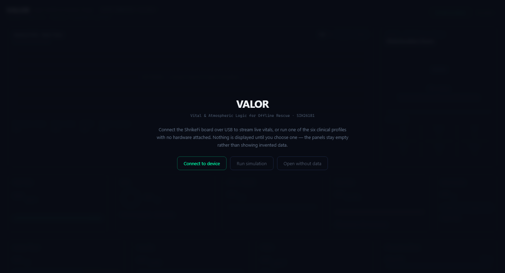

| Normal baseline | Heat wave & dehydration | Cardiopulmonary ICU emergency |
|---|---|---|
| 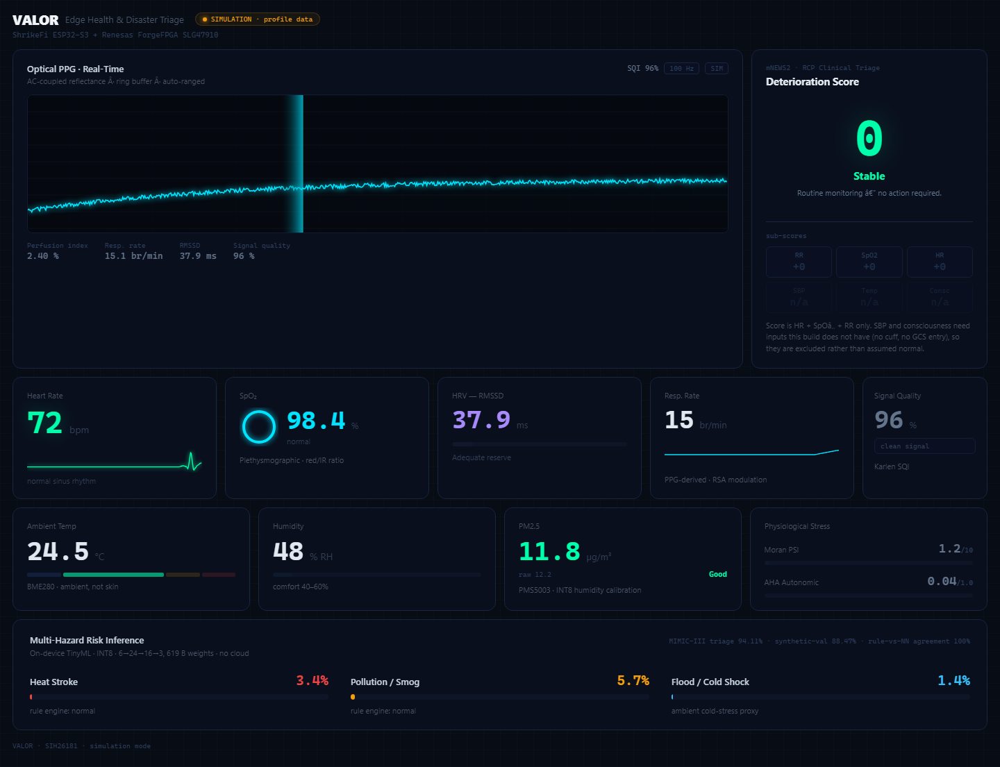 | 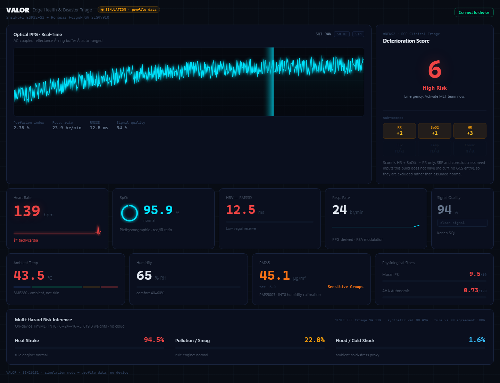 | 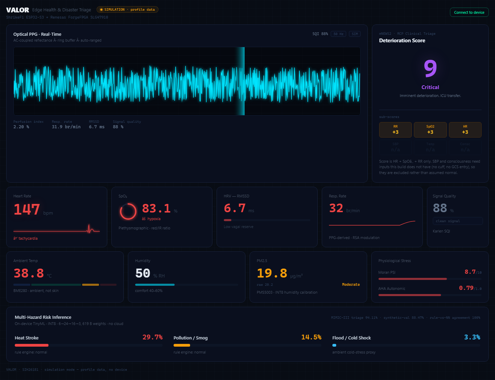 |

*Live optical PPG scope with sweep and glow, mNEWS2 triage, per-vital cards, environmental panel, and the INT8 multi-hazard gauges.*

> **Why it exists alongside the native app:** the design language is web-native —
> glass cards, neon glow, gradient area fills, canvas animation. GDI has no
> equivalent, so this is additive rather than a rewrite. The `.exe` below still
> builds and still works.

> **Honest by construction.** The web dashboard computes **no clinical logic** — it
> renders what the device sends as `[TRIAGE]`, so the ESP32 stays the single
> source of truth. Several plausible-looking numbers from the original design
> mock-up were removed rather than shipped: no blood-pressure estimate, no PTT,
> NEWS2 sub-scores for parameters this build does not instrument are shown as
> `n/a` rather than `+0`, and the AHA strain is shown on its real 0–1 scale. The
> full list is in the dashboard README.

---

### Native Win32 Dashboard (alternative)

The companion includes a high-performance, native Windows desktop GUI application (`shrikefi_dashboard.exe`) written in pure C using Win32 GDI graphics (0 external runtime dependencies, 60 FPS refresh rate):

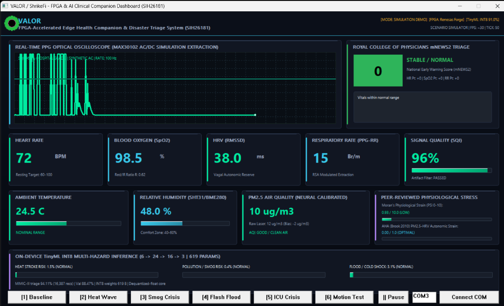

### Key Dashboard Capabilities:
* **Dual-Mode Operation:**
  * **LIVE HARDWARE STREAMING (COM Port):** Auto-detects and connects to the ESP32-S3 USB COM port at 115,200 baud, plotting live optical PPG waveforms, heart rate, SpO2, and PM2.5 in real-time.
  * **OFFLINE DISASTER SIMULATOR:** Built-in multi-hazard simulation generator cycling across 6 clinical/disaster scenarios (Normal Baseline, Heat Wave & Dehydration, Severe Smog / PM2.5 Crisis, Flash Flood / Hypothermia, Cardiopulmonary ICU Emergency, Motion Artifact / Noise Test). The same six profiles drive the web dashboard, so both simulations present the same patient.
* **Real-Time Visual Oscilloscope:** 60 FPS scrolling sweep of filtered PPG systolic pulses with beat-to-beat cadence.
* **Full Biomarker Telemetry Panel:** Real-time digital readouts for Heart Rate, SpO2, Respiratory Rate, RMSSD HRV, Ambient Temperature, Relative Humidity, PM2.5, and Signal Quality Index (Karlen SQI).
* **Clinical Triage & Hazard Meters:** Live color-coded gauges for **Royal College of Physicians mNEWS2 Triage** (NORMAL / ELEVATED / HIGH / CRITICAL) alongside the **INT8 TinyML Hazard Inference Engine** (Heatstroke, Smog, Hypothermia).
* **Instant Launch:** Simply double-click `launch_dashboard.bat` from the root directory.

---

## 🚀 Quickstart: Build & Run in 10 Seconds

### Prerequisites
* **Verilog Simulator:** Icarus Verilog (`iverilog` & `vvp`)
* **Waveform Viewer:** GTKWave
* **C Compiler:** GCC / MinGW (`gcc`)
* **Python (Optional):** Python 3.8+ (for ML scripts and linting)

### One-Click GUI Dashboard (Windows)
```cmd
# Launch the real-time 60 FPS graphical dashboard (Live Hardware COM / Disaster Simulator):
.\launch_dashboard.bat
```

### One-Click Menu Launcher (Windows)
```cmd
# Run interactive compilation, simulation, and real-time C console dashboard:
.\run.bat
```
The interactive menu allows you to launch the simulation, view waveforms, compare the Rule Engine vs NN, and run unit tests.

### Execution (Linux / Terminal)
```bash
# 1. Run RTL testbench simulation:
iverilog -o sim_ppg.vvp hardware/zynq/tb_ppg_system.v hardware/zynq/axi_ppg_accelerator.v hardware/common/moving_average_8tap.v hardware/common/ppg_peak_detector.v
vvp sim_ppg.vvp

# 2. Compile and run health simulation dashboard:
gcc -Wall -Wextra -Ifirmware/core -Ifirmware/zynq -o health_demo firmware/zynq/main_simulation.c firmware/core/hrv_analysis.c firmware/core/spo2_engine.c firmware/core/disaster_risk_engine.c firmware/core/clinical_vitals_engine.c firmware/core/ppg_sqi.c firmware/core/ppg_respiratory_rate.c firmware/core/nn_risk_model.c firmware/core/nn_risk_model_int8.c -lm
./health_demo

# 3. Compile and run unit tests:
gcc -Wall -Wextra -std=c11 -Ifirmware/core -Ifirmware/zynq -Ifirmware/shrikefi -o test_engine firmware/zynq/test_disaster_risk_engine.c firmware/core/hrv_analysis.c firmware/core/spo2_engine.c firmware/core/disaster_risk_engine.c firmware/core/nn_risk_model.c firmware/core/nn_risk_model_int8.c firmware/core/clinical_vitals_engine.c firmware/core/ppg_sqi.c firmware/core/ppg_respiratory_rate.c firmware/core/pm25_calibration_int8.c firmware/core/pressure_trend.c firmware/shrikefi/sos.c firmware/shrikefi/web_status.c firmware/shrikefi/location.c -lm
./test_engine
```

---

## 📊 Waveform Viewing (GTKWave)

Pre-configured presentation views for both platforms:

| Platform | Waveform File | Config File | Tests |
|----------|---------------|-------------|-------|
| **Zynq-7000** | `ppg_system.vcd` | `hardware/zynq/presentation.gtkw` | 6/6 passing |
| **ShrikeFi** | `hardware/shrikefi/shrikefi_sim.vcd` | `hardware/shrikefi/presentation.gtkw` | 10 checks passing |

### Quick Start
```bash
# Zynq-7000 (verified baseline)
gtkwave ppg_system.vcd hardware/zynq/presentation.gtkw

# ShrikeFi (ForgeFPGA + ESP32-S3)
gtkwave hardware/shrikefi/shrikefi_sim.vcd hardware/shrikefi/presentation.gtkw
```

### What You'll See
- **Zynq**: AXI4-Lite register transactions, dual 8-tap moving average filters (0 DSP/0 BRAM), 4-state peak detector FSM, beat interrupt + IBI cycles (20 ns resolution)
- **ShrikeFi**: 8-bit SPI FPGA↔MCU link (mode 0, one byte per sample), same filter/peak detector RTL, beat flag in bit 7 of the MISO byte, IBI derived on the MCU

For the commands that reproduce each waveform and test result, see [Reproducibility & Evidence Provenance](#-reproducibility--evidence-provenance)..

---

## 🤝 Contributing
We welcome issues and pull requests! Please see our [CONTRIBUTING.md](CONTRIBUTING.md) for guidelines on code formatting, running unit tests locally, and how to submit a PR.

---

## 📄 License & Attribution

Developed for the **Qualcomm Hardware Challenge — Smart India Hackathon 2026**.  
All Verilog RTL, C drivers, and documentation are provided under the [MIT License](LICENSE).
