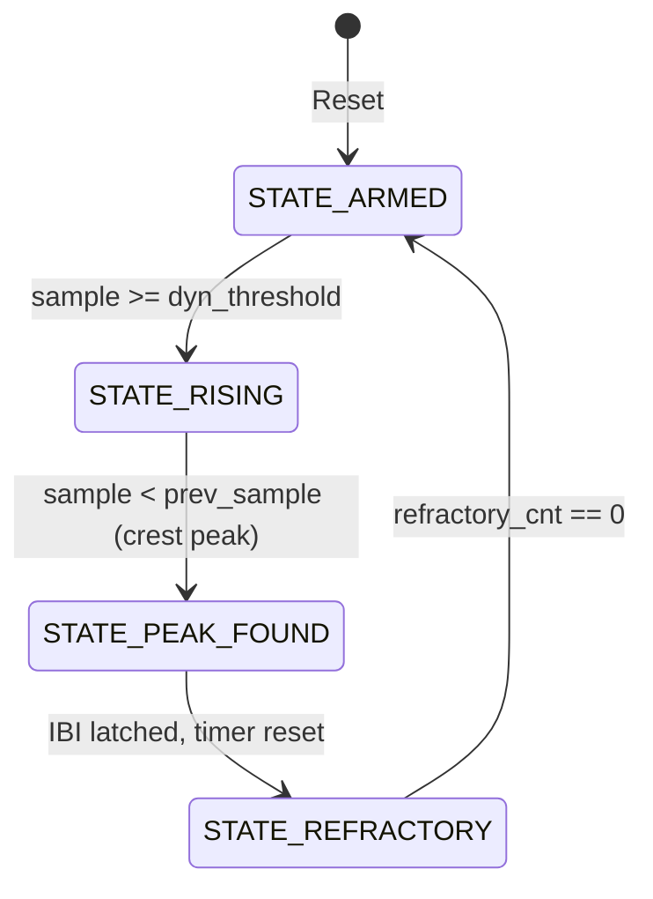

# Hardware Architecture & Microarchitecture Specification

## 1. Operational Reality & SoC Constraints

The PPG Accelerator is a synthesizable AXI4-Lite hardware IP. It exists for a single reason: software cannot handle high-frequency biological signal processing under strict wearable power budgets without killing the battery or dropping data.

During a disaster (e.g., severe heat wave, flood), the system must run continuously. Forcing the primary CPU to poll raw sensor data and perform DSP filtering keeps the core awake, burns power, and generates dangerous heat on the user's wrist. 

By offloading signal conditioning and interval timing to dedicated Programmable Logic (PL), the CPU remains in deep sleep 99% of the time. The FPGA fabric handles the math, capturing the Inter-Beat Interval (IBI) with **20 ns precision**. This eliminates OS scheduling jitter entirely, preventing garbage data from poisoning the AI risk engine.

```
+-----------------------------------------------------------------------------------+
|                            HETEROGENEOUS SoC ARCHITECTURE                         |
|                                                                                   |
|  +-------------------------------------+   +-----------------------------------+  |
|  |       PROCESSING SYSTEM (PS)        |   |     PROGRAMMABLE LOGIC (PL/FPGA)  |  |
|  |                                     |   |                                   |  |
|  |  +-------------------------------+  |   |  +-----------------------------+  |  |
|  |  |   C Application & Algorithms  |  |   |  |   axi_ppg_accelerator.v     |  |  |
|  |  |  - HRV (RMSSD / SDNN)         |  |   |  |  (AXI4-Lite Slave Engine)   |  |  |
|  |  |  - SpO2 Beer-Lambert Engine   |  |   |  +--------------+--------------+  |  |
|  |  |  - Disaster Risk AI (CTSI)    |  |   |                 |                 |  |
|  |  +---------------+---------------+  |   |  +--------------v--------------+  |  |
|  |                  |                  |   |  | 8-Tap Running-Sum Filters   |  |  |
|  |  +---------------v---------------+  |   |  | (Red 660nm + IR 940nm)      |  |  |
|  |  | Hardware Driver (driver_ppg.c)|  |   |  +--------------+--------------+  |  |
|  |  +---------------+---------------+  |   |                 |                 |  |
|  |                  |                  |   |  +--------------v--------------+  |  |
|  |  +---------------v---------------+  |   |  | Adaptive Peak Detector FSM  |  |  |
|  |  | AXI4-Lite Master (M_AXI_GP0)  |==|===|=>| 50MHz Cycle Counter (20ns)  |  |  |
|  |  +-------------------------------+  |   |  +--------------+--------------+  |  |
|  |                                     |   |                 |                 |  |
|  |  IRQ Controller <===================|===|=================+ irq_beat        |  |
|  +-------------------------------------+   +-----------------------------------+  |
+-----------------------------------------------------------------------------------+
```

---

## 2. Memory-Mapped Register Specification

The accelerator occupies a strict **32-byte address space** over the 32-bit AXI4-Lite slave bus. Memory footprint is minimized to ensure fast, low-latency accesses.

| Offset | Register Name | Type | Reset Value | Bitfield Description |
| :--- | :--- | :---: | :---: | :--- |
| `0x00` | `REG_RED_RAW` | R/W | `0x00000000` | **[7:0]**: Raw 8-bit Red PPG sample. Writing a byte pushes it into the Red filter pipeline and strobes data-valid. |
| `0x04` | `REG_RED_FILTERED` | RO | `0x00000000` | **[7:0]**: Smoothed Red channel output from the moving average filter. |
| `0x08` | `REG_IBI_CYCLES` | RO | `0x00000000` | **[31:0]**: Cycle-accurate interval between systolic peaks, clocked at 50 MHz (1 cycle = 20 ns). |
| `0x0C` | `REG_STATUS_THRESH`| Mixed | `0x00007800` | **[0] (RO/W1C)**: `beat_flag` — Set to `1` by hardware on peak detect. Cleared by writing `1`.<br>**[15:8] (R/W)**: `dyn_threshold` — Systolic peak threshold (Default: `120` = `0x78`). |
| `0x10` | `REG_IR_RAW` | R/W | `0x00000000` | **[7:0]**: Raw 8-bit IR PPG sample. Writing pushes it into the IR filter pipeline. |
| `0x14` | `REG_IR_FILTERED` | RO | `0x00000000` | **[7:0]**: Smoothed IR channel output for SpO2 calculation. |

---

## 3. Hardware Friction Points & Solutions

### 3.1 AXI4-Lite Deadlock Prevention
Standard AXI4-Lite allows write address (`AWVALID`/`AWREADY`) and write data (`WVALID`/`WREADY`) channels to complete independently. 
- **The Failure Mode**: Naive AXI slaves demand both `AWVALID` and `WVALID` on the exact same cycle. If the interconnect staggers them, the bus locks up, requiring a hard reboot of the system.
- **The Fix**: We decouple the handshake. Two independent state flags (`aw_done` and `w_done`) track completion.

```verilog
// Commit register write ONLY when both phases have independently completed
if ((aw_done || (s_axi_awvalid && s_axi_awready)) &&
    (w_done  || (s_axi_wvalid  && s_axi_wready))) begin
    execute_register_write();
    s_axi_bvalid     <= 1'b1;
    aw_done          <= 1'b0;
    w_done           <= 1'b0;
end
```

### 3.2 8-Tap Moving Average DSP Filter ($O(1)$ Logic)
Optical sensors mounted on a moving human body generate massive baseline wander and high-frequency noise. We must filter it without burning logic gates on multipliers.

Rather than summing 8 terms every cycle (which scales poorly), the hardware maintains an 11-bit running sum:
$$\text{Sum}[n] = \text{Sum}[n-1] + x[n] - x[n-8]$$
$$\text{Output}[n] = \text{Sum}[n] \gg 3$$

- **Area Used**: 0 DSP48 slices, 8 8-bit flip-flops, 1 11-bit adder/subtractor.
- **Why it matters**: Shifting wires right by 3 bits (`>> 3`) costs zero logic gates and zero power. This is brute-force efficiency.

### 3.3 Adaptive Peak Detector & FSM
The peak detection engine implements a rigid 4-state finite state machine to extract the heartbeat:



- **The Refractory Period**: Blood bouncing off the aortic valve creates a "dicrotic notch"—a secondary bump in the signal. If we don't blank the sensor for 250 ms after a heartbeat, the system registers double heartbeats, halving the HRV calculation and triggering a false heatstroke alert.

---

## 4. Static Timing Analysis (STA) & Area Constraints

Target: **Xilinx Zynq-7000 (XC7Z020-CLG400-1)** | Clock: **50 MHz ($20.0\text{ ns}$)**

We built this to be nearly invisible on the silicon die. The utilization metrics speak for themselves.

| Resource Type | Available on Chip | Used by PPG Accelerator | Utilization (%) |
| :--- | :---: | :---: | :---: |
| **LUT (Lookup Tables)** | 53,200 | ~142 | **0.27%** |
| **FF (Flip-Flops)** | 106,400 | ~186 | **0.17%** |
| **DSP48 Slices** | 220 | **0** | **0.00%** |
| **BRAM (Block RAM)** | 140 | **0** | **0.00%** |
| **Worst Negative Slack (WNS)** | — | **+14.28 ns** | **Timing Met (Zero Violations)** |

With a max theoretical frequency of **~174 MHz**, the 50 MHz operational target runs with a 3.5× safety margin, completely eliminating setup/hold failures under thermal stress.

---

## 5. Architectural Defense

If challenged on the architecture, refer to these hard constraints:

**Why AXI4-Lite?**
It is the standard for memory-mapped control registers. Full AXI4 adds burst logic and reordering overhead that we do not need and cannot afford in our area budget.

**Why the Write-1-to-Clear (W1C) pattern?**
If software had to read the register, modify the bit, and write it back to clear the interrupt, a new heartbeat arriving exactly during that CPU instruction window would be wiped out. W1C prevents read-modify-write race conditions entirely.

**How does this map to production silicon?**
This RTL prototype proves out the AMBA interconnect behavior and math. On a production SoC (like the Snapdragon QCS series), the 8-tap filter maps to the DSP vector extensions (HVX), the FSM maps to hardware timers, and the TinyML net compiles to the NPU. The AXI4-Lite memory map ports 1-to-1 to the SoC Network-on-Chip (NoC).
