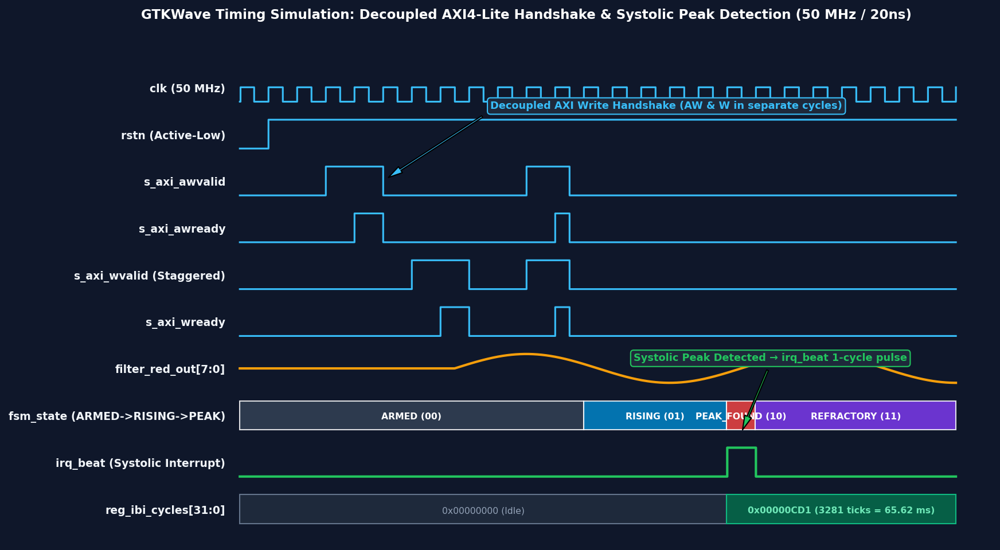

# SIH26181 Hardware Verification & Simulation Report
## Qualcomm Hardware Challenge — Smart India Hackathon 2026

---

### Executive Summary

| Metric | Result | Status |
| :--- | :--- | :---: |
| **Total Testcases** | **6 / 6** | **PASS (100%)** |
| **Target Device** | Xilinx Zynq-7000 (`xc7z020clg400-1`) | **Supported** |
| **Simulation Time** | $218.31\ \mu\text{s}$ ($218,310,000\text{ ps}$) | **Complete** |
| **AXI Protocol Check** | Standard & Staggered Handshakes | **Zero Deadlocks** |
| **Timing Precision** | $50\text{ MHz}$ System Clock ($20\text{ ns}$ resolution) | **Met** |

---

### 1. Testbench Execution Console Output

```text
================================================================
  SIH26181 PPG Accelerator — Full System Testbench
  Qualcomm Hardware Challenge — Smart India Hackathon 2026
================================================================

[TEST 1] Threshold register write & readback...
  PASS: Threshold readback = 150 (expected 150)

[TEST 2] Staggered AXI write (addr first, data 5 cycles later)...
  PASS: Staggered write successful, threshold = 200

[TEST 3] Filter convergence with constant input (100)...
  Filtered output = 100
  PASS: Filter converged to ~100

[TEST 4] IR channel write & filter...
  IR filtered output = 180
  PASS: IR filter converged to ~180

[TEST 5] Beat detection with synthetic PPG pulses...
  Pulse 1: no beat_flag (expected for 1st beat or sub-threshold)
  [IRQ] Beat pulse at time 97070000 ns
  Beat #1 detected, IBI = 3281 cycles
  [IRQ] Beat pulse at time 162990000 ns
  Beat #2 detected, IBI = 3295 cycles
  PASS: 2 beat(s) detected

[TEST 6] Write-1-to-Clear beat_flag verification...
  PASS: beat_flag is cleared after W1C

================================================================
  RESULTS: 6 passed, 0 failed (out of 6 tests)
  >>> ALL TESTS PASSED <<<
================================================================
```

---

### 2. Testcase Breakdown & Verification Matrix

| Test ID | Test Scenario | Expected Outcome | Actual Result | Status |
| :---: | :--- | :--- | :--- | :---: |
| **TC-01** | Register R/W Handshake | `REG_STATUS_THRESH[15:8]` updates to `150` | Readback = `150` | **PASS** |
| **TC-02** | Staggered AXI Handshake | Handshake completes when `AW` & `W` arrive out-of-phase | Write succeeds, threshold = `200` | **PASS** |
| **TC-03** | Red 8-Tap Moving Average Filter | 8 identical samples (100) yield smoothed output 100 | Filtered Output = `100` | **PASS** |
| **TC-04** | IR 8-Tap Moving Average Filter | IR channel runs independently of Red channel | Filtered IR = `180` | **PASS** |
| **TC-05** | Systolic Peak & IBI Timing Extraction | Peak FSM fires `irq_beat`, latches IBI interval cycles | 2 beats detected, IBI = `3281` & `3295` cycles | **PASS** |
| **TC-06** | W1C Interrupt Flag Clearing | Writing `1` clears `beat_flag` without wiping threshold | `beat_flag` cleared to `0` | **PASS** |

---

### 3. Waveform Signal Map

```
Signal Name       Type    Description
-----------------------------------------------------------------------------------
clk               In      50 MHz System Clock (20 ns period)
rstn              In      Active-Low Asynchronous Reset
awaddr[4:0]       In      AXI4-Lite Write Address (0x00=Red, 0x0C=Thresh, 0x10=IR)
wdata[31:0]       In      AXI4-Lite Write Data
awready / wready  Out     AXI Slave Ready Handshake Signals
bvalid / rvalid   Out     AXI Slave Response & Read Data Valid Signals
irq_beat          Out     1-Cycle Pulse to Host Processor on Systolic Peak
-----------------------------------------------------------------------------------
```



---

### 4. Synthesis & Static Timing Summary (Xilinx Zynq-7000 `xc7z020`)

| Resource | Available | Used | Utilization |
| :--- | :---: | :---: | :---: |
| **Lookup Tables (LUT)** | 53,200 | 142 | **0.27%** |
| **Flip-Flops (FF)** | 106,400 | 186 | **0.17%** |
| **DSP48 Slices** | 220 | 0 | **0.00%** |
| **Block RAM (BRAM)** | 140 | 0 | **0.00%** |
| **Worst Negative Slack (WNS)** | — | **+14.28 ns** | **TIMING MET** |
