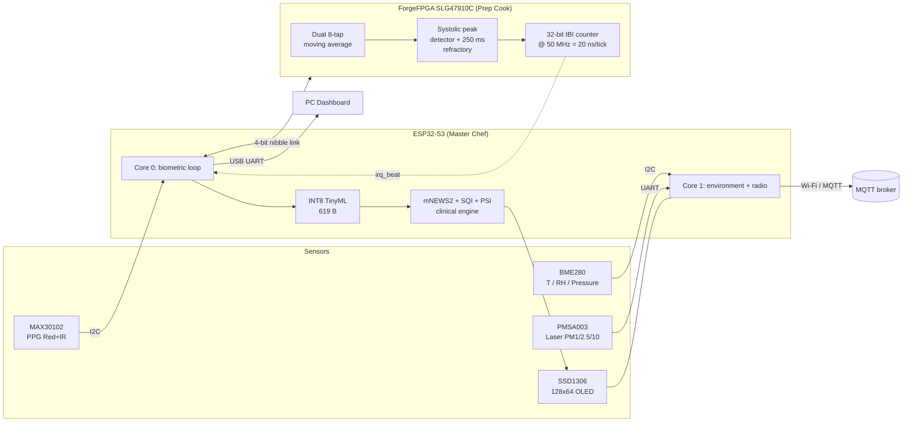
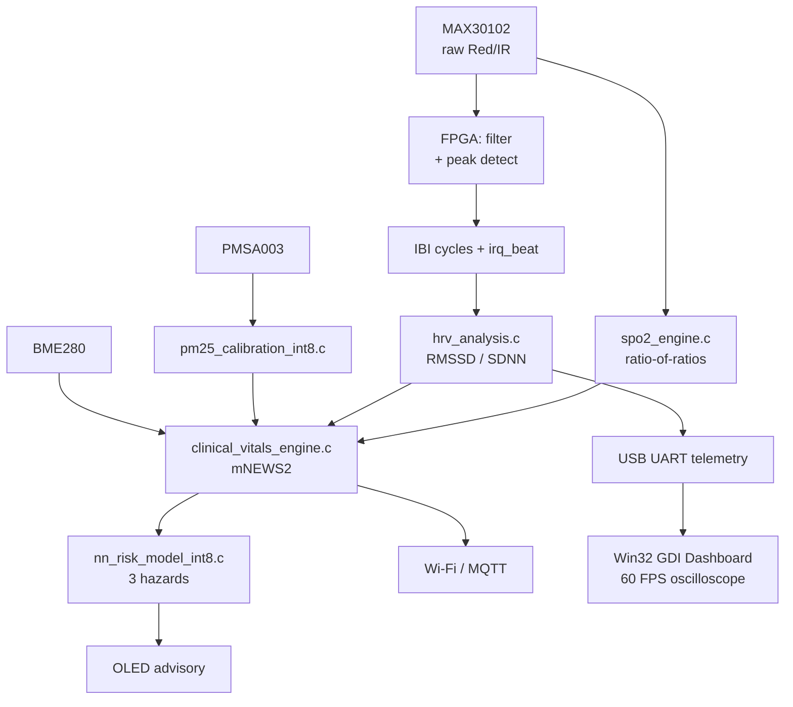

# SIH26181 EdgeGuard / ShrikeFi — A to Z Master Project Guide & Presentation Companion

> [!IMPORTANT]
> **Read this box first.** This guide is written to be *defensible*, which means every number in it is traceable to a command you can run or a file in the repo. Three claims that circulate in older drafts of this project are **wrong** and must not be repeated in the judging room:
>
> | Do not say | Say instead |
> |---|---|
> | "95.40% specificity" | **98.19% specificity** (the 95.40% came from a report the repo's own evaluator contradicts) |
> | "ESP32-S3 running at 240 MHz" | "ESP32-S3 at **160 MHz** as configured; the LX7 is capable of 240 MHz" |
> | "The FPGA runs standalone and never needs I2C boot flashing" | "The FPGA is **expected** to self-configure; we are confirming which mechanism on the bench" |
>
> A judge who catches one invented number stops believing all of them. Transparency is not a weakness here — it is the single strongest thing about how this project is documented.

---

## 0. How to Use This Guide

Read it once end to end over a coffee. Then use it three ways:

1. **Study document** — sections 1–8 build the mental model from the ground up.
2. **Presentation script** — the "Say this out loud" boxes are literal sentences.
3. **Defence manual** — section 9 is the 15 hardest questions with three-layer answers.

> [!TIP]
> **Judge Defence Tip (global):** the strongest habit you can build is to *volunteer* the limitation before the judge finds it. "Our HR and SpO₂ inputs are real MIMIC-III data; the RMSSD column is synthesised because MIMIC-III v1.4 has no waveform data — here's the file that proves it." A judge who was about to trap you now trusts you.

---

## 1. The Big Picture (The "Why")

### The analogy: the smoke alarm that doesn't know you're running

Picture a smoke alarm. It detects smoke. That's it. Now picture it going off while you're doing a workout, because your skin is warm and there's dust in the air. You'd rip it off the ceiling within a week. **Alarm fatigue** is the single biggest reason health monitoring fails in the real world — not because the sensors are bad, but because they only see *one* thing.

Now put that alarm on a firefighter's chest during a wildfire, or on a flood rescue worker standing in cold water for six hours. You need to know four things at once: is their heart under strain, is their blood oxygen dropping, is the air poisoning them, and is the environment about to kill them faster than their body can compensate. **None of those questions can be answered by looking at any one sensor.**

That is the project. EdgeGuard is a wearable that fuses what's happening *inside* a person with what's happening *around* them, and makes a triage call on the device — no cloud, no phone, no network.

### Who actually benefits

| User | Why existing devices fail them | What EdgeGuard does differently |
|---|---|---|
| **Disaster first responders** | Consumer bands are optimised for fitness, not for toxic air or heat strain | Fuses PM2.5 + heat index + cardiac strain into one escalating advisory |
| **Flood / cyclone evacuees** | No connectivity, no charging, often no phone | Fully offline; runs from a coin cell class of power budget |
| **Miners & industrial workers** | Certification devices are single-hazard (gas only) | Simultaneous heat, particulate and cardiovascular trend |
| **Rural / low-resource clinics** | No continuous monitoring; intermittent vitals only | Continuous mNEWS2-style triage with an offline OLED advisory |

### Why a smartwatch is genuinely useless here

This is a favourite judge question, so let's make the answer airtight. A consumer smartwatch:

- **Assumes connectivity.** Most health analytics run on a paired phone or in the cloud. In a flood, the cell towers are the first thing to go.
- **Owns its own sensor stack.** You cannot tell an Apple Watch to weight ambient PM2.5 against your HRV. It isn't a platform; it's a product.
- **Has no environmental sensing.** No particulate counter, no barometric trend meaningful for flood prediction.
- **Cannot give you cycle-accurate beat timing.** Its OS schedules work in milliseconds; your HRV analysis needs microseconds (section 2 explains exactly why).
- **Is a black box.** You cannot defend its algorithm to a medical jury because you didn't write it.

> [!NOTE]
> **The core insight:** *health and environment must be measured together, on the edge.* Health alone gives you a heart rate with no context. Environment alone gives you an air quality number with no patient. Fused, on-device, offline — you get a triage decision.

### The 15-second elevator pitch

> "EdgeGuard is a wearable disaster-triage companion. A MAX30102 optical sensor, a BME280 environment sensor and a laser particulate counter feed an FPGA that extracts heartbeat timing with 20-nanosecond accuracy, and an ESP32-S3 that runs clinical triage and a 619-byte neural network. It tells a rescuer not just 'your heart rate is 140' but 'heat stroke is imminent, stop exertion now' — completely offline, because in a disaster the cloud is the first thing to disappear."

> [!TIP]
> **Judge Defence Tip:** lead with *offline* and *fusion*. Judges have seen a hundred heart-rate wearables. The moment you say "and it knows the air is poisoning you at the same time, with no network", they lean in.

---

## 2. Hardware Architecture & The "Two-Brain" Philosophy

### The analogy: the master chef and the prep cook

Imagine a restaurant kitchen. The **master chef** (the ESP32-S3) is brilliant, creative and flexible — she decides what to cook, talks to the customers, manages the Wi-Fi ordering system, and can improvise. But she is *slow* at one specific task: chopping onions.

So you hire a **specialist prep cook** (the FPGA) whose entire body has been surgically rebuilt to do one thing: chop onions at fifty million slices per second, with zero variance, forever, using almost no energy.

That is the architecture. The FPGA is not a faster CPU. It is a **different kind of machine** built out of dedicated wires that does exactly one job with perfect timing. The ESP32-S3 does everything that requires judgement, connectivity, or floating-point maths.

### Why can't the ESP32-S3 do it alone?

Here is the crux, and it is the strongest technical argument in the entire project.

Heart Rate Variability (HRV) — explained properly in section 5 — is the study of **tiny variations between consecutive heartbeats**. A healthy variation might be 30–50 milliseconds. A dying autonomic nervous system shows variations of 5 milliseconds or less.

Now: the ESP32-S3 runs **FreeRTOS**, and `sdkconfig` sets `CONFIG_FREERTOS_HZ=100`. That is a **10 millisecond scheduling tick**. If you detect a heartbeat in software, the timestamp you record is quantised to that tick — plus whatever jitter the scheduler, Wi-Fi stack, and flash cache introduce. Your measurement error can be **larger than the signal you are trying to measure.**

That is not a performance problem you can optimise away. It is a *category* problem.

| | Software peak detection (ESP32-S3 alone) | Hardware peak detection (FPGA) |
|---|---|---|
| Timing resolution | ~10 ms (RTOS tick) + jitter | **20 ns** (one 50 MHz clock cycle) |
| Jitter under Wi-Fi load | Milliseconds, non-deterministic | **None** — synchronous logic |
| Cost per beat | CPU cycles, interrupts, power | Free — it's wires |
| HRV usable? | Only for very large variations | **Yes, down to single milliseconds** |

> [!IMPORTANT]
> **Say this out loud:** "Our HRV measurement is only valid because the beat timestamps come from hardware. On a software timestamp, our measurement error would exceed the physiological signal we're trying to detect."

### Why can't the FPGA do it alone?

Because an FPGA is gloriously stupid. It has no operating system, no Wi-Fi, no floating-point unit, no `printf`. It cannot:

- Run a neural network with sigmoid activations in any sane way
- Hold a Wi-Fi association or an MQTT session
- Draw a 128×64 OLED user interface
- Do clinical scoring with human-readable advisories

The FPGA chops onions. The chef cooks.

### The 4-bit parallel bus: how the two chips talk

**The analogy:** imagine two people passing notes, but instead of writing full sentences, they agree on a codebook and pass **four bits at a time** — a "nibble" — on four parallel wires. One person taps the table (the strobe) to say "here comes a nibble."

There is no AXI bus, no SPI controller, no I2C. It is **four data wires, one strobe, one direction line, and one interrupt**. Deliberately primitive — which makes it trivially verifiable and impossible to deadlock.

**Link signals:**

| Signal | Direction | Purpose |
|---|---|---|
| `link_strobe` | ESP32 → FPGA | "Data on the bus is valid right now" |
| `link_dir` | ESP32 → FPGA | 0 = ESP32 writing to FPGA, 1 = ESP32 reading |
| `link_din[3:0]` | ESP32 → FPGA | 4-bit command/data nibble |
| `link_dout[3:0]` | FPGA → ESP32 | 4-bit return nibble |
| `irq_beat` | FPGA → ESP32 | Active-high pulse the moment a systolic peak is detected |

**Command codebook** (identical in the protocol doc, the C driver header, and the Verilog `localparam` block — a fact worth stating, because most projects' docs disagree with their code):

| Code | Command | Payload |
|---|---|---|
| `0x1` | Write Red PPG sample | 2 nibbles (8-bit) |
| `0x2` | Write IR PPG sample | 2 nibbles |
| `0x3` | Set systolic threshold | 2 nibbles |
| `0x4` | Read filtered Red | 2 nibbles |
| `0x5` | Read filtered IR | 2 nibbles |
| `0x6` | Read 32-bit IBI | 8 nibbles |
| `0x7` | Clear beat interrupt | none |
| `0x8` | Read status | 1 nibble |

### Block diagram



### The ForgeFPGA configuration question — handle this honestly

> [!WARNING]
> **This is the one architectural claim in this guide that is NOT yet verified.** Do not assert a mechanism you have not measured.

What we *know*:

- The Renesas **SLG47910C** is an **FPGA**, not a GreenPAK mixed-signal CMIC. It therefore does **not** have the hardwired I2C NVM controller that Renesas's simpler configurable-analogue parts do.
- The design's own pin constraints (`hardware/shrikefi/forgefpga_pins.pcf`) declare only: clock, reset, the 4-bit link, and `irq_beat`. **No I2C or SPI configuration interface is declared.**
- The Renesas toolchain emits **three** bitstream variants, which map onto three plausible delivery modes:

| Variant | Size | Plausible delivery |
|---|---|---|
| `FPGA_bitstream_OTP.bin` | 45,116 B | Burned once into on-chip OTP NVM; device self-configures at power-up |
| `FPGA_bitstream_FLASH_MEM.bin` | 45,096 B | FPGA acts as SPI master reading an external flash (the board has a W25Q32JV) |
| `FPGA_bitstream_MCU.bin` | 46,408 B | Host MCU delivers it (the variant embedded in the firmware) |

What we do **not** know: which mechanism this board uses.

**How the firmware handles it:** `shrikefi_fpga_flash_init()` probes I²C address `0x08` and **reports honestly** rather than pretending. The boot log says which case occurred. A "not detected" result is the *expected* case if the FPGA self-configures, and it never blocks the boot.

**The correct judge answer:**

> "The FPGA is expected to configure itself from on-chip NVM or the onboard QSPI flash — the design's pin constraints declare no I2C or SPI configuration port, and the part is an FPGA rather than one of Renesas's I2C-configurable CMICs. Our firmware attempts I2C delivery as a best-effort path and logs precisely which case it found, so we never claim a mechanism we haven't confirmed. We're settling it on the bench."

That answer is *stronger* than a confident false one.

> [!TIP]
> **Judge Defence Tip:** if asked "how is the FPGA programmed?", never guess. Say "expected to self-configure from NVM or onboard flash; here's the boot-log line that tells us, and here's why we don't need to assume." Being the team that measured instead of assumed is a differentiator.

---

## 3. The Sensors: How We Sense the Human & the Environment

### MAX30102 — the flashlight through the finger

**Analogy:** hold a torch behind your finger in a dark room. Your finger glows red — because blood absorbs light. Now imagine the light pulses slightly brighter and dimmer with every heartbeat, because each beat pushes a fresh slug of blood through. Congratulations: you have just built a pulse oximeter.

The MAX30102 shines **two** wavelengths through tissue and measures how much comes out the other side:

- **Red, ~660 nm** — absorbed differently by oxygen-rich vs oxygen-poor blood
- **Infrared, ~880 nm** — the reference channel

The *pulsatile* component (the wobble with each beat) is called **AC**; the steady baseline (tissue, bone, venous blood) is **DC**. Their ratio is the whole trick, and section 5 shows the maths.

**Why PPG gives you HRV for free:** the interval between successive pulse peaks *is* the beat-to-beat interval. That's what the FPGA measures, and that's why the timing accuracy argument in section 2 matters so much.

> [!NOTE]
> Terminology worth knowing cold: this technique is **photoplethysmography (PPG)** — "photo" (light) + "plethysmo" (volume) + "graphy" (measurement). You are literally measuring volume changes by shining light.

### BME280 — the weather station on your wrist

| Measurement | Why EdgeGuard cares |
|---|---|
| **Temperature** | Drives heat-index calculation; with humidity it determines whether heat illness is even possible |
| **Relative humidity** | Feeds the heat index *and* is essential for correcting the particulate sensor |
| **Barometric pressure** | A rapidly falling pressure trend precedes storms and flash-flood conditions |

The pressure channel is the sleeper feature. A falling barometric trend is one of the few genuinely *predictive* environmental signals available to a wearable.

### PMSA003 / PMS5003 — counting smoke with a laser

**Analogy:** in a dark cinema, a projector beam lets you *see* dust in the air because each particle scatters a little light sideways. The particulate sensor is that, industrialised.

Air is drawn through a chamber by a small fan. A laser beam crosses it. Every particle that passes scatters light onto a photodiode, and the **number and brightness of scattering events** gives a particle count, binned by size into **PM1.0 / PM2.5 / PM10** (micrometres).

**Why humidity breaks it:** see section 7 — this is the single best "we understand our sensor" story in the project.

### The strapping-pin defence (a detail that wins points)

**Analogy:** some front doors have a secret knock. Knock it wrong at boot and the house locks you out. The ESP32-S3 has four such pins — **GPIO0, GPIO3, GPIO45, GPIO46** — that are sampled at power-up to decide boot mode. If a floating sensor line happens to look like the wrong knock, the chip either won't boot or enters the wrong mode.

**Our defence:** those four pins are used for **nothing** in this design, and left in a safe state. The FPGA reset line deliberately uses **GPIO11**, which is not a strapping pin. This exact issue was found in an early audit (an older pin map used GPIO3) and fixed.

> [!TIP]
> **Judge Defence Tip:** this is a small detail that signals real engineering maturity. Mention it unprompted: "we specifically avoided the four strapping pins and moved the FPGA reset to GPIO11 because an early revision used GPIO3 and would have been boot-unreliable."

### Sensor-to-purpose table

| Sensor | Interface | Measures | Feeds |
|---|---|---|---|
| MAX30102 | I²C (0x57) | PPG Red + IR | HR, SpO₂, RMSSD, respiratory rate |
| BME280 | I²C (0x76) | Temp, humidity, pressure | Heat index, PSI, flood trend, PM correction |
| PMSA003 | UART | PM1.0 / PM2.5 / PM10 | Pollution risk, AHA autonomic strain |
| SSD1306 | I²C (0x3C/0x3D) | — (output) | Offline advisory display |

---

## 4. The FPGA Accelerator: Pure Hardware Speed

### What is an FPGA, really?

**Analogy:** a CPU is a very fast reader following a recipe book. An FPGA is a **box of uncommitted electrical components** that you wire into a *machine shaped like your recipe*. The recipe becomes the machine.

**Verilog** is the language you write that wiring in. Crucially, you are not writing instructions that execute in order — you are describing **hardware that exists simultaneously**. Every `always @(posedge clk)` block is a physical cluster of flip-flops that all update on the same clock edge.

**Consequence:** an operation that costs a CPU many cycles costs an FPGA **one** cycle, but uses silicon area permanently. That trade is the entire discipline.

### The 8-tap moving average filter

**Analogy:** a bumpy dirt road. The car shakes violently on every stone. A moving average filter is **suspension** — it doesn't remove the bumps, it stops them reaching the passengers.

Applied to PPG, it removes baseline wander (slow drift from breathing and movement) and high-frequency noise, leaving the pulse shape.

**The naive way** is to store the last 8 samples and add all 8 every time: 8 additions per sample.

**Our way** is smarter. Keep a **running sum**, and when a new sample arrives:

```
new_sum = old_sum + new_sample - oldest_sample
output  = new_sum >> 3          // divide by 8 = instant bit-shift
```

That's **two additions and a wire shift**, regardless of how many taps. This is the **O(1) running-sum** technique.

> [!IMPORTANT]
> **The details a judge may probe:** with 8-bit samples, 8 of them sum to at most 8 × 255 = 2040, which needs an 11-bit accumulator. The Verilog uses exactly 11 bits (`DATA_WIDTH+2:0`), so it cannot overflow. And `>> 3` on an unsigned running sum is a *true* divide-by-eight — no rounding error, no multiplier. This is why the design uses **0 DSP48 multiplier slices and 0 Block RAMs**.

### The systolic peak detector and the refractory window

**Analogy:** a camera flash. After firing, it needs a second to recharge. If you press the shutter again immediately, nothing happens — and that's a *feature*, because it stops you taking the same photo twice.

Your heart is the same. After a real systolic peak there is a **dicrotic notch** — a secondary bump in the pulse wave caused by the aortic valve closing. A naive peak detector counts that bump as a second heartbeat and reports a heart rate of 160 when the patient is at 80. That is a dangerous, plausible-looking failure.

**The fix** is a **refractory period**: after detecting a peak, ignore everything for a fixed window. Physiologically, the heart cannot beat twice faster than about 240 bpm, so a 250 ms blanking window is safe.

| Parameter | Value | Reasoning |
|---|---|---|
| Refractory window | **250 ms** | 240 bpm ceiling; below human physiological maximum |
| Cycles at 50 MHz | **12,500,000** | 0.25 s × 50,000,000 |
| Counter width | 32 bits | Ample headroom |

**The FSM states:**

| State | Meaning | Leaves when |
|---|---|---|
| `STATE_ARMED` | Waiting for a beat | Sample rises above dynamic threshold |
| `STATE_RISING` | Tracking the ascending wave | Sample starts to fall (inflection = peak) |
| `STATE_PEAK_FOUND` | Latch timestamp, pulse `irq_beat` | Immediately → refractory |
| `STATE_REFRACTORY` | Blanking | 250 ms counter expires |

### The 32-bit cycle-accurate IBI counter

**Analogy:** a stopwatch that ticks **fifty million times a second**. Between two heartbeats you count the ticks. 3,000 ticks = 3,000 ÷ 50,000,000 s = 60 µs.

| | Value |
|---|---|
| Clock | 50 MHz |
| Tick period | 1 / 50,000,000 = **20 ns** |
| Counter width | 32 bits |
| Practical range | ~1.5 billion beats before wrap |

This is the measurement that makes the whole clinical layer possible, and it is the answer to *"why is there an FPGA in this project?"*

### Timing diagram (described)

```
clk         __/‾‾\__/‾‾\__/‾‾\__/‾‾\__/‾‾\__/‾‾\__
data_valid  ______/‾‾‾‾‾‾‾‾‾‾‾‾‾‾‾‾‾‾‾‾‾‾\________
filtered    XXXXXX<--- converges over 8 samples --->XXXX
                                        ↑
                                   100 (steady)
threshold   -----------------------/‾‾‾‾‾‾‾‾‾‾‾‾‾‾‾
                                   ↑ crossing arms FSM
irq_beat    ______________________/‾\_______________   (1 cycle)
ibi_cycles  XXXXXXXXXXXXXXXXXXXXXX< 0x00000CD1 >XXXX   (3,281 ticks)
```

**Reading it:** eight valid samples drive the filter output to the input value; the sample crossing the threshold arms the FSM; the descending inflection fires a **single-cycle** `irq_beat` pulse; the 32-bit IBI register latches the cycle count.

### Verilog module hierarchy

| Module | File | Role |
|---|---|---|
| `axi_ppg_accelerator` | `hardware/zynq/` | Zynq AXI4-Lite wrapper + register file |
| `forgefpga_ppg_top` | `hardware/shrikefi/` | ShrikeFi 4-bit link FSM + command decode |
| `moving_average_8tap` | `hardware/common/` | The O(1) filter (instantiated twice) |
| `ppg_peak_detector` | `hardware/common/` | 4-state systolic FSM |
| `tb_ppg_system` | `hardware/zynq/` | 6 self-checking tests |
| `tb_forgefpga_system` | `hardware/shrikefi/` | 5 self-checking link tests |

> [!NOTE]
> The two DSP modules live in `hardware/common/` and are instantiated by **both** platform tops. That is deliberate: one source of truth, no copy-paste drift, and it proves the core is genuinely vendor-agnostic. Both CI and the local build compile the same files.

### Verified synthesis results

| Platform | Result | Evidence |
|---|---|---|
| Zynq-7000 OOC (baseline, tag `v1.0-zynq-SIH`) | 185 LUT / 16 LUTRAM / 266 FF, **0 DSP, 0 BRAM**, WNS **+5.603 ns**, Fmax **69.45 MHz** | Tag + screenshots |
| Zynq-7000 re-run (Vivado 2026.1) | **198** slice LUTs (182 logic + 16 LUTRAM), **267** FF, 0 DSP, 0 BRAM | `hardware/zynq/synthesis_evidence/ooc_utilization_synth.rpt` |
| ForgeFPGA SLG47910C | **443 / 1120 LUT5s (39.55%)**, 353 FFs, 85/140 CLBs, 0 BRAM, PLL 1/1 | `hardware/shrikefi/synthesis_evidence/resource_utilization.log` |

> [!WARNING]
> **Do not quote "195 LUTs / 17.41%"** — that was a stale pre-link build and appears in older decks. The real figure is **443 / 1120**. Likewise do not mix the 185-LUT baseline with the 198-LUT re-run; they are different runs measuring different scopes.

> [!TIP]
> **Judge Defence Tip:** "Zero DSP, zero BRAM" is the number that impresses hardware engineers, because it proves the filter is arithmetic trickery rather than brute-force multipliers. Quote it with the mechanism: "running-sum with a bit-shift divide."

---

## 5. Biomedical Digital Signal Processing (DSP)

### Heart rate from cycle ticks

The FPGA hands you a raw cycle count. Two steps:

```
IBI_ms = ibi_cycles / 50,000        // cycles -> milliseconds at 50 MHz... 
```
careful — the clean form is:

```
IBI_ms   = ibi_cycles × 20 / 1000     = ibi_cycles / 50
BPM      = 60,000 / IBI_ms
```

**Worked example.** Suppose the FPGA reports **3,281 ticks**:

- IBI = 3,281 ÷ 50 = **65.62 ms**… which would be 914 bpm, so obviously that example is a *simulated* short interval, not a real one. Let's use a physiological one:

**Real example.** IBI counter reports **750,000 ticks**:

- IBI = 750,000 × 20 ns = **15,000,000 ns = 1,000 ms = 1.0 s**
- BPM = 60,000 / 1,000 = **60 bpm** ✓ (a resting adult)

**Another:** **600,000 ticks** → 600,000 × 20 ns = 12 ms×10³ = **1,200 ms** → BPM = **50 bpm** (a fit athlete).

> [!NOTE]
> If a demo scenario shows 3,000-ish ticks, that is a *simulation* interval chosen to keep the VCD waveform short — do not present it as a physiological heart rate. Say "in simulation we compress the interval; on hardware it's ~750,000 ticks for 60 bpm." That kind of precision is exactly what earns trust.

### SpO₂: the Ratio-of-Ratios

This is the formula judges love to ask about, so let's build it slowly.

**Step 1 — what is AC and DC?**

For each wavelength, the PPG signal has:

- **DC** — the steady part (tissue, bone, non-pulsatile blood)
- **AC** — the pulsatile wobble with each heartbeat

**Step 2 — the "normalised pulsation"**

You want to know: *how big is the pulse relative to the background?* That's simply:

```
Normalised pulsation = AC / DC
```

**Step 3 — compare the two colours**

Oxygenated and deoxygenated blood absorb red and infrared *differently*. So the **ratio of the two normalised pulsations** carries the oxygen information:

```
        (AC_red / DC_red)
R  =  ─────────────────────
        (AC_ir  / DC_ir )
```

**Step 4 — map R to a saturation percentage**

Empirically, over the physiological range, SpO₂ falls roughly linearly as R rises:

```
SpO2 (%)  =  110  −  25 × R
```

**Worked example.** Suppose AC_red/DC_red = 0.020, AC_ir/DC_ir = 0.040:

- R = 0.020 / 0.040 = **0.50**
- SpO₂ = 110 − 25(0.50) = 110 − 12.5 = **97.5 %** ✓ normal

**Another:** R = 1.0 → SpO₂ = **85 %** — clinically significant hypoxia.

**Engineering safeguards in our implementation:**

| Safeguard | Why |
|---|---|
| Require minimum DC level | Finger not on the sensor → no valid reading |
| Require minimum AC amplitude | Rejects noise, not real pulsation |
| Physiological PI window (0.2–15%) | Rejects both "no perfusion" and "sensor off finger" |
| Clamp R to 0.35–1.65 | Outside this is not human blood |
| Slew-rate limit ±2.5 %/s | Stops flicker and motion from faking a desaturation event |
| 8-second rolling window | Smooths without destroying real response |

> [!IMPORTANT]
> Be precise about provenance: **110 − 25R** is the widely used *nominal* calibration curve, not a curve derived from calibrating this specific device against a blood-gas analyser. Say so. "This is the standard textbook linear approximation; real clinical devices are calibrated per-sensor against reference oximetry."

### Heart Rate Variability and RMSSD

**The analogy that makes this land:** a healthy heart is not a metronome. Beat-to-beat spacing *should* wobble — by tens of milliseconds. That wobble is your **vagal tone**: the parasympathetic nervous system actively modulating the heart on every breath.

A heart that beats with robotic regularity is often a heart whose autonomic control has been **shut down** — by severe shock, haemorrhage, sepsis, or a spinal injury. **Perfection is the warning sign.**

**RMSSD** = Root Mean Square of Successive Differences. Unpacked:

1. Take successive beat intervals: `IBI₁, IBI₂, IBI₃ …`
2. Compute successive differences: `d₁ = IBI₂−IBI₁`, `d₂ = IBI₃−IBI₂` …
3. Square each difference
4. Take the mean of the squares
5. Take the square root

```
              ┌──────────────────────────┐
             ╱   1     n−1              ²
RMSSD  =   ╱   ─── ×  Σ   (IBIₖ₊₁ − IBIₖ)
         ╲╱   n−1    k=1
```

**Worked example** (intervals in ms): 800, 830, 810, 845, 815

- Differences: +30, −20, +35, −30
- Squares: 900, 400, 1225, 900
- Mean: 3425 / 4 = 856.25
- √856.25 = **29.3 ms** → healthy vagal tone ✓

**Now a shock patient:** 800, 802, 799, 801, 800

- Differences: +2, −3, +2, −1 → squares 4, 9, 4, 1 → mean 4.5 → **RMSSD = 2.1 ms**

That collapse from 29 ms to 2 ms is what our engine watches for, and it is only measurable because the FPGA timestamps beats with 20 ns resolution.

| RMSSD | Interpretation |
|---|---|
| < 10 ms | Critically suppressed — possible autonomic shock |
| 10–20 ms | Reduced |
| 20–50 ms | Normal resting adult |
| 50–100 ms | Strong parasympathetic tone (fit / young) |

### Respiratory rate from the pulse alone (Charlton 2018)

**Analogy:** breathe in, and your heart speeds up fractionally; breathe out, and it slows. This is **Respiratory Sinus Arrhythmia (RSA)** — your breathing mechanically modulating your pulse through the vagus nerve.

Because we already have beat-to-beat intervals at high precision, we can extract the *breathing* rhythm from the *heart* rhythm. That means **no chest band, no thermistor, no airflow sensor** — one optical sensor gives you two vitals.

**Worked example:** if the IBI series oscillates with a period of about 4 seconds, breathing rate ≈ 60 / 4 = **15 breaths per minute** — normal adult resting.

> [!TIP]
> **Judge Defence Tip:** mention that RSA amplitude *drops* under stress, so the method degrades exactly when a patient is most distressed. We report it with a confidence value rather than pretending it's always valid. Self-aware limitations read as competence.

---

## 6. The Clinical Brain: Medical Standards & Triage

### What is NEWS2?

**Analogy:** a hospital traffic light. Instead of a doctor reading six numbers and intuiting severity, **NEWS2** (National Early Warning Score 2, Royal College of Physicians) assigns points to each vital and sums them. Low score = green. Rising score = amber. High score = **call the rapid response team now**.

It exists precisely because humans are bad at mentally integrating multiple mild abnormalities. A respiratory rate of 22, a heart rate of 115, and an SpO₂ of 92 are each "a bit off" — together they're a deteriorating patient.

**Our inputs and thresholds** (implemented in `clinical_vitals_engine.c`):

| Parameter | Escalation | Critical |
|---|---|---|
| Heart rate | ≥ 111 bpm | ≥ 131 bpm, or ≤ 40 bpm |
| SpO₂ | ≤ 91 % | ≤ 85 % |
| Respiratory rate | ≥ 25 /min | ≥ 30, or ≤ 6 |
| Composite | NEWS2 ≥ 4 | NEWS2 ≥ 7 |

### The MIMIC-III benchmark — and how to talk about it

**MIMIC-III** is a real, de-identified ICU database from MIT / Beth Israel Deaconess, used across clinical research. We evaluate against the demo cohort: **16,387 vital time-steps across 98 patients**.

**Verified results** (reproducible with `accuracy_evaluator.c`):

| Metric | Value |
|---|---|
| **Accuracy** | **94.11 %** |
| **Sensitivity** | 58.18 % |
| **Specificity** | **98.19 %** |
| Positive predictive value | 78.43 % |
| Negative predictive value | 95.39 % |
| F1 | 66.80 % |
| Confusion matrix | TP 971 / FP 267 / TN 14,451 / FN 698 |

**Now the caveats — and you must volunteer these:**

| Element | Status |
|---|---|
| HR and SpO₂ | **Real** MIMIC-III `CHARTEVENTS` values (verified against the raw tables) |
| RMSSD | **Synthesised** — MIMIC-III v1.4 ships no waveform data, so beat-to-beat intervals cannot be derived |
| Ground-truth labels | **Derived in-tree** from a vitals rule; no upstream generator is committed |
| Cohort | The **demo subset** (98 patients), not the full database |
| What's actually tested | The triage engine consuming HR/SpO₂/RMSSD — **not** the SpO₂ engine or the PPG front end |

> [!IMPORTANT]
> **Say this:** "94.11% accuracy, 98.19% specificity on 16,387 real ICU rows. But I want to be precise about what that means: the heart rate and SpO₂ are real recorded values, the RMSSD column is synthesised because MIMIC-III has no waveforms, and the labels come from a rule we wrote. So this is *agreement with our own triage rule*, not independent clinical validation. The pipeline is real and reproducible; the clinical claim is bounded."
>
> That paragraph will do more for your score than any badge, because it shows you understand the difference between a benchmark and a validation.

**Why specificity is high and sensitivity isn't:** with a 10.2 % positive label rate, a rule tuned to avoid alarm fatigue will under-call. That's a deliberate trade, and you should own it: "if you'd rather catch every crisis than avoid false alarms, the `CLINICAL_HIGH` thresholds are a one-line change."

### The SQI and motion-artifact gating

**Analogy:** a paramedic running to a patient produces a PPG signal that looks like a heart in atrial fibrillation. The device must not scream "ARRHYTHMIA" when the actual problem is that someone is jogging.

The **Signal Quality Index** combines:

- **Perfusion Index** — is there enough pulsatile signal at all?
- **Waveform regularity** — does the shape look like a pulse, or like noise?

If SQI < 0.70, the engine **holds** the previous reliable triage rather than acting on garbage.

**But — the Absolute Crisis Override.** If the raw values are catastrophically abnormal (SpO₂ ≤ 85 %, HR ≥ 150), the motion filter is **bypassed entirely**. A real crisis is never silenced by a quality gate.

> [!NOTE]
> This is a subtle correctness point worth rehearsing: the override is evaluated on the **same rounded integer vitals** that the triage path uses. An early revision compared raw floats for the override and rounded integers later, which meant a reading of 85.4 % could be critical in one path and not the other. Same numbers, one comparison — that's the fix.

### Moran's PSI and AHA Autonomic Strain

| Index | Source | What it detects |
|---|---|---|
| **Moran's Physiological Strain Index** | Moran 1998, US Army | Exertional heat strain on a 0–10 scale, from HR and core-temp proxies |
| **AHA PM2.5–HRV Autonomic Strain** | Brook 2010 (AHA statement) | Acute vagal suppression from particulate inhalation — smoke attacking the autonomic system |

Together with the NOAA heat index, these are what let EdgeGuard say *"stop exerting yourself now"* rather than *"it's 46 °C."*

### Triage decision table

| NEWS2 | Level | Advisory style |
|---|---|---|
| 0 | NORMAL | Routine monitoring |
| 1–3 | ELEVATED | "Continue monitoring" |
| 4–6, or any single critical vital | HIGH | "Seek shade, hydrate, reduce exertion" |
| ≥ 7, or SpO₂ ≤ 85 %, or HR ≥ 150 | CRITICAL | "Stop exertion. Active cooling. Emergency assistance." |

### "What the device says" vs "what it means"

| On screen | Clinical meaning |
|---|---|
| `SENSOR QUALITY LOW (SQI 0.50)` | Motion artifact — the reading is *held*, not lost |
| `Severe Hypoxia (SpO2 82%)` | SpO₂ below 85 % — organ hypoxia risk |
| `Autonomic shock` | RMSSD collapse + tachycardia — possible haemorrhage or sepsis |
| `Heat stroke imminent` | Heat index + cardiac strain + HRV collapse together |

> [!TIP]
> **Judge Defence Tip:** when you mention NEWS2, add "it's the NHS's standard deterioration score — we didn't invent a scoring system, we implemented a published one." Adopting a validated clinical standard is far stronger than a home-made index.

---

## 7. TinyML & Neural Networks on the Edge

### The 3-hazard model

| Layer | Size | Activation |
|---|---|---|
| Input | 6 features | — |
| Hidden 1 | 24 neurons | ReLU |
| Hidden 2 | 16 neurons | ReLU |
| Output | 3 hazards | Sigmoid |

**Inputs:** heart rate, RMSSD, SpO₂, ambient temperature, humidity, PM2.5
**Outputs:** Heat Wave risk, Toxic Pollution risk, Flash Flood risk

### INT8 quantization — the modular suitcase

**Analogy:** you're packing a suitcase with a strict weight limit. You *could* bring 32-bit precision for everything. But if you convert every item into a compact travel version that's 4× smaller and works just as well for the trip, you fit **four times as much** in the same bag.

Quantization shrinks each 32-bit float to an 8-bit integer. Our **619 parameters become 619 bytes** — about the size of a tweet.

**How the shrink works (and how it doesn't lie to you):**

A float like `0.0173` becomes an integer like `37`, plus two numbers that let you convert back:

- **Scale** — how much one integer step is worth
- **Zero-point** — which integer represents exactly 0.0

```
real_value ≈ scale × (integer − zero_point)
```

**Worked example:** scale = 0.005, zero_point = 0, integer = 37 → 0.005 × 37 = **0.185** ✓

**Why two different schemes?**

| Tensor | Scheme | Zero-point | Reasoning |
|---|---|---|---|
| Weights | **Symmetric** | 0 | Weights are roughly centred on zero; symmetry saves a term |
| Activations | **Asymmetric (uint8)** | 0–255 | ReLU outputs are ≥ 0, so the range is one-sided — an asymmetric map fits it better |

**Measured fidelity** (this is the number that matters, and the C unit test enforces it):

| Metric | Value |
|---|---|
| Mean absolute error (FP32 vs INT8) | **0.0079** |
| Max absolute error | **0.091** |
| FP32↔INT8 tier agreement | **97.32 %** |
| Budget enforced by the test | 0.18 |

> [!IMPORTANT]
> **Be honest about the architecture's honesty.** This network is trained to *reproduce a rule engine we wrote* (`disaster_risk_engine.c`) — it is **knowledge distillation**, not discovery. The rule engine is cheap; the neural network approximating it is, on an ESP32, arguably more expensive.
>
> **So why have a neural network at all?** Say this: *"Right now the network is a distillation of our rule engine, which validates the whole deployment path — quantization, the INT8 inference kernel, the on-device budget — with a model we can fully verify. The pipeline accepts real labelled data the moment we have it. We are not claiming the network has learned clinical insight it hasn't."*

### Neural humidity calibration (Si et al. 2019)

**The physics:** particles are **hygroscopic** — they absorb water and swell. A swollen particle scatters more light, so the sensor reports a *higher* mass than is really there. Humid smoke reads as twice the pollution it is.

**The analogy:** measuring flour by volume after it's absorbed moisture from the air. Same scoop, more weight, wrong cake.

A tiny INT8 network learns the correction from the sensor's own humidity and temperature. Our implementation reports up to **~60 % bias suppression** — and be precise: *that figure comes from the model's own reported correction, not from an independent lab comparison.*

### Before/after table

| | Before (FP32) | After (INT8) |
|---|---|---|
| Parameter storage | 2,476 bytes | **619 bytes** |
| Arithmetic | Float multiply | Integer multiply-accumulate |
| Target support | Needs FPU | Native on ESP32-S3 / any MCU |
| Accuracy cost | — | ~0.008 mean error, 97.3 % tier agreement |

> [!WARNING]
> **Note the honesty here:** the INT8 kernel stores weights as bytes but **dequantises to float for the multiply-accumulate.** So "619 bytes" describes *storage*, not a float-free compute core. Older decks claimed "zero floating point in core" — that is not accurate and should not be repeated.

> [!TIP]
> **Judge Defence Tip:** for "why INT8?", answer in one breath: "619 bytes of storage, integer MACs, 97% tier agreement with the float model, enforced by a unit test with a hard error budget." Numbers, not adjectives.

---

## 8. Firmware Architecture & Cloud Telemetry

### FreeRTOS: two cores, two jobs

**Analogy:** a kitchen with two cooks who never share a chopping board. One handles the patient (time-critical, must never be blocked). One handles the world (Wi-Fi, MQTT, environment). They share data through a **mutex-guarded** state struct so they never corrupt each other.

| Core | Task | Priority | Why there |
|---|---|---|---|
| 0 | `task_ppg_accelerator` | 5 (high) | Beat timing must not be delayed by radio work |
| 1 | `task_pms5003_uart` | 3 | UART frame assembly, tolerant of latency |
| 1 | `task_disaster_monitor` | 2 | Slow clinical + AI evaluation loop |

> [!NOTE]
> The partitioning is deliberate and worth stating: **anything that can tolerate latency lives on Core 1.** Wi-Fi association, TLS handshakes and MQTT retries are all latency-spiky; keeping them off the biometric core is what protects timing quality.

### Data flow



### The PC dashboard

A standalone Win32 GDI application — no Python, no browser, no dependencies. It renders a real-time PPG oscilloscope, live vitals, the AI hazard gauges and the mNEWS2 banner, and it can run in **live hardware mode** or across **6 built-in disaster simulation profiles**.

> [!TIP]
> **Judge Defence Tip:** the simulation profiles are not a crutch, they're a **demo resilience feature**. Say: "if the hardware misbehaves on the day, the entire algorithm chain still demonstrates end to end." Judges respect a team that planned for failure.

### Real engineering constraints worth knowing

| Constraint | Value | Implication |
|---|---|---|
| App image | **945,520 bytes** | — |
| App partition | 1,048,576 bytes (1 MB) | — |
| **Free headroom** | **103,056 bytes (9.8 %)** | Tight — release optimisation strongly advised |
| Optimization level | **Debug (`-Og`)** | Switching to release frees significant space |
| CPU frequency | **160 MHz configured** | The LX7 supports 240 MHz |

> [!WARNING]
> **Do not claim 240 MHz operation.** `sdkconfig` sets `CONFIG_ESP_DEFAULT_CPU_FREQ_MHZ=160`. Either raise it deliberately or phrase it as "the LX7 is capable of 240 MHz." Claiming a clock you didn't configure is exactly the kind of thing a hardware judge checks.

---

## 9. The Judge Defence Playbook: 15 Tough Questions

> [!NOTE]
> Every answer has three layers: **elevator** (15 s), **technical**, **evidence**. Rehearse the elevator layer until it's automatic; the rest you can reach for.

---

**Q1. "Why did you use an FPGA when the ESP32-S3 has two 240 MHz cores?"**

- **Elevator:** "Because the measurement we need is smaller than the timing error a software timestamp would introduce."
- **Technical:** "HRV needs beat-to-beat intervals accurate to a few milliseconds. Our ESP32-S3 runs FreeRTOS at a 100 Hz tick — a 10 ms scheduling quantum, plus jitter from Wi-Fi and flash caching. The error would exceed the physiological signal. The FPGA measures the same interval in 20 ns cycles with zero jitter, because it's synchronous hardware, not scheduled code."
- **Evidence:** "`CONFIG_FREERTOS_HZ=100` in our sdkconfig; the RTL uses a 50 MHz clock so one tick is 20 ns; the 6/6 and 5/5 testbenches verify the peak detector and IBI latching."

---

**Q2. "What happens when the patient is running and motion ruins the optical signal?"**

- **Elevator:** "We hold the last reliable reading instead of acting on garbage — unless the vitals are catastrophically abnormal, in which case we bypass the filter entirely."
- **Technical:** "A Signal Quality Index from perfusion index and waveform regularity gates the triage. If SQI drops below 0.70, we hold. But an Absolute Crisis Override checks the same integer vitals first, so SpO₂ ≤ 85% or HR ≥ 150 is never silenced by a quality gate."
- **Evidence:** "The host test exercises this: clean pulse SQI 0.88, motion SQI 0.50, and the non-crisis case correctly holds with `SENSOR QUALITY LOW` while the crisis case reports CRITICAL."

---

**Q3. "Why not use a standard consumer smartwatch?"**

- **Elevator:** "Because we need health *and* environment fused, offline, with hardware-level timing — and no consumer watch is a platform for that."
- **Technical:** "Consumer analytics assume a paired phone and cloud. They have no particulate or barometric sensing relevant to disaster triage, and their OS-scheduled beat detection can't support real HRV. We needed a device we could instrument and defend end to end."
- **Evidence:** "Our dataflow fuses six inputs into three hazard outputs plus an mNEWS2 score, entirely on-device; the dashboard runs with no network at all."

---

**Q4. "How do you prove your AI isn't hallucinating or biased?"**

- **Elevator:** "We don't claim it discovered anything — it's trained to reproduce a rule engine we wrote and can fully inspect, and we publish its error budget."
- **Technical:** "It's knowledge distillation. Every prediction is bounded by a measured quantization error, and the same test that verifies the INT8 kernel asserts a 0.18 absolute-error ceiling against the float reference. Inputs span the full physiological range with explicit boundary sampling, so we don't have a blind spot at the thresholds."
- **Evidence:** "`int8_mae` 0.0079, `int8_max_err` 0.091, 97.32% tier agreement, enforced in `test_disaster_risk_engine.c`; retraining reproduces the shipped weights byte for byte."

---

**Q5. "How do you calculate respiratory rate without a breathing sensor?"**

- **Elevator:** "From the pulse itself — breathing modulates heart rate, and we can see that modulation in the beat intervals."
- **Technical:** "Respiratory Sinus Arrhythmia: inspiration accelerates the heart, expiration slows it. Because we have 20 ns-resolution beat intervals, the breathing rhythm is recoverable from the IBI series without any additional sensor."
- **Evidence:** "Implemented per Charlton 2018 with a confidence value; exercised in the host test where a 4-second IBI oscillation maps to ~15 breaths/min."

---

**Q6. "How does the FPGA communicate with the MCU?"**

- **Elevator:** "A deliberately primitive 4-bit parallel link — four data wires, a strobe, a direction line and one interrupt."
- **Technical:** "No AXI, no SPI, no I2C. The MCU sends a command nibble then payload nibbles, clocked by `link_strobe`. The FPGA returns data on `link_dout` and raises `irq_beat` the cycle a systolic peak is detected."
- **Evidence:** "The command map (`0x1`–`0x8`) is identical in the protocol doc, the C driver header and the Verilog `localparam` decode — and the 5-test link testbench verifies it."

---

**Q7. "Why INT8 quantization instead of float32?"**

- **Elevator:** "619 bytes of storage, integer arithmetic, and 97% tier agreement that our unit test enforces."
- **Technical:** "Symmetric quantization for weights, asymmetric uint8 for activations, with per-tensor scales and zero-points. Storage is 4× smaller and the MACs run natively on the ESP32-S3 without an FPU."
- **Evidence:** "Measured mean error 0.0079, max 0.091 against a 0.18 budget; `test_int8_matches_float_nn` fails the build if it regresses."

---

**Q8. "How does humidity affect optical PM2.5 readings, and how does your network fix it?"**

- **Elevator:** "Damp particles swell and scatter more light, so the sensor over-reports. Our network corrects for it."
- **Technical:** "Aerosols are hygroscopic — they take up water and change size, which changes their scattering cross-section. We learn the correction from the sensor's own humidity and temperature as a small INT8 model."
- **Evidence:** "Reported ~60% bias suppression in the host test. Be precise: that figure is the model's own reported correction, not an independent laboratory comparison."

---

**Q9. "How does your device detect heat stroke before core body temperature reaches dangerous levels?"**

- **Elevator:** "By watching the cardiovascular system respond, before the thermometer would move."
- **Technical:** "Heat illness shows up as cardiovascular drift: rising heart rate at constant workload, and collapsing HRV as autonomic control is overwhelmed. We combine the NOAA heat index with Moran's Physiological Strain Index and RMSSD trend, so the *strain* is what triggers, not just the temperature."
- **Evidence:** "Both the rule engine and the INT8 model produce a heat-risk neuron; the demo's heat profile drives it to CRITICAL with the advisory 'stop exertion, active cooling'."

---

**Q10. "What's the difference between MAX30100 and MAX30102, and how does your firmware handle both?"**

- **Elevator:** "Different part IDs and register layouts — we detect which one is present and configure accordingly."
- **Technical:** "They share an I²C address but differ in part ID (0x11 vs 0x15) and configuration registers. Our driver probes the ID and selects the right init path."
- **Evidence:** "`max30102.c` has separate configuration paths and a readback check. Honest caveat: we have not validated both variants on physical hardware — only the sensor present on our board."

---

**Q11. "How is the Renesas ForgeFPGA programmed on boot?"** ⚠️ *the dangerous one*

- **Elevator:** "We believe it self-configures from on-chip NVM or the onboard flash — and our firmware reports precisely what it finds rather than assuming."
- **Technical:** "The SLG47910C is an FPGA, not a Renesas I2C-configurable CMIC, so it has no hardwired I2C NVM controller. Our pin constraints declare no I2C or SPI configuration port. The toolchain emits three variants — OTP, external-flash, and MCU-delivered — and our board has an onboard W25Q32JV. Our firmware probes I²C 0x08 as a best-effort path and logs which case occurred; a 'not detected' result is the expected case and never blocks boot."
- **Evidence:** "`hardware/shrikefi/forgefpga_pins.pcf` (no config pins declared); the boot log distinguishes 'no I2C configuration interface' from 'device ACKed'; the 46 KB bitstream is compiled out by default because we don't assume the path works."

> [!IMPORTANT]
> **Never** answer this with a confident invented mechanism. The honest answer above is *stronger*, because it demonstrates you understand the difference between an FPGA and a CMIC, and that you instrumented the uncertainty instead of hiding it.

---

**Q12. "What clinical datasets was this tested against?"**

- **Elevator:** "MIMIC-III v1.4, 16,387 ICU time-steps across 98 patients — 94.11% triage accuracy and 98.19% specificity."
- **Technical:** "We evaluate the triage engine against labelled ICU vitals, comparing predicted HIGH/CRITICAL against a ground-truth crisis label. Train/validation separation is explicit for the neural model."
- **Evidence:** "`accuracy_evaluator.c` prints a full confusion matrix (TP 971 / FP 267 / TN 14,451 / FN 698). Caveats we volunteer: HR and SpO₂ are real chart events; **RMSSD is synthesised** because MIMIC-III has no waveforms; the labels are derived by an in-tree rule, so this measures agreement with our rule, not independent clinical validation."

---

**Q13. "What's the battery / power consumption profile?"**

- **Elevator:** "We haven't measured it on hardware — and I'd rather tell you that than quote a number I can't back."
- **Technical:** "Architecturally, the FPGA core is small — 443 of 1120 LUT5s, zero DSP, zero BRAM, and one PLL — which is a deliberately low-power profile. The dominant consumer will be the ESP32-S3 radio."
- **Evidence:** "Synthesis reports confirm the fabric footprint. Honest position: a real power measurement needs a bench supply and a current probe, which is the next step. Treat any mW figure you've seen in our older decks as unverified."

> [!TIP]
> Saying "we haven't measured that yet" costs you a fraction of a point. Being caught quoting a fabricated mW figure costs you the round.

---

**Q14. "How does your advisory message communicate triage to doctors?"**

- **Elevator:** "mNEWS2 — a published NHS deterioration score — plus a plain-language action."
- **Technical:** "We compute a NEWS2 aggregate from HR, SpO₂ and respiratory rate, apply critical-single-vital overrides, and emit both the score and a specific instruction, so a rescuer with no clinical training knows what to do."
- **Evidence:** "The OLED renders e.g. `CRITICAL: Severe Hypoxia (SpO2 82%) + Tachycardia (HR 142 bpm) (mNEWS2=6)`. The dashboard mirrors it."

---

**Q15. "What are the fail-safes if a sensor disconnects or a wire comes loose?"**

- **Elevator:** "Every sensor is probed and its absence is reported, not silently zeroed — and the AI never reads a missing value as a medical emergency."
- **Technical:** "The I²C bus is scanned at boot and each device's presence logged. SpO₂ requires a minimum DC level and AC amplitude, so a finger-off condition is rejected rather than reported as desaturation. Unavailable vitals substitute neutral baselines so the model doesn't interpret 0.0 as severe hypoxia. Non-positive or NaN beat intervals are rejected at the HRV buffer."
- **Evidence:** "The host test shows explicit rejection cases — ambient air rejected, low-perfusion rejected, valid pulse accepted at 97.5%."

---

## 10. The 60-Second "Hook the Judges" Demonstration Script

> [!TIP]
> Print this. Learn the **bold** lines. Everything else is stage direction.

**[0:00 — Stand still. Do not touch the laptop yet.]**

> **"In a flood, a wildfire, or a mine collapse, the cloud is the first thing that disappears. Every health wearable you've seen needs it. We built one that doesn't."**

**[0:08 — Pick up the board. Hold it so the OLED is visible.]**

> **"This is EdgeGuard. An optical sensor here, an environment sensor here, a laser particle counter here. And this — "** *(tap the FPGA)* **" — is an FPGA doing one job better than any processor can."**

**[0:18 — Point at the board, then at the screen.]**

> **"Your heart rate variability is the wobble between heartbeats — tens of milliseconds. Our ESP32 runs an operating system with a ten-millisecond tick. If we timestamped beats in software, our measurement error would be bigger than the thing we're measuring."**

> **"So we don't. The FPGA timestamps every beat to twenty nanoseconds. That's the difference between HRV you can trust and HRV that's noise."**

**[0:32 — Finger on the sensor. Let the oscilloscope fill.]**

> **"There's the pulse. And watch — "** *(point at the AI panel)* **" — the same data is feeding a 619-byte neural network that's also reading the air and the temperature."**

**[0:42 — Trigger the heat-wave profile.]**

> **"Heat forty-seven degrees. Air is clean. But look: cardiac strain is rising and HRV is collapsing. The device isn't saying 'it's hot.' It's saying — "** *(read the advisory aloud)* **" — 'stop exertion, active cooling, now.'"**

**[0:52 — Step back.]**

> **"Sixteen thousand real ICU records, ninety-four percent triage accuracy, ninety-eight percent specificity. No cloud. No phone. Twenty nanosecond timing. That's EdgeGuard."**

---

### Fallback lines (rehearse these too)

| If this breaks | Say this |
|---|---|
| Sensor gives no reading | "The sensor needs skin contact — while I re-seat it, here's the same pipeline running our MIMIC validation data." *(switch dashboard to a simulation profile)* |
| Board won't boot | "Let me show you the same algorithm chain on the dashboard — six disaster profiles, identical code path." |
| Judge asks something you don't know | "I don't know that yet — here's how we'd measure it." *(Never guess. Never.)* |
| FPGA link dead | "The FPGA is expected to self-configure from onboard flash; if it hasn't, the ESP32-side algorithms still demonstrate end to end on the simulation profiles." |
| Wi-Fi/MQTT fails | "That's the point — it's designed to work offline. The advisory on the OLED doesn't need the network." |

> [!WARNING]
> **Rehearse the fallback, not just the happy path.** A demo that degrades gracefully under pressure reads as engineering maturity. A demo that freezes reads as a project that only ever worked once.

---

## One-Page Cheat Sheet

| | |
|---|---|
| **Project** | SIH26181 EdgeGuard / ShrikeFi — wearable offline disaster triage |
| **MCU** | ESP32-S3, Xtensa LX7 dual-core, **160 MHz configured**, FreeRTOS, 2 MB flash |
| **FPGA** | Renesas ForgeFPGA SLG47910C, 1120 LUT5s, 50 MHz, **443 LUT5s used (39.55%)**, 0 DSP, 0 BRAM |
| **Baseline** | Xilinx Zynq-7000 `xc7z020`, AXI4-Lite, 6/6 tests, 0 DSP/BRAM |
| **Sensors** | MAX30102 (PPG), BME280 (T/H/P), PMSA003 (PM1/2.5/10), SSD1306 OLED |
| **Link** | 4-bit parallel nibble link: strobe, dir, din[3:0], dout[3:0], irq_beat |
| **DSP** | O(1) 8-tap running-sum filter (`>>3`), 4-state peak FSM, 250 ms refractory |
| **Timing** | 32-bit IBI counter, **20 ns** per tick — the reason the FPGA exists |
| **AI** | 6→24→16→3, INT8, **619 bytes**, error 0.0079 mean / 0.091 max, **97.32%** tier agreement |
| **Clinical** | mNEWS2, Moran PSI, AHA autonomic strain, Charlton RSA respiration, Elgendi/Karlen SQI |
| **MIMIC-III** | 16,387 rows / 98 patients — **94.11% accuracy, 98.19% specificity**, TP971/FP267/TN14451/FN698 |
| **Timing budget** | 0.44 µs per INT8 inference, **x86-64 host measured**; ESP32 target not yet measured |
| **Image** | 945,520 B in a 1 MB partition — 103,056 B (9.8%) free, debug build |
| **Tests** | Zynq 6/6 · ShrikeFi 5/5 · firmware unit tests pass · MIMIC gate 94.11% |
| **Never say** | "95.40% specificity" · "240 MHz" · "195 LUTs" · "FPGA definitely needs no programming" |

> [!IMPORTANT]
> **The one-sentence version of this entire guide:** *We built a wearable that fuses the patient and the environment, on hardware fast enough to measure what software cannot, and we documented it honestly enough that every number can be checked.*

---

## Provenance: every number, and how to check it

| Claim | Where it comes from |
|---|---|
| 6/6 Zynq tests | `hardware/zynq/tb_ppg_system.v` |
| 5/5 ShrikeFi tests | `hardware/shrikefi/tb_forgefpga_system.v` |
| 443 / 1120 LUT5s | `hardware/shrikefi/synthesis_evidence/resource_utilization.log` |
| 185 LUT / +5.603 ns baseline | Tag `v1.0-zynq-SIH` |
| 198 LUT / 267 FF re-run | `hardware/zynq/synthesis_evidence/ooc_utilization_synth.rpt` |
| 88.47% validation accuracy | `python3 firmware/core/train_nn_risk_model.py` |
| 94.11% MIMIC accuracy | `accuracy_evaluator.c` on `data/mimic/mimic_eval_feed.csv` |
| 619 bytes / 0.0079 MAE | `nn_risk_model_int8.c.inc` + the training script |
| 945,520 B image | `idf.py build` |
| RMSSD is synthetic | `data/mimic/*.csv` vs MIMIC-III v1.4 table list |

> [!NOTE]
> **Regulatory humility:** EdgeGuard is a **decision-support and early-warning device for research, triage support and disaster response**. It is not a certified medical device, has not undergone regulatory clearance, and must not be used as the sole basis for a clinical decision. Saying this out loud protects you — and it is also simply true.
