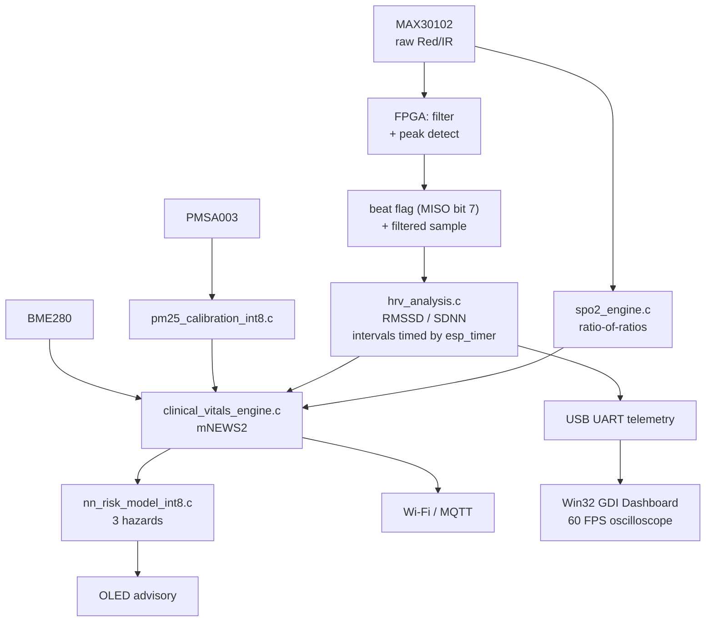

# SIH26181 VALOR (Vital and Atmospheric Logic for Offline Rescue) / ShrikeFi — A to Z Master Project Guide & Presentation Companion

> [!IMPORTANT]
> **Read this box first.** This guide is written to be *defensible*, which means every number in it is traceable to a command you can run or a file in the repo. Three claims that circulate in older drafts of this project are **wrong** and must not be repeated in the judging room:
>
> | Do not say | Say instead |
> |---|---|
> | "95.40% specificity" | **98.19% specificity** (the 95.40% came from a report the repo's own evaluator contradicts) |
> | "ESP32-S3 running at 240 MHz" | "ESP32-S3 at **160 MHz** as configured; the LX7 is capable of 240 MHz" |
> | "The FPGA runs standalone and never needs I2C boot flashing" | "The ESP32 delivers the bitstream **over SPI** (16 MHz, open-loop); the link handshake — not the programming call — is what proves the FPGA is running. There is no I2C route into it at all." |
>
> A judge who catches one invented number stops believing all of them. Transparency is not a weakness here — it is the single strongest thing about how this project is documented.

---

## 0. How to Use This Guide

Read it once end to end over a coffee. Then use it three ways:

1. **Study document** — sections 1–8 build the mental model from the ground up.
2. **Presentation script** — the "Say this out loud" boxes are literal sentences.
3. **Defence manual** — section 9 is the 15 hardest questions with three-layer answers.

> [!TIP]
> **Judge Defence Tip (global):** the strongest habit you can build is to *volunteer* the limitation before the judge finds it. "Our HR and SpO₂ inputs are real MIMIC-III data; the RMSSD column is synthesised because MIMIC-III v1.4 has no waveform data — here's the file that proves it." A judge who was about to trap you now trusts you.

---

## 1. The Big Picture (The "Why")

### The analogy: the smoke alarm that doesn't know you're running

Picture a smoke alarm. It detects smoke. That's it. Now picture it going off while you're doing a workout, because your skin is warm and there's dust in the air. You'd rip it off the ceiling within a week. **Alarm fatigue** is the single biggest reason health monitoring fails in the real world — not because the sensors are bad, but because they only see *one* thing.

Now put that alarm on a firefighter's chest during a wildfire, or on a flood rescue worker standing in cold water for six hours. You need to know four things at once: is their heart under strain, is their blood oxygen dropping, is the air poisoning them, and is the environment about to kill them faster than their body can compensate. **None of those questions can be answered by looking at any one sensor.**

That is the project. VALOR (Vital and Atmospheric Logic for Offline Rescue) is a wearable that fuses what's happening *inside* a person with what's happening *around* them, and makes a triage call on the device — no cloud, no phone, no network.

### Who actually benefits

| User | Why existing devices fail them | What VALOR does differently |
|---|---|---|
| **Disaster first responders** | Consumer bands are optimised for fitness, not for toxic air or heat strain | Fuses PM2.5 + heat index + cardiac strain into one escalating advisory |
| **Flood / cyclone evacuees** | No connectivity, no charging, often no phone | Fully offline; runs from a coin cell class of power budget |
| **Miners & industrial workers** | Certification devices are single-hazard (gas only) | Simultaneous heat, particulate and cardiovascular trend |
| **Rural / low-resource clinics** | No continuous monitoring; intermittent vitals only | Continuous mNEWS2-style triage with an offline OLED advisory |

### Why a smartwatch is genuinely useless here

This is a favourite judge question, so let's make the answer airtight. A consumer smartwatch:

- **Assumes connectivity.** Most health analytics run on a paired phone or in the cloud. In a flood, the cell towers are the first thing to go.
- **Owns its own sensor stack.** You cannot tell an Apple Watch to weight ambient PM2.5 against your HRV. It isn't a platform; it's a product.
- **Has no environmental sensing.** No particulate counter, no barometric trend meaningful for flood prediction.
- **Cannot give you cycle-accurate beat timing.** Its OS schedules work in milliseconds; your HRV analysis needs microseconds (section 2 explains exactly why).
- **Is a black box.** You cannot defend its algorithm to a medical jury because you didn't write it.

> [!NOTE]
> **The core insight:** *health and environment must be measured together, on the edge.* Health alone gives you a heart rate with no context. Environment alone gives you an air quality number with no patient. Fused, on-device, offline — you get a triage decision.

### The 15-second elevator pitch

> "VALOR (Vital and Atmospheric Logic for Offline Rescue) is a wearable disaster-triage companion. A MAX30102 optical sensor, a BME280 environment sensor and a laser particulate counter feed an FPGA that finds each heartbeat in hardware — no operating system in the loop — and an ESP32-S3 that times those beats to the microsecond and runs clinical triage on a 619-byte neural network. It tells a rescuer not just 'your heart rate is 140' but 'heat stroke is imminent, stop exertion now' — completely offline, because in a disaster the cloud is the first thing to disappear."

> [!TIP]
> **Judge Defence Tip:** lead with *offline* and *fusion*. Judges have seen a hundred heart-rate wearables. The moment you say "and it knows the air is poisoning you at the same time, with no network", they lean in.

---

## 2. Hardware Architecture & The "Two-Brain" Philosophy

### The analogy: the master chef and the prep cook

Imagine a restaurant kitchen. The **master chef** (the ESP32-S3) is brilliant, creative and flexible — she decides what to cook, talks to the customers, manages the Wi-Fi ordering system, and can improvise. But she is *slow* at one specific task: chopping onions.

So you hire a **specialist prep cook** (the FPGA) whose entire body has been surgically rebuilt to do one thing: chop onions at fifty million slices per second, with zero variance, forever, using almost no energy.

That is the architecture. The FPGA is not a faster CPU. It is a **different kind of machine** built out of dedicated wires that does exactly one job with perfect timing. The ESP32-S3 does everything that requires judgement, connectivity, or floating-point maths.

### Why can't the ESP32-S3 do it alone?

Here is the crux, and it is the strongest technical argument in the entire project.

Heart Rate Variability (HRV) — explained properly in section 5 — is the study of **tiny variations between consecutive heartbeats**. A healthy variation might be 30–50 milliseconds. A dying autonomic nervous system shows variations of 5 milliseconds or less.

Now: the ESP32-S3 runs **FreeRTOS**, and `sdkconfig` sets `CONFIG_FREERTOS_HZ=100`. That is a **10 millisecond scheduling tick**. If you detect a heartbeat in software, the timestamp you record is quantised to that tick — plus whatever jitter the scheduler, Wi-Fi stack, and flash cache introduce. Your measurement error can be **larger than the signal you are trying to measure.**

That is not a performance problem you can optimise away. It is a *category* problem.

| | Software peak detection (ESP32-S3 alone) | Hardware peak detection (FPGA) |
|---|---|---|
| What the timestamp is quantised to | ~10 ms (RTOS tick) + jitter | **1 µs** MCU hardware timer, gated by a hardware-set beat flag |
| Peak-finding resolution | One task period, if the beat is seen at all | **20 ns** (one 50 MHz clock edge) |
| Jitter under Wi-Fi load | Milliseconds, non-deterministic | **None in detection** — synchronous logic, no scheduler in the loop |
| Cost per beat | CPU cycles, interrupts, power | Free — it's wires |
| HRV usable? | Only for very large variations | **Yes, down to single milliseconds** |

> [!IMPORTANT]
> **Say this out loud:** "Our HRV is only valid because the *beat detection* happens in hardware. In software, detection would be quantised to the 10 ms scheduler tick and jittered by the Wi-Fi stack — error larger than the signal. The FPGA finds the crest in synchronous logic with no scheduler in the loop, and the interval between those hardware-set flags is then timed by a 1 µs hardware timer on the MCU."

### Why can't the FPGA do it alone?

Because an FPGA is gloriously stupid. It has no operating system, no Wi-Fi, no floating-point unit, no `printf`. It cannot:

- Run a neural network with sigmoid activations in any sane way
- Hold a Wi-Fi association or an MQTT session
- Draw a 128×64 OLED user interface
- Do clinical scoring with human-readable advisories

The FPGA chops onions. The chef cooks.

### The 8-bit SPI link: how the two chips talk

**The analogy:** imagine two people passing notes down a single lane each way, one bit at a time, but perfectly in step — one of them taps a clock, and both read one bit on every tap. Eight taps and a whole byte has moved in each direction, *at the same time*.

The two chips are joined by a **4-wire SPI bus, mode 0 (CPOL = 0, CPHA = 0), MSB first.** The ESP32-S3 is the **controller** and the ForgeFPGA is the **target**. Because SPI is full duplex, a single transaction carries data both ways: the MCU shifts the sample out on MOSI while the FPGA shifts its reply back on MISO.

> [!WARNING]
> **An earlier revision of this guide described a 4-bit parallel nibble link** — four data wires, a strobe, a direction line, a command codebook and a dedicated `irq_beat` interrupt pin. That design was **retired before it was ever built.** There is no strobe, no direction line, no separate interrupt, no command map, and no instruction decode anywhere in the RTL or the firmware. Everything below describes the link that actually exists, and every claim in it is traceable to `firmware/shrikefi/shrikefi_link_driver.c`, `firmware/shrikefi/shrikefi_pinmap.h`, `hardware/shrikefi/forgefpga_pins.pcf` and `hardware/shrikefi/forgefpga_ppg_top.v`.

**Link signals.** The ESP32 side is fixed by the board's internal copper traces; the FPGA side is fixed by the design's own pin constraints.

| Signal | ESP32-S3 | FPGA pad | Direction | Purpose |
|---|---|---|---|---|
| `SCK` | GPIO12 | `PIN_16` (`spi_sck`) | ESP32 → FPGA | SPI clock, generated by the ESP32 |
| `SS_n` (CS) | GPIO10, driven **manually** | `PIN_17` (`spi_ss_n`) | ESP32 → FPGA | Active-low chip select, asserted around each transaction |
| `MOSI` | GPIO11 | `PIN_18` (`spi_mosi`) | ESP32 → FPGA | The 8-bit raw PPG sample |
| `MISO` | GPIO13 | `PIN_19` (`spi_miso` + `PIN_19_OE`) | FPGA → ESP32 | `{beat_latched, filt_sample[6:0]}` |
| FPGA enable | GPIO8 | — | ESP32 → FPGA | `EN` — held through the boot-mode latch |
| FPGA power | GPIO9 | — | ESP32 → FPGA | `PWR` — the FPGA rail, switched by the MCU |

Two pads round out the FPGA side: `led_user` on `PIN_7` drives the blue user LED (D12), and `OSC_EN` is the oscillator enable — a clock resource, not a GPIO. **There is no reset pad.** The RTL generates its own power-on reset from an internal counter (`POR_CYC` clocks) because nothing on the ShrikeFi interconnect drives `PIN_13`.

**The frame: one 8-bit transaction per optical sample.**

| Byte | Bits | Meaning |
|---|---|---|
| MOSI | `[7:0]` | Raw 8-bit PPG sample written by the MCU |
| MISO | `[7]` | `beat_latched` — set when the peak detector found a systolic crest |
| MISO | `[6:0]` | Low 7 bits of the 8-tap moving-average output |

Bit 7 is the beat flag, so only the **low seven bits** of the filter output come back; the FPGA's own detector uses the full 8-bit average internally, so detection is unaffected. The reply to transaction *k+1* carries the result of the sample sent in transaction *k* — one transfer of pipeline latency, because the filter, the beat latch and the SPI transmit shift register each cost a clock.

**There is no command map.** The write *is* the sample and the reply *is* the reading. No opcode, no register address, no payload length negotiation, no `SHRIKEFI_CMD_*` identifier anywhere in the driver, and no decode block in the Verilog.

**How the MCU gets the IBI.** The FPGA does not timestamp beats and does not put a cycle count on the link. The MCU watches bit 7 of each reply and, on a rising beat flag, differences its own `esp_timer_get_time()` readings to get the interval (section 5 covers the arithmetic).

**Why SPI is the right choice here.** The ForgeFPGA has a small I/O budget, and an SPI target costs a shift register rather than a bus. Unlike a parallel link it needs no strobe agreement, no direction turnaround and no opcode space — and a heartbeat is exactly one bit, so the one thing the link must not lose is cheap to send. The ESP32-S3 already has a hardware SPI controller (`driver/spi_master.h` on `SPI2_HOST`), so the MCU pays almost no CPU cost per sample. The runtime link runs at **1 MHz**; the same wires carry the bitstream at **16 MHz** during FPGA configuration.

### Block diagram

```mermaid
flowchart LR
    subgraph Sensors
        M[MAX30102<br/>PPG Red+IR]
        B[BME280<br/>T / RH / Pressure]
        P[PMSA003<br/>Laser PM1/2.5/10]
        O[SSD1306<br/>128x64 OLED]
    end

    subgraph MCU["ESP32-S3  (Master Chef)"]
        T1[Core 0: biometric loop]
        T2[Core 1: environment + radio]
        AI[INT8 TinyML<br/>619 B]
        CL[mNEWS2 + SQI + PSI<br/>clinical engine]
    end

    subgraph FPGA["ForgeFPGA SLG47910C  (Prep Cook)"]
        F1[Dual 8-tap<br/>moving average]
        F2[Systolic peak<br/>detector + 250 ms<br/>refractory]
        F3[Beat latch + SPI reply<br/>bit7 = beat flag<br/>bits[6:0] = filtered]
    end

    M -->|I2C| T1
    B -->|I2C| T2
    P -->|UART| T2
    O --- T2
    T1 <-->|"8-bit SPI, mode 0, 1 MHz<br/>1 full-duplex frame per sample"| FPGA
    F1 --> F2 --> F3
    T1 --> AI --> CL --> O
    T2 -->|Wi-Fi / MQTT| Cloud[(MQTT broker)]
    T1 -->|USB UART| PC[PC Dashboard]
```

> [!NOTE]
> **One link, both directions, no interrupt pin.** The beat does not arrive on a dedicated wire: it arrives as bit 7 of the MISO byte, which the MCU is already clocking in as part of the sample transaction. The MCU derives the inter-beat interval from its own `esp_timer_get_time()` deltas between rising beat flags — the FPGA's internal 32-bit interval counter never crosses the link.

### The ForgeFPGA configuration question — handle this honestly

> [!WARNING]
> **This is the one architectural claim in this guide that is NOT yet verified.** Do not assert a mechanism you have not measured.

What we *know*:

- The Renesas **SLG47910C** is an **FPGA**, not a GreenPAK mixed-signal CMIC. It therefore does **not** have the hardwired I2C NVM controller that Renesas's simpler configurable-analogue parts do.
- The design's own pin constraints (`hardware/shrikefi/forgefpga_pins.pcf`) declare the clock enable (`OSC_EN`), an **SPI interface** (`spi_sck`/`spi_ss_n`/`spi_mosi`/`spi_miso` on `PIN_16`–`PIN_19`, plus `PIN_19_OE`), and the user LED (`PIN_7`). **No I2C configuration port is declared** — and note there is no reset pin either, which is why the RTL generates its own power-on reset. The SPI pads are the same four wires the runtime link uses, so the declared SPI interface serves both configuration and sampling.
- The Renesas toolchain emits **three** bitstream variants, which map onto three plausible delivery modes:

| Variant | Size | Plausible delivery |
|---|---|---|
| `FPGA_bitstream_OTP.bin` | 45,116 B | Burned once into on-chip OTP NVM; device self-configures at power-up |
| `FPGA_bitstream_FLASH_MEM.bin` | 45,096 B | FPGA acts as SPI master reading an external flash (the board has a W25Q32JV) |
| `FPGA_bitstream_MCU.bin` | 46,408 B | Host MCU delivers it (the variant embedded in the firmware) |

What we do **not** know, without reading a boot log on the bench: whether the part is already configured from OTP before the ESP32 gets to it, or whether it is waiting for the MCU to deliver the bitstream.

**How the firmware handles it — and this is a place where an older draft of this guide was simply wrong.** `shrikefi_fpga_flash_init()` does **not** probe I²C. It drives the vendor's reset/boot-latch sequence on `PWR`/`EN`/`SS`, then streams `FPGA_bitstream_MCU.bin` (46,408 bytes) out of `SPI2` at 16 MHz in 256-byte chunks, toggling chip select per chunk. The transfer is **open-loop** — nothing is read back, so the call cannot confirm the FPGA accepted anything — and a non-OK result is explicitly non-fatal: boot continues either way. The authoritative check is the `0x55` link handshake a few lines later, which only answers if the FPGA is alive and running user-mode logic. (The I²C bus scanner does label address `0x08` as "ForgeFPGA", but that is a string in a scan log, not a configuration path.)

**The correct judge answer:**

> "The design's pin constraints declare no I²C configuration port, and the part is an FPGA rather than one of Renesas's I²C-configurable CMICs, so there is no I²C route into it. What they *do* declare is a 4-wire SPI interface on PIN_16–PIN_19, shared with the runtime link, and that is the route the firmware uses: it runs the vendor's reset/boot-latch sequence and streams the 46 KB bitstream over SPI2 at 16 MHz. That transfer is open-loop, so we don't present it as proof of anything — our proof is the link handshake that follows, which only succeeds if the FPGA is configured and running. Whether the part *also* self-configures from OTP is the one thing we're still settling on the bench."

That answer is *stronger* than a confident false one.

> [!TIP]
> **Judge Defence Tip:** if asked "how is the FPGA programmed?", never guess. Say "over SPI, using the vendor's reset/boot-latch sequence — and because that transfer is open-loop, we prove the FPGA is running with a link handshake instead of assuming the programming worked." Being the team that measured instead of assumed is a differentiator.

---

## 3. The Sensors: How We Sense the Human & the Environment

### MAX30102 — the flashlight through the finger

**Analogy:** hold a torch behind your finger in a dark room. Your finger glows red — because blood absorbs light. Now imagine the light pulses slightly brighter and dimmer with every heartbeat, because each beat pushes a fresh slug of blood through. Congratulations: you have just built a pulse oximeter.

The MAX30102 shines **two** wavelengths through tissue and measures how much comes out the other side:

- **Red, ~660 nm** — absorbed differently by oxygen-rich vs oxygen-poor blood
- **Infrared, ~880 nm** — the reference channel

The *pulsatile* component (the wobble with each beat) is called **AC**; the steady baseline (tissue, bone, venous blood) is **DC**. Their ratio is the whole trick, and section 5 shows the maths.

**Why PPG gives you HRV for free:** the interval between successive pulse peaks *is* the beat-to-beat interval. That's what the FPGA measures, and that's why the timing accuracy argument in section 2 matters so much.

> [!NOTE]
> Terminology worth knowing cold: this technique is **photoplethysmography (PPG)** — "photo" (light) + "plethysmo" (volume) + "graphy" (measurement). You are literally measuring volume changes by shining light.

### BME280 — the weather station on your wrist

| Measurement | Why VALOR cares |
|---|---|
| **Temperature** | Drives heat-index calculation; with humidity it determines whether heat illness is even possible |
| **Relative humidity** | Feeds the heat index *and* is essential for correcting the particulate sensor |
| **Barometric pressure** | A rapidly falling pressure trend precedes storms and flash-flood conditions |

The pressure channel is the sleeper feature. A falling barometric trend is one of the few genuinely *predictive* environmental signals available to a wearable.

### PMSA003 / PMS5003 — counting smoke with a laser

**Analogy:** in a dark cinema, a projector beam lets you *see* dust in the air because each particle scatters a little light sideways. The particulate sensor is that, industrialised.

Air is drawn through a chamber by a small fan. A laser beam crosses it. Every particle that passes scatters light onto a photodiode, and the **number and brightness of scattering events** gives a particle count, binned by size into **PM1.0 / PM2.5 / PM10** (micrometres).

**Why humidity breaks it:** see section 7 — this is the single best "we understand our sensor" story in the project.

### The strapping-pin defence (a detail that wins points)

**Analogy:** some front doors have a secret knock. Knock it wrong at boot and the house locks you out. The ESP32-S3 has four such pins — **GPIO0, GPIO3, GPIO45, GPIO46** — that are sampled at power-up to decide boot mode. If a floating sensor line happens to look like the wrong knock, the chip either won't boot or enters the wrong mode.

**Our defence:** those four pins are used for **nothing** in this design, and left in a safe state. The FPGA reset line deliberately uses **GPIO11**, which is not a strapping pin. This exact issue was found in an early audit (an older pin map used GPIO3) and fixed.

> [!TIP]
> **Judge Defence Tip:** this is a small detail that signals real engineering maturity. Mention it unprompted: "we specifically avoided the four strapping pins and moved the FPGA reset to GPIO11 because an early revision used GPIO3 and would have been boot-unreliable."

### Sensor-to-purpose table

| Sensor | Interface | Measures | Feeds |
|---|---|---|---|
| MAX30102 | I²C (0x57) | PPG Red + IR | HR, SpO₂, RMSSD, respiratory rate |
| BME280 | I²C (0x76) | Temp, humidity, pressure | Heat index, PSI, flood trend, PM correction |
| PMSA003 | UART | PM1.0 / PM2.5 / PM10 | Pollution risk, AHA autonomic strain |
| SSD1306 | I²C (0x3C/0x3D) | — (output) | Offline advisory display |

---

## 4. The FPGA Accelerator: Pure Hardware Speed

### What is an FPGA, really?

**Analogy:** a CPU is a very fast reader following a recipe book. An FPGA is a **box of uncommitted electrical components** that you wire into a *machine shaped like your recipe*. The recipe becomes the machine.

**Verilog** is the language you write that wiring in. Crucially, you are not writing instructions that execute in order — you are describing **hardware that exists simultaneously**. Every `always @(posedge clk)` block is a physical cluster of flip-flops that all update on the same clock edge.

**Consequence:** an operation that costs a CPU many cycles costs an FPGA **one** cycle, but uses silicon area permanently. That trade is the entire discipline.

### The 8-tap moving average filter

**Analogy:** a bumpy dirt road. The car shakes violently on every stone. A moving average filter is **suspension** — it doesn't remove the bumps, it stops them reaching the passengers.

Applied to PPG, it removes baseline wander (slow drift from breathing and movement) and high-frequency noise, leaving the pulse shape.

**The naive way** is to store the last 8 samples and add all 8 every time: 8 additions per sample.

**Our way** is smarter. Keep a **running sum**, and when a new sample arrives:

```
new_sum = old_sum + new_sample - oldest_sample
output  = new_sum >> 3          // divide by 8 = instant bit-shift
```

That's **two additions and a wire shift**, regardless of how many taps. This is the **O(1) running-sum** technique.

> [!IMPORTANT]
> **The details a judge may probe:** with 8-bit samples, 8 of them sum to at most 8 × 255 = 2040, which needs an 11-bit accumulator. The Verilog uses exactly 11 bits (`DATA_WIDTH+2:0`), so it cannot overflow. And `>> 3` on an unsigned running sum is a *true* divide-by-eight — no rounding error, no multiplier. This is why the design uses **0 DSP48 multiplier slices and 0 Block RAMs**.

### The systolic peak detector and the refractory window

**Analogy:** a camera flash. After firing, it needs a second to recharge. If you press the shutter again immediately, nothing happens — and that's a *feature*, because it stops you taking the same photo twice.

Your heart is the same. After a real systolic peak there is a **dicrotic notch** — a secondary bump in the pulse wave caused by the aortic valve closing. A naive peak detector counts that bump as a second heartbeat and reports a heart rate of 160 when the patient is at 80. That is a dangerous, plausible-looking failure.

**The fix** is a **refractory period**: after detecting a peak, ignore everything for a fixed window. Physiologically, the heart cannot beat twice faster than about 240 bpm, so a 250 ms blanking window is safe.

| Parameter | Value | Reasoning |
|---|---|---|
| Refractory window | **250 ms** | 240 bpm ceiling; below human physiological maximum |
| Cycles at 50 MHz | **12,500,000** | 0.25 s × 50,000,000 |
| Counter width | 32 bits | Ample headroom |

**The FSM states:**

| State | Meaning | Leaves when |
|---|---|---|
| `STATE_ARMED` | Waiting for a beat | Sample rises above dynamic threshold |
| `STATE_RISING` | Tracking the ascending wave | Sample starts to fall (inflection = peak) |
| `STATE_PEAK_FOUND` | Latch the internal interval counter, set the beat flag | Immediately → refractory; the flag is cleared once it has been shifted out on MISO |
| `STATE_REFRACTORY` | Blanking | 250 ms counter expires |

### The 32-bit cycle-accurate interval counter

**Analogy:** a stopwatch that ticks **fifty million times a second**. Between two heartbeats you count the ticks. 3,000 ticks = 3,000 ÷ 50,000,000 s = 60 µs.

| | Value |
|---|---|
| Clock | 50 MHz |
| Tick period | 1 / 50,000,000 = **20 ns** |
| Counter width | 32 bits |
| Wraps after | 2³² ticks ÷ 50 MHz = **85.9 seconds** (4,294,967,296 ticks) of continuous counting |

> [!WARNING]
> **The counter counts ticks, not beats.** 2³² ticks at 20 ns is about **85.9 seconds**, not "1.5 billion beats before wrap". An earlier revision of this table said "~1.5 billion beats before wrap", which confuses a tick count with a beat count and is wrong by roughly six orders of magnitude. If a judge asks the wrap period, the answer is 85.9 seconds.

> [!IMPORTANT]
> **Be precise about what crosses the link.** The peak-detector FSM holds a 32-bit `ibi_cycles` count internally, but **no SPI register carries it and the firmware never reads it** — the reply byte is only `{beat_flag, filtered[6:0]}`. The MCU reconstructs the interval from its own `esp_timer_get_time()` deltas between rising beat flags (`s_sim_ibi = delta_us * 50` in `shrikefi_link_driver.c`). So the *detection* is cycle-accurate and jitter-free in hardware, while the interval the firmware reports is quantised by the MCU's 1 µs timer and merely *expressed* in 20 ns ticks. Do not tell a judge that the FPGA hands over a hardware timestamp — it does not.

This is the measurement that makes the whole clinical layer possible, and it is the answer to *"why is there an FPGA in this project?"*

### Timing diagram (described)

```
clk         __/‾‾\__/‾‾\__/‾‾\__/‾‾\__/‾‾\__/‾‾\__
data_valid  ______/‾‾‾‾‾‾‾‾‾‾‾‾‾‾‾‾‾‾‾‾‾‾\________
filtered    XXXXXX<--- converges over 8 samples --->XXXX
                                        ↑
                                   100 (steady)
threshold   -----------------------/‾‾‾‾‾‾‾‾‾‾‾‾‾‾‾
                                   ↑ crossing arms FSM
beat flag   ______________________/‾\_______________   (1 cycle, sent as MISO bit 7)
ibi_cycles  XXXXXXXXXXXXXXXXXXXXXX< 0x00000CD1 >XXXX   (3,281 internal ticks = 65.62 µs)
```

**Reading it:** eight valid samples drive the filter output to the input value; the sample crossing the threshold arms the FSM; the descending inflection sets the beat flag for one clock, which is returned as bit 7 of the next MISO byte and then cleared. The RTL's internal 32-bit interval counter latches on that same edge — but, as noted above, that count stays inside the FPGA.

### Verilog module hierarchy

| Module | File | Role |
|---|---|---|
| `axi_ppg_accelerator` | `hardware/zynq/` | Zynq AXI4-Lite wrapper + register file |
| `forgefpga_ppg_top` | `hardware/shrikefi/` | ShrikeFi top: `spi_target` + filter + peak detector + beat-latch reply. **No command decode, no link FSM** |
| `moving_average_8tap` | `hardware/common/` | The O(1) filter (instantiated twice) |
| `ppg_peak_detector` | `hardware/common/` | 4-state systolic FSM |
| `tb_ppg_system` | `hardware/zynq/` | 6 self-checking tests |
| `tb_forgefpga_system` | `hardware/shrikefi/` | 5 self-checking SPI link tests |

> [!NOTE]
> The two DSP modules live in `hardware/common/` and are instantiated by **both** platform tops. That is deliberate: one source of truth, no copy-paste drift, and it proves the core is genuinely vendor-agnostic. Both CI and the local build compile the same files.

### Verified synthesis results

| Platform | Result | Evidence |
|---|---|---|
| Zynq-7000 OOC (baseline, tag `v1.0-zynq-SIH`) | 185 LUT / 16 LUTRAM / 266 FF, **0 DSP, 0 BRAM**, WNS **+5.603 ns**, Fmax **69.45 MHz** | Tag + screenshots |
| Zynq-7000 re-run (Vivado 2026.1) | **198** slice LUTs (182 logic + 16 LUTRAM), **267** FF, 0 DSP, 0 BRAM | `hardware/zynq/synthesis_evidence/ooc_utilization_synth.rpt` |
| ForgeFPGA SLG47910C | **363 / 1120 LUT5s (32.41%)**, 202 FFs, 75/140 CLBs, 0 BRAM, PLL 0/1 | `hardware/shrikefi/synthesis_evidence/resource_utilization_spi_link.log` |

> [!WARNING]
> **Do not quote 443 LUT5s / 353 FFs / 85 CLBs** — that belongs to the superseded 4-bit parallel link build. The current SPI hardware fitter report measures **363 / 1120 LUT5s (32.41%)**, **202 FFs**, and **75/140 CLBs** with **PLL 0/1**. Two earlier SPI figures (222 and 342 LUT5s) are also real measurements of older netlists — see `hardware/shrikefi/synthesis_evidence/README.md` for the fit history. Likewise do not mix the 185-LUT baseline with the 198-LUT re-run; they are different runs measuring different scopes.
>
> **Do not quote WNS −10.088 ns either.** The fitter auto-constrains `clk` to 500 MHz because the design declares no clock constraint; the achievable period is 12,087 ps (82.73 MHz), so at the documented 50 MHz the margin is +7.913 ns. See the timing section of the evidence README.

> [!TIP]
> **Judge Defence Tip:** "Zero DSP, zero BRAM" is the number that impresses hardware engineers, because it proves the filter is arithmetic trickery rather than brute-force multipliers. Quote it with the mechanism: "running-sum with a bit-shift divide."

---

## 5. Biomedical Digital Signal Processing (DSP)

### Heart rate from cycle ticks

The interval counter runs at 50 MHz, so **one tick is 20 ns** and there are **50,000 ticks in a millisecond**. The conversion is therefore:

```
IBI_ns = ibi_cycles × 20              // 1 tick = 20 ns
IBI_ms = ibi_cycles / 50,000          // 50,000 ticks per millisecond
IBI_s  = ibi_cycles / 50,000,000
BPM    = 60,000 / IBI_ms = 60 / IBI_s = 3,000,000,000 / ibi_cycles
```

> [!WARNING]
> **A 1000× error lived in this section and has been corrected.** An earlier revision printed `IBI_ms = ibi_cycles × 20 / 1000 = ibi_cycles / 50`. The divisor is wrong: converting nanoseconds to **milliseconds** divides by 1,000,000, not 1,000, so the correct constant is 50,000 — not 50. Every example derived from it (65.62 ms for 3,281 ticks, "750,000 ticks = 1,000 ms", "600,000 ticks = 1,200 ms") was wrong by the same factor of 1000. The formulas printed above are the correct ones, and they agree with the rest of this guide: section 4 states that 3,000 ticks is 60 µs, and the timing diagram in section 4 shows 3,281 ticks for the same shortened simulation interval.

**Worked example.** The RTL's internal counter reads **3,281 ticks** (`0x00000CD1`, the value in the section 4 timing diagram):

- IBI = 3,281 × 20 ns = **65,620 ns = 65.62 µs**
- 65.62 µs corresponds to a "rate" of 60 / 0.00006562 ≈ **914,000 bpm** — which is obviously not a heart rate. That is because the testbench deliberately compresses the sample period and the refractory window so the VCD stays short. **Never present this value as a physiological interval.**

**Real examples** (a physiological IBI is between about 0.3 s and 1.5 s):

| Heart rate | Interval | Ticks at 50 MHz | MCU `esp_timer_get_time()` delta |
|---|---|---|---|
| **60 bpm** (resting adult) | 1.000 s | **50,000,000** | 1,000,000 µs |
| **50 bpm** (fit athlete) | 1.200 s | **60,000,000** | 1,200,000 µs |
| **75 bpm** | 0.800 s | **40,000,000** | 800,000 µs |
| **120 bpm** (exertion) | 0.500 s | **25,000,000** | 500,000 µs |

> [!NOTE]
> If a demo scenario shows a few thousand ticks, that is a *simulation* interval chosen to keep the VCD waveform short — do not present it as a physiological heart rate. On hardware a 60 bpm beat is **50,000,000 ticks**, or a 1,000,000 µs `esp_timer_get_time()` delta between rising beat flags. That kind of precision is exactly what earns trust.

> [!IMPORTANT]
> **Where the number actually comes from.** The firmware does not read a cycle count from the FPGA — the SPI reply carries only `{beat flag, filtered[6:0]}`. `shrikefi_link_driver.c` takes the delta of `esp_timer_get_time()` on each rising beat flag and multiplies by 50 to express it in 20 ns ticks (`s_sim_ibi = delta_us * 50`). So the tick figures in the table above are the *equivalent* count at 50 MHz; the real measurement is the MCU timer delta in the right-hand column, which is quantised to 1 µs.

### SpO₂: the Ratio-of-Ratios

This is the formula judges love to ask about, so let's build it slowly.

**Step 1 — what is AC and DC?**

For each wavelength, the PPG signal has:

- **DC** — the steady part (tissue, bone, non-pulsatile blood)
- **AC** — the pulsatile wobble with each heartbeat

**Step 2 — the "normalised pulsation"**

You want to know: *how big is the pulse relative to the background?* That's simply:

```
Normalised pulsation = AC / DC
```

**Step 3 — compare the two colours**

Oxygenated and deoxygenated blood absorb red and infrared *differently*. So the **ratio of the two normalised pulsations** carries the oxygen information:

```
        (AC_red / DC_red)
R  =  ─────────────────────
        (AC_ir  / DC_ir )
```

**Step 4 — map R to a saturation percentage**

Empirically, over the physiological range, SpO₂ falls roughly linearly as R rises:

```
SpO2 (%)  =  110  −  25 × R
```

**Worked example.** Suppose AC_red/DC_red = 0.020, AC_ir/DC_ir = 0.040:

- R = 0.020 / 0.040 = **0.50**
- SpO₂ = 110 − 25(0.50) = 110 − 12.5 = **97.5 %** ✓ normal

**Another:** R = 1.0 → SpO₂ = **85 %** — clinically significant hypoxia.

**Engineering safeguards in our implementation** (`firmware/core/spo2_engine.h` / `spo2_engine.c` — the constants are quoted so they can be checked):

| Safeguard | Constant | Why |
|---|---|---|
| Require minimum DC level | `SPO2_MIN_DC_IR` 1000 / `SPO2_MIN_DC_RED` 800 counts | Finger not on the sensor → no valid reading (ambient air is < 600 counts) |
| Require minimum AC amplitude | `SPO2_MIN_AC_IR` 10 / `SPO2_MIN_AC_RED` 8 counts | Rejects noise, not real pulsation |
| Perfusion-index window | **0.15 – 15 %** (`SPO2_MIN_PERFUSION_INDEX` = 0.15f, `SPO2_MAX_PERFUSION_INDEX` = 15.0f) | The *minimum is 0.15 %, not 0.2 %*. Rejects both "no perfusion" and "sensor off finger" |
| Clamp R | 0.35 – 1.65 (`SPO2_MIN_RATIO_R` / `SPO2_MAX_RATIO_R`) | Outside this is not human blood |
| Flatness gate, not a slew limiter | **2 % max spread across the last 8 windows** (`SPO2_STABLE_SPREAD_PCT` = 2.0f, `SPO2_STABLE_MIN_WINDOWS` = 8) | This is a *stability* test on consecutive estimates, not a ±2.5 %/s rate limit — the older wording was wrong on both the value and the mechanism. It is what stops a still-settling estimate from being published as an emergency |
| Latch gate | **8 consecutive valid windows** (`SPO2_REQUIRED_VALID_WINDOWS` = 8), i.e. `REQUIRED_VALID_WINDOWS` and `STABLE_MIN_WINDOWS` are both 8 | A single valid window used to latch and publish. Measured on hardware the reported value climbed 78 % → 96 % over ~30 s, all of it published as VALID — and a real 78 % is a life-threatening desaturation, so that was not cosmetic |
| Measurement window | 50 samples per estimate (`SPO2_WINDOW_SIZE` = 50), then an 8-estimate moving average (`SPO2_MA_FILTER_SIZE` = 8) | Smooths without destroying real response |

> [!NOTE]
> **Why the latch gate exists at all.** The underlying R ratio keeps drifting for far longer than one window while the LED current control settles the DC baseline, so a fixed short window cannot tell "settled" from "still ramping". The gate therefore asks the question that matters — has the smoothed estimate stopped moving? — across the *full* moving-average depth, and only then publishes. Sampling 30 s of hardware data was what exposed the original bug.

> [!IMPORTANT]
> Be precise about provenance: **110 − 25R** is the widely used *nominal* calibration curve, not a curve derived from calibrating this specific device against a blood-gas analyser. Say so. "This is the standard textbook linear approximation; real clinical devices are calibrated per-sensor against reference oximetry."

### Heart Rate Variability and RMSSD

**The analogy that makes this land:** a healthy heart is not a metronome. Beat-to-beat spacing *should* wobble — by tens of milliseconds. That wobble is your **vagal tone**: the parasympathetic nervous system actively modulating the heart on every breath.

A heart that beats with robotic regularity is often a heart whose autonomic control has been **shut down** — by severe shock, haemorrhage, sepsis, or a spinal injury. **Perfection is the warning sign.**

**RMSSD** = Root Mean Square of Successive Differences. Unpacked:

1. Take successive beat intervals: `IBI₁, IBI₂, IBI₃ …`
2. Compute successive differences: `d₁ = IBI₂−IBI₁`, `d₂ = IBI₃−IBI₂` …
3. Square each difference
4. Take the mean of the squares
5. Take the square root

```
              ┌──────────────────────────┐
             ╱   1     n−1              ²
RMSSD  =   ╱   ─── ×  Σ   (IBIₖ₊₁ − IBIₖ)
         ╲╱   n−1    k=1
```

**Worked example** (intervals in ms): 800, 830, 810, 845, 815

- Differences: +30, −20, +35, −30
- Squares: 900, 400, 1225, 900
- Mean: 3425 / 4 = 856.25
- √856.25 = **29.3 ms** → healthy vagal tone ✓

**Now a shock patient:** 800, 802, 799, 801, 800

- Differences: +2, −3, +2, −1 → squares 4, 9, 4, 1 → mean 4.5 → **RMSSD = 2.1 ms**

That collapse from 29 ms to 2 ms is what our engine watches for, and it is only measurable because each beat is *located* in hardware rather than by a scheduled task, and the interval between beats is timed by a 1 µs hardware timer instead of a 10 ms OS tick.

| RMSSD | Interpretation |
|---|---|
| < 10 ms | Critically suppressed — possible autonomic shock |
| 10–20 ms | Reduced |
| 20–50 ms | Normal resting adult |
| 50–100 ms | Strong parasympathetic tone (fit / young) |

### Respiratory rate from the pulse alone (Charlton 2018)

**Analogy:** breathe in, and your heart speeds up fractionally; breathe out, and it slows. This is **Respiratory Sinus Arrhythmia (RSA)** — your breathing mechanically modulating your pulse through the vagus nerve.

Because we already have beat-to-beat intervals at high precision, we can extract the *breathing* rhythm from the *heart* rhythm. That means **no chest band, no thermistor, no airflow sensor** — one optical sensor gives you two vitals.

**Worked example:** if the IBI series oscillates with a period of about 4 seconds, breathing rate ≈ 60 / 4 = **15 breaths per minute** — normal adult resting.

> [!TIP]
> **Judge Defence Tip:** mention that RSA amplitude *drops* under stress, so the method degrades exactly when a patient is most distressed. We report it with a confidence value rather than pretending it's always valid. Self-aware limitations read as competence.

---

## 6. The Clinical Brain: Medical Standards & Triage

### What is NEWS2?

**Analogy:** a hospital traffic light. Instead of a doctor reading six numbers and intuiting severity, **NEWS2** (National Early Warning Score 2, Royal College of Physicians) assigns points to each vital and sums them. Low score = green. Rising score = amber. High score = **call the rapid response team now**.

It exists precisely because humans are bad at mentally integrating multiple mild abnormalities. A respiratory rate of 22, a heart rate of 115, and an SpO₂ of 92 are each "a bit off" — together they're a deteriorating patient.

**Our inputs and thresholds** (implemented in `clinical_vitals_engine.c`):

| Parameter | Escalation | Critical |
|---|---|---|
| Heart rate | ≥ 111 bpm | ≥ 131 bpm, or ≤ 40 bpm |
| SpO₂ | ≤ 91 % | ≤ 85 % |
| Respiratory rate | ≥ 25 /min | ≥ 30, or ≤ 6 |
| Composite | NEWS2 ≥ 4 | NEWS2 ≥ 7 |

### The MIMIC-III benchmark — and how to talk about it

**MIMIC-III** is a real, de-identified ICU database from MIT / Beth Israel Deaconess, used across clinical research. We evaluate against the demo cohort: **16,387 vital time-steps across 98 patients**.

**Verified results** (reproducible with `accuracy_evaluator.c`):

| Metric | Value |
|---|---|
| **Accuracy** | **94.11 %** |
| **Sensitivity** | 58.18 % |
| **Specificity** | **98.19 %** |
| Positive predictive value | 78.43 % |
| Negative predictive value | 95.39 % |
| F1 | 66.80 % |
| Confusion matrix | TP 971 / FP 267 / TN 14,451 / FN 698 |

**Now the caveats — and you must volunteer these:**

| Element | Status |
|---|---|
| HR and SpO₂ | **Real** MIMIC-III `CHARTEVENTS` values (verified against the raw tables) |
| RMSSD | **Synthesised** — MIMIC-III v1.4 ships no waveform data, so beat-to-beat intervals cannot be derived |
| Ground-truth labels | **Derived in-tree** from a vitals rule; no upstream generator is committed |
| Cohort | The **demo subset** (98 patients), not the full database |
| What's actually tested | The triage engine consuming HR/SpO₂/RMSSD — **not** the SpO₂ engine or the PPG front end |

> [!IMPORTANT]
> **Say this:** "94.11% accuracy, 98.19% specificity on 16,387 real ICU rows. But I want to be precise about what that means: the heart rate and SpO₂ are real recorded values, the RMSSD column is synthesised because MIMIC-III has no waveforms, and the labels come from a rule we wrote. So this is *agreement with our own triage rule*, not independent clinical validation. The pipeline is real and reproducible; the clinical claim is bounded."
>
> That paragraph will do more for your score than any badge, because it shows you understand the difference between a benchmark and a validation.

**Why specificity is high and sensitivity isn't:** with a 10.2 % positive label rate, a rule tuned to avoid alarm fatigue will under-call. That's a deliberate trade, and you should own it: "if you'd rather catch every crisis than avoid false alarms, the `CLINICAL_HIGH` thresholds are a one-line change."

### The SQI and motion-artifact gating

**Analogy:** a paramedic running to a patient produces a PPG signal that looks like a heart in atrial fibrillation. The device must not scream "ARRHYTHMIA" when the actual problem is that someone is jogging.

The **Signal Quality Index** combines:

- **Perfusion Index** — is there enough pulsatile signal at all?
- **Waveform regularity** — does the shape look like a pulse, or like noise?

If SQI < 0.70, the engine **holds** the previous reliable triage rather than acting on garbage.

**But — the Absolute Crisis Override.** If the raw values are catastrophically abnormal (SpO₂ ≤ 85 %, HR ≥ 150), the motion filter is **bypassed entirely**. A real crisis is never silenced by a quality gate.

> [!NOTE]
> This is a subtle correctness point worth rehearsing: the override is evaluated on the **same rounded integer vitals** that the triage path uses. An early revision compared raw floats for the override and rounded integers later, which meant a reading of 85.4 % could be critical in one path and not the other. Same numbers, one comparison — that's the fix.

### Moran's PSI and AHA Autonomic Strain

| Index | Source | What it detects |
|---|---|---|
| **Moran's Physiological Strain Index** | Moran 1998, US Army | Exertional heat strain on a 0–10 scale, from HR and core-temp proxies |
| **AHA PM2.5–HRV Autonomic Strain** | Brook 2010 (AHA statement) | Acute vagal suppression from particulate inhalation — smoke attacking the autonomic system |

Together with the NOAA heat index, these are what let VALOR say *"stop exerting yourself now"* rather than *"it's 46 °C."*

### Triage decision table

| NEWS2 | Level | Advisory style |
|---|---|---|
| 0 | NORMAL | Routine monitoring |
| 1–3 | ELEVATED | "Continue monitoring" |
| 4–6, or any single critical vital | HIGH | "Seek shade, hydrate, reduce exertion" |
| ≥ 7, or SpO₂ ≤ 85 %, or HR ≥ 150 | CRITICAL | "Stop exertion. Active cooling. Emergency assistance." |

### "What the device says" vs "what it means"

| On screen | Clinical meaning |
|---|---|
| `SENSOR QUALITY LOW (SQI 0.50)` | Motion artifact — the reading is *held*, not lost |
| `Severe Hypoxia (SpO2 82%)` | SpO₂ below 85 % — organ hypoxia risk |
| `Autonomic shock` | RMSSD collapse + tachycardia — possible haemorrhage or sepsis |
| `Heat stroke imminent` | Heat index + cardiac strain + HRV collapse together |

> [!TIP]
> **Judge Defence Tip:** when you mention NEWS2, add "it's the NHS's standard deterioration score — we didn't invent a scoring system, we implemented a published one." Adopting a validated clinical standard is far stronger than a home-made index.

---

## 7. TinyML & Neural Networks on the Edge

### The 3-hazard model

| Layer | Size | Activation |
|---|---|---|
| Input | 6 features | — |
| Hidden 1 | 24 neurons | ReLU |
| Hidden 2 | 16 neurons | ReLU |
| Output | 3 hazards | Sigmoid |

**Inputs:** heart rate, RMSSD, SpO₂, ambient temperature, humidity, PM2.5
**Outputs:** Heat Wave risk, Toxic Pollution risk, Flash Flood risk

### INT8 quantization — the modular suitcase

**Analogy:** you're packing a suitcase with a strict weight limit. You *could* bring 32-bit precision for everything. But if you convert every item into a compact travel version that's 4× smaller and works just as well for the trip, you fit **four times as much** in the same bag.

Quantization shrinks each 32-bit float to an 8-bit integer. Our **619 parameters become 619 bytes** — about the size of a tweet — and a full forward pass is **576 multiply-accumulates** (6×24 + 24×16 + 16×3 = 144 + 384 + 48).

> [!NOTE]
> **Two different numbers, two different things.** 619 is the *storage* count (weights + biases, one byte each). 576 is the *arithmetic* count (one MAC per weight, biases added free). Quote whichever the question is about — "619 parameters" for memory, "576 int8 MACs" for compute. Measured inference time is **0.44 µs on an x86-64 host at `-O2`**; the ESP32-S3 figure has **not** been measured, so do not quote 0.44 µs as an on-device number.

**How the shrink works (and how it doesn't lie to you):**

A float like `0.0173` becomes an integer like `37`, plus two numbers that let you convert back:

- **Scale** — how much one integer step is worth
- **Zero-point** — which integer represents exactly 0.0

```
real_value ≈ scale × (integer − zero_point)
```

**Worked example:** scale = 0.005, zero_point = 0, integer = 37 → 0.005 × 37 = **0.185** ✓

**Why two different schemes?**

| Tensor | Scheme | Zero-point | Reasoning |
|---|---|---|---|
| Weights | **Symmetric** | 0 | Weights are roughly centred on zero; symmetry saves a term |
| Activations | **Asymmetric (uint8)** | 0–255 | ReLU outputs are ≥ 0, so the range is one-sided — an asymmetric map fits it better |

**Measured fidelity** (this is the number that matters, and the C unit test enforces it):

| Metric | Value |
|---|---|
| Mean absolute error (FP32 vs INT8) | **0.0079** |
| Max absolute error | **0.091** |
| FP32↔INT8 tier agreement | **97.32 %** |
| Budget enforced by the test | 0.18 |

> [!IMPORTANT]
> **Be honest about the architecture's honesty.** This network is trained to *reproduce a rule engine we wrote* (`disaster_risk_engine.c`) — it is **knowledge distillation**, not discovery. The rule engine is cheap; the neural network approximating it is, on an ESP32, arguably more expensive.
>
> **So why have a neural network at all?** Say this: *"Right now the network is a distillation of our rule engine, which validates the whole deployment path — quantization, the INT8 inference kernel, the on-device budget — with a model we can fully verify. The pipeline accepts real labelled data the moment we have it. We are not claiming the network has learned clinical insight it hasn't."*

### Neural humidity calibration (Si et al. 2019)

**The physics:** particles are **hygroscopic** — they absorb water and swell. A swollen particle scatters more light, so the sensor reports a *higher* mass than is really there. Humid smoke reads as twice the pollution it is.

**The analogy:** measuring flour by volume after it's absorbed moisture from the air. Same scoop, more weight, wrong cake.

A tiny INT8 network learns the correction from the sensor's own humidity and temperature. Our implementation reports up to **~60 % bias suppression** — and be precise: *that figure comes from the model's own reported correction, not from an independent lab comparison.*

### Before/after table

| | Before (FP32) | After (INT8) |
|---|---|---|
| Parameter storage | 2,476 bytes | **619 bytes** |
| Arithmetic | Float multiply | Integer multiply-accumulate |
| Target support | Needs FPU | Native on ESP32-S3 / any MCU |
| Accuracy cost | — | ~0.008 mean error, 97.3 % tier agreement |

> [!WARNING]
> **Note the honesty here:** the INT8 kernel stores weights as bytes but **dequantises to float for the multiply-accumulate.** So "619 bytes" describes *storage*, not a float-free compute core. Older decks claimed "zero floating point in core" — that is not accurate and should not be repeated.

> [!TIP]
> **Judge Defence Tip:** for "why INT8?", answer in one breath: "619 bytes of storage, integer MACs, 97% tier agreement with the float model, enforced by a unit test with a hard error budget." Numbers, not adjectives.

---

## 8. Firmware Architecture & Cloud Telemetry

### FreeRTOS: two cores, two jobs

**Analogy:** a kitchen with two cooks who never share a chopping board. One handles the patient (time-critical, must never be blocked). One handles the world (Wi-Fi, MQTT, environment). They share data through a **mutex-guarded** state struct so they never corrupt each other.

| Core | Task | Priority | Why there |
|---|---|---|---|
| 0 | `task_ppg_accelerator` | 5 (high) | Beat timing must not be delayed by radio work |
| 1 | `task_pms5003_uart` | 3 | UART frame assembly, tolerant of latency |
| 1 | `task_disaster_monitor` | 2 | Slow clinical + AI evaluation loop |

> [!NOTE]
> The partitioning is deliberate and worth stating: **anything that can tolerate latency lives on Core 1.** Wi-Fi association, TLS handshakes and MQTT retries are all latency-spiky; keeping them off the biometric core is what protects timing quality.

### Data flow


```mermaid
flowchart TD
    A[MAX30102<br/>raw Red/IR] --> B[FPGA: filter<br/>+ peak detect]
    B --> C["beat flag (MISO bit 7)<br/>+ filtered sample"]
    C --> D[hrv_analysis.c<br/>RMSSD / SDNN<br/>intervals timed by esp_timer]
    A --> E[spo2_engine.c<br/>ratio-of-ratios]
    F[BME280] --> G[clinical_vitals_engine.c<br/>mNEWS2]
    H[PMSA003] --> I[pm25_calibration_int8.c]
    I --> G
    D --> G
    E --> G
    G --> J[nn_risk_model_int8.c<br/>3 hazards]
    J --> K[OLED advisory]
    D --> L[USB UART telemetry]
    G --> M[Wi-Fi / MQTT]
    L --> N[Win32 GDI Dashboard<br/>60 FPS oscilloscope]
```

### The PC dashboard

A standalone Win32 GDI application — no Python, no browser, no dependencies. It renders a real-time PPG oscilloscope, live vitals, the AI hazard gauges and the mNEWS2 banner, and it can run in **live hardware mode** or across **6 built-in disaster simulation profiles**.

> [!TIP]
> **Judge Defence Tip:** the simulation profiles are not a crutch, they're a **demo resilience feature**. Say: "if the hardware misbehaves on the day, the entire algorithm chain still demonstrates end to end." Judges respect a team that planned for failure.

### Real engineering constraints worth knowing

| Constraint | Value | Implication |
|---|---|---|
| Device flash | **8 MB** (ESP32-S3-WROOM-1-N8R2) | `CONFIG_ESPTOOLPY_FLASHSIZE_8MB=y` |
| App image | **945,520 bytes** (~0.9 MiB) | — |
| App partition | **7,340,032 bytes (7 MB)** — `factory`, type `app`, offset `0x10000`, size `0x700000` | `firmware/shrikefi/partitions.csv` |
| **Free headroom** | **6,394,512 bytes (~87 %)** | Comfortable. The stock ESP-IDF "single app" table reserved only 1 MB and left ~10 %, which would have failed the build the moment anything was added |
| Optimization level | **Debug (`-Og`)** | Switching to release still frees space, but it is no longer urgent |
| CPU frequency | **160 MHz configured** | The LX7 supports 240 MHz |

> [!WARNING]
> **The 1 MB / 103,056-byte / 9.8 % figures in earlier revisions of this table were stale.** They described the stock ESP-IDF single-app partition on a 2 MB-configured part. `partitions.csv` was changed to a 7 MB app partition precisely because the old table's headroom would have broken the next build. The current numbers are: **945,520 B image in a 7,340,032 B partition on an 8 MB module, ~87 % free.** If you quote "9.8 % free" in the judging room you are quoting a revision that no longer exists.

> [!WARNING]
> **Do not claim 240 MHz operation.** `sdkconfig` sets `CONFIG_ESP_DEFAULT_CPU_FREQ_MHZ=160`. Either raise it deliberately or phrase it as "the LX7 is capable of 240 MHz." Claiming a clock you didn't configure is exactly the kind of thing a hardware judge checks.

---

## 9. The Judge Defence Playbook: 15 Tough Questions

> [!NOTE]
> Every answer has three layers: **elevator** (15 s), **technical**, **evidence**. Rehearse the elevator layer until it's automatic; the rest you can reach for.

---

**Q1. "Why did you use an FPGA when the ESP32-S3 has two 160 MHz cores?"**

- **Elevator:** "Because the measurement we need is smaller than the timing error a software timestamp would introduce."
- **Technical:** "HRV needs beat-to-beat intervals accurate to a few milliseconds. If the ESP32 timestamped beats inside a FreeRTOS task, the reading would be quantised to the 10 ms scheduler tick *plus* whatever jitter Wi-Fi and flash caching add — error larger than the signal. So detection happens in hardware: the FPGA's peak detector finds the systolic crest in synchronous logic at 50 MHz with no scheduler in the loop, and sets a beat flag. The MCU then only has to notice that flag and read its own 1 µs hardware timer, which is a 10,000× finer quantum than the RTOS tick — and the detection step has no jitter at all. What we do **not** claim is that the FPGA hands the MCU a 20 ns timestamp: the interval is timed by the MCU."
- **Evidence:** "`CONFIG_FREERTOS_HZ=100` in our sdkconfig; the RTL detects the peak at 50 MHz and returns the beat as **bit 7 of the MISO byte**; `shrikefi_link_driver.c` times the interval with `esp_timer_get_time()` on rising beat flags, so its resolution is 1 µs. The 6/6 and 5/5 testbenches verify the peak detector and the beat flag."

---

**Q2. "What happens when the patient is running and motion ruins the optical signal?"**

- **Elevator:** "We hold the last reliable reading instead of acting on garbage — unless the vitals are catastrophically abnormal, in which case we bypass the filter entirely."
- **Technical:** "A Signal Quality Index from perfusion index and waveform regularity gates the triage. If SQI drops below 0.70, we hold. But an Absolute Crisis Override checks the same integer vitals first, so SpO₂ ≤ 85% or HR ≥ 150 is never silenced by a quality gate."
- **Evidence:** "The host test exercises this: clean pulse SQI 0.88, motion SQI 0.50, and the non-crisis case correctly holds with `SENSOR QUALITY LOW` while the crisis case reports CRITICAL."

---

**Q3. "Why not use a standard consumer smartwatch?"**

- **Elevator:** "Because we need health *and* environment fused, offline, with hardware-level timing — and no consumer watch is a platform for that."
- **Technical:** "Consumer analytics assume a paired phone and cloud. They have no particulate or barometric sensing relevant to disaster triage, and their OS-scheduled beat detection can't support real HRV. We needed a device we could instrument and defend end to end."
- **Evidence:** "Our dataflow fuses six inputs into three hazard outputs plus an mNEWS2 score, entirely on-device; the dashboard runs with no network at all."

---

**Q4. "How do you prove your AI isn't hallucinating or biased?"**

- **Elevator:** "We don't claim it discovered anything — it's trained to reproduce a rule engine we wrote and can fully inspect, and we publish its error budget."
- **Technical:** "It's knowledge distillation. Every prediction is bounded by a measured quantization error, and the same test that verifies the INT8 kernel asserts a 0.18 absolute-error ceiling against the float reference. Inputs span the full physiological range with explicit boundary sampling, so we don't have a blind spot at the thresholds."
- **Evidence:** "`int8_mae` 0.0079, `int8_max_err` 0.091, 97.32% tier agreement, enforced in `test_disaster_risk_engine.c`; retraining reproduces the shipped weights byte for byte."

---

**Q5. "How do you calculate respiratory rate without a breathing sensor?"**

- **Elevator:** "From the pulse itself — breathing modulates heart rate, and we can see that modulation in the beat intervals."
- **Technical:** "Respiratory Sinus Arrhythmia: inspiration accelerates the heart, expiration slows it. Because our beats are hardware-detected and the interval between them is timed to the microsecond, the breathing rhythm is recoverable from the IBI series without any additional sensor."
- **Evidence:** "Implemented per Charlton 2018 and running on the device — `ppg_respiratory_rate.c` is compiled into the ESP build, fed from a 40-beat rolling window of *accepted* IBIs, and its output goes into the NEWS2 respiratory term via `clinical_vitals_assess_full()`. A 4-second IBI oscillation maps to ~15 breaths/min. It reports a confidence value and RR is only trusted when the estimate is reliable."

  > **Be precise if pressed:** before this was wired up, NEWS2 ran with RR defaulted to a normal 14, which silently disabled the tachypnoea and bradypnoea terms — the most sensitive part of the score. If you are asked about an older build, that is the honest answer.

---

**Q6. "How does the FPGA communicate with the MCU?"**

- **Elevator:** "Over 4-wire SPI — one 8-bit full-duplex transfer per optical sample. The MCU sends the sample; the FPGA returns the filtered waveform with the beat flag in bit 7."
- **Technical:** "8-bit SPI, **mode 0, MSB first, on the ESP32's `SPI2_HOST`**, at 1 MHz, with chip select driven manually on GPIO10 so that each sample is exactly one transaction. There is **no command map**: the write *is* the sample, and the reply is `{beat_latched, filt_sample[6:0]}`. The FPGA holds no register file and answers no opcodes. There is no interrupt pin either — the beat arrives as bit 7 of the byte the MCU is already clocking in, and the MCU derives the inter-beat interval from its own `esp_timer_get_time()` deltas. (An earlier revision of this guide described a 4-bit parallel nibble link with a strobe, a direction line and a `0x1`–`0x8` command codebook. **That design was retired before it was ever built** and none of it exists in the code.)"
- **Evidence:** "`firmware/shrikefi/shrikefi_link_driver.c` includes `driver/spi_master.h`, initialises `SPI2_HOST` and sets `.mode = 0`; `hardware/shrikefi/forgefpga_ppg_top.v` instantiates `spi_target`; `hardware/shrikefi/forgefpga_pins.pcf` binds `spi_sck`/`spi_ss_n`/`spi_mosi`/`spi_miso` to `PIN_16`–`PIN_19`; and `tb_forgefpga_system.v` drives the DUT exactly that way in its 5 self-checking tests. There is no `SHRIKEFI_CMD_*` identifier in the driver and no opcode decode in the RTL — grep for either and the only hits are in retired documentation."

---

**Q7. "Why INT8 quantization instead of float32?"**

- **Elevator:** "619 bytes of storage, integer arithmetic, and 97% tier agreement that our unit test enforces."
- **Technical:** "Symmetric quantization for weights, asymmetric uint8 for activations, with per-tensor scales and zero-points. Storage is 4× smaller than float32, and the win is that 619 parameters fit in a few hundred bytes with a 576-MAC forward pass. Note the ESP32-S3 *does* have a single-precision FPU and this kernel dequantizes to float for the multiply-accumulate, so quantization buys footprint here, not the absence of floating point."
- **Evidence:** "Measured mean error 0.0079, max 0.091 against a 0.18 budget; `test_int8_matches_float_nn` fails the build if it regresses."

---

**Q8. "How does humidity affect optical PM2.5 readings, and how does your network fix it?"**

- **Elevator:** "Damp particles swell and scatter more light, so the sensor over-reports. Our network corrects for it."
- **Technical:** "Aerosols are hygroscopic — they take up water and change size, which changes their scattering cross-section. We learn the correction from the sensor's own humidity and temperature as a small INT8 model."
- **Evidence:** "Reported ~60% bias suppression in the host test. Be precise: that figure is the model's own reported correction, not an independent laboratory comparison."

---

**Q9. "How does your device detect heat stroke before core body temperature reaches dangerous levels?"**

- **Elevator:** "By watching the cardiovascular system respond, before the thermometer would move."
- **Technical:** "Heat illness shows up as cardiovascular drift: rising heart rate at constant workload, and collapsing HRV as autonomic control is overwhelmed. We combine the NOAA heat index with Moran's Physiological Strain Index and RMSSD trend, so the *strain* is what triggers, not just the temperature."
- **Evidence:** "Both the rule engine and the INT8 model produce a heat-risk neuron; the demo's heat profile drives it to CRITICAL with the advisory 'stop exertion, active cooling'."

---

**Q10. "What's the difference between MAX30100 and MAX30102, and how does your firmware handle both?"**

- **Elevator:** "Different part IDs and register layouts — we detect which one is present and configure accordingly."
- **Technical:** "They share an I²C address but differ in part ID (0x11 vs 0x15) and configuration registers. Our driver probes the ID and selects the right init path."
- **Evidence:** "`max30102.c` has separate configuration paths and a readback check. Honest caveat: we have not validated both variants on physical hardware — only the sensor present on our board."

---

**Q11. "How is the Renesas ForgeFPGA programmed on boot?"** ⚠️ *the dangerous one*

- **Elevator:** "Over SPI — the ESP32 runs the vendor's reset/boot-latch sequence and streams the bitstream to it. Because that transfer is open-loop, we prove the FPGA is running with a link handshake rather than with the programming call."
- **Technical:** "The SLG47910C is an FPGA, not a Renesas I2C-configurable CMIC, so it has no hardwired I2C NVM controller — and our pin constraints declare no I2C configuration port, so there is no I2C route into it. What they *do* declare is a 4-wire SPI interface on `PIN_16`–`PIN_19`, shared with the runtime link, and that is the route the firmware uses: `shrikefi_fpga_flash_init()` drives `PWR`/`EN`/`SS` through the boot-mode latch, then streams `FPGA_bitstream_MCU.bin` (46,408 bytes) over `SPI2` at 16 MHz in 256-byte chunks. Nothing is read back, so the call cannot confirm delivery, and a failure is explicitly non-fatal. The authoritative check is the `0x55` handshake on the runtime link, which only answers if the FPGA is alive. Whether the part *also* self-configures from OTP is the open question we are settling on the bench."
- **Evidence:** "`firmware/shrikefi/shrikefi_link_driver.c: shrikefi_fpga_flash_init()` (the SPI2 stream, using `esp_rom_delay_us` for the sub-tick latch windows); the call site and its 'open-loop, non-fatal, authoritative check is the handshake' comment in `main_shrikefi.c`; the boot log prints 'configuration COMPLETE! (46408 bytes loaded)' and then the link probe result. `hardware/shrikefi/forgefpga_pins.pcf` names the SPI pads. The I²C scanner in `esp32_i2c_hal.c` labels address `0x08` as 'ForgeFPGA', but that is a string on a scan log line, not a configuration path."

> [!IMPORTANT]
> **Never** answer this with a confident invented mechanism. The honest answer above is *stronger*, because it distinguishes an FPGA from a CMIC, describes the path the code actually takes, and shows that the uncertainty is instrumented instead of hidden.

---

**Q12. "What clinical datasets was this tested against?"**

- **Elevator:** "MIMIC-III v1.4, 16,387 ICU time-steps across 98 patients — 94.11% triage accuracy and 98.19% specificity."
- **Technical:** "We evaluate the triage engine against labelled ICU vitals, comparing predicted HIGH/CRITICAL against a ground-truth crisis label. Train/validation separation is explicit for the neural model."
- **Evidence:** "`accuracy_evaluator.c` prints a full confusion matrix (TP 971 / FP 267 / TN 14,451 / FN 698). Caveats we volunteer: HR and SpO₂ are real chart events; **RMSSD is synthesised** because MIMIC-III has no waveforms; the labels are derived by an in-tree rule, so this measures agreement with our rule, not independent clinical validation."

---

**Q13. "What's the battery / power consumption profile?"**

- **Elevator:** "We haven't measured it on hardware — and I'd rather tell you that than quote a number I can't back."
- **Technical:** "Architecturally, the FPGA core is small — 363 of 1120 LUT5s (32.41%), 202 FFs, 75/140 CLBs, zero DSP, zero BRAM, and zero PLL — which is a deliberately low-power profile. The dominant consumer will be the ESP32-S3 radio."
- **Evidence:** "Synthesis reports confirm the fabric footprint. Honest position: a real power measurement needs a bench supply and a current probe, which is the next step. Treat any mW figure you've seen in our older decks as unverified."

> [!TIP]
> Saying "we haven't measured that yet" costs you a fraction of a point. Being caught quoting a fabricated mW figure costs you the round.

---

**Q14. "How does your advisory message communicate triage to doctors?"**

- **Elevator:** "mNEWS2 — a published NHS deterioration score — plus a plain-language action."
- **Technical:** "We compute a NEWS2 aggregate from HR, SpO₂ and respiratory rate, apply critical-single-vital overrides, and emit both the score and a specific instruction, so a rescuer with no clinical training knows what to do."
- **Evidence:** "The OLED renders e.g. `CRITICAL: Severe Hypoxia (SpO2 82%) + Tachycardia (HR 142 bpm) (mNEWS2=6)`. The dashboard mirrors it."

---

**Q15. "What are the fail-safes if a sensor disconnects or a wire comes loose?"**

- **Elevator:** "Every sensor is probed and its absence is reported, not silently zeroed — and the AI never reads a missing value as a medical emergency."
- **Technical:** "The I²C bus is scanned at boot and each device's presence logged. SpO₂ requires a minimum DC level and AC amplitude, so a finger-off condition is rejected rather than reported as desaturation. Unavailable vitals substitute neutral baselines so the model doesn't interpret 0.0 as severe hypoxia. Non-positive or NaN beat intervals are rejected at the HRV buffer."
- **Evidence:** "The host test shows explicit rejection cases — ambient air rejected, low-perfusion rejected, valid pulse accepted at 97.5%."

---

## 10. The 60-Second "Hook the Judges" Demonstration Script

> [!TIP]
> Print this. Learn the **bold** lines. Everything else is stage direction.

**[0:00 — Stand still. Do not touch the laptop yet.]**

> **"In a flood, a wildfire, or a mine collapse, the cloud is the first thing that disappears. Every health wearable you've seen needs it. We built one that doesn't."**

**[0:08 — Pick up the board. Hold it so the OLED is visible.]**

> **"This is VALOR (Vital and Atmospheric Logic for Offline Rescue). An optical sensor here, an environment sensor here, a laser particle counter here. And this — "** *(tap the FPGA)* **" — is an FPGA doing one job better than any processor can."**

**[0:18 — Point at the board, then at the screen.]**

> **"Your heart rate variability is the wobble between heartbeats — tens of milliseconds. Our ESP32 runs an operating system with a ten-millisecond tick. If we timestamped beats in software, our measurement error would be bigger than the thing we're measuring."**

> **"So we don't. The FPGA finds the peak itself, in hardware, at fifty megahertz — no operating system in the loop, no jitter. Then a microsecond timer on the ESP32 measures the gap between those hardware-confirmed beats. That's the difference between HRV you can trust and HRV that's noise."**

**[0:32 — Finger on the sensor. Let the oscilloscope fill.]**

> **"There's the pulse. And watch — "** *(point at the AI panel)* **" — the same data is feeding a 619-byte neural network that's also reading the air and the temperature."**

**[0:42 — Trigger the heat-wave profile.]**

> **"Heat forty-seven degrees. Air is clean. But look: cardiac strain is rising and HRV is collapsing. The device isn't saying 'it's hot.' It's saying — "** *(read the advisory aloud)* **" — 'stop exertion, active cooling, now.'"**

**[0:52 — Step back.]**

> **"Sixteen thousand real ICU records, ninety-four percent triage accuracy, ninety-eight percent specificity. No cloud. No phone. Hardware beat detection, microsecond interval timing. That's VALOR."**

---

### Fallback lines (rehearse these too)

| If this breaks | Say this |
|---|---|
| Sensor gives no reading | "The sensor needs skin contact — while I re-seat it, here's the same pipeline running our MIMIC validation data." *(switch dashboard to a simulation profile)* |
| Board won't boot | "Let me show you the same algorithm chain on the dashboard — six disaster profiles, identical code path." |
| Judge asks something you don't know | "I don't know that yet — here's how we'd measure it." *(Never guess. Never.)* |
| FPGA link dead | "The ESP32 streams the bitstream to it over SPI at boot; if that didn't take, the ESP32-side algorithms still demonstrate end to end on the simulation profiles." |
| Wi-Fi/MQTT fails | "That's the point — it's designed to work offline. The advisory on the OLED doesn't need the network." |

> [!WARNING]
> **Rehearse the fallback, not just the happy path.** A demo that degrades gracefully under pressure reads as engineering maturity. A demo that freezes reads as a project that only ever worked once.

---

## One-Page Cheat Sheet

| | |
|---|---|
| **Project** | SIH26181 VALOR (Vital and Atmospheric Logic for Offline Rescue) / ShrikeFi — wearable offline disaster triage |
| **MCU** | ESP32-S3 (WROOM-1-N8R2), Xtensa LX7 dual-core, **160 MHz configured**, FreeRTOS, **8 MB flash** |
| **FPGA** | Renesas ForgeFPGA SLG47910C, 1120 LUT5s, 50 MHz, **363 LUT5s used (32.41%)**, 202 FFs, 75 CLBs, 0 DSP, 0 BRAM, 0 PLL |
| **Baseline** | Xilinx Zynq-7000 `xc7z020`, AXI4-Lite, 6/6 tests, 0 DSP/BRAM |
| **Sensors** | MAX30102 (PPG), BME280 (T/H/P), PMSA003 (PM1/2.5/10), SSD1306 OLED |
| **Link** | **8-bit SPI, mode 0 (4-wire):** SCK/SS_n/MOSI/MISO, 1 MHz, CS driven manually — one full-duplex frame per sample; beat = **MISO bit 7**. No command map, no strobe, no IRQ pin |
| **DSP** | O(1) 8-tap running-sum filter (`>>3`), 4-state peak FSM, 250 ms refractory |
| **Timing** | Peak detection at 50 MHz (**20 ns** per tick); the 32-bit interval counter is internal — the MCU times beats with `esp_timer_get_time()` (**1 µs**) |
| **AI** | 6→24→16→3, INT8, **619 bytes / 576 MACs**, error 0.0079 mean / 0.091 max, **97.32%** tier agreement |
| **Clinical** | mNEWS2, Moran PSI, AHA autonomic strain, Charlton RSA respiration, Elgendi/Karlen SQI |
| **MIMIC-III** | 16,387 rows / 98 patients — **94.11% accuracy, 98.19% specificity**, TP971/FP267/TN14451/FN698 |
| **Timing budget** | 0.44 µs per INT8 inference, **x86-64 host measured**; ESP32 target not yet measured |
| **Image** | 945,520 B in a **7 MB app partition** (`0x700000` at `0x10000`) on **8 MB flash** — ~6.39 MB (~87%) free, debug build |
| **Tests** | Zynq 6/6 · ShrikeFi 5/5 · firmware unit tests pass · MIMIC gate 94.11% |
| **Never say** | "95.40% specificity" · "240 MHz" · "443 LUTs" · "4-bit parallel link" · "no SPI/nibble command map" · "9.8% free" · "FPGA definitely needs no programming" |

> [!IMPORTANT]
> **The one-sentence version of this entire guide:** *We built a wearable that fuses the patient and the environment, on hardware fast enough to measure what software cannot, and we documented it honestly enough that every number can be checked.*

---

## Provenance: every number, and how to check it

| Claim | Where it comes from |
|---|---|
| 6/6 Zynq tests | `hardware/zynq/tb_ppg_system.v` |
| 5/5 ShrikeFi tests | `hardware/shrikefi/tb_forgefpga_system.v` |
| 363 / 1120 LUT5s | `hardware/shrikefi/synthesis_evidence/resource_utilization_spi_link.log` |
| 185 LUT / +5.603 ns baseline | Tag `v1.0-zynq-SIH` |
| 198 LUT / 267 FF re-run | `hardware/zynq/synthesis_evidence/ooc_utilization_synth.rpt` |
| 88.47% validation accuracy | `python3 firmware/core/train_nn_risk_model.py` |
| 94.11% MIMIC accuracy | `accuracy_evaluator.c` on `data/mimic/mimic_eval_feed.csv` |
| 619 bytes / 0.0079 MAE | `nn_risk_model_int8.c.inc` + the training script |
| 945,520 B image | `idf.py build` |
| RMSSD is synthetic | `data/mimic/*.csv` vs MIMIC-III v1.4 table list |

> [!NOTE]
> **Regulatory humility:** VALOR is a **decision-support and early-warning device for research, triage support and disaster response**. It is not a certified medical device, has not undergone regulatory clearance, and must not be used as the sole basis for a clinical decision. Saying this out loud protects you — and it is also simply true.
