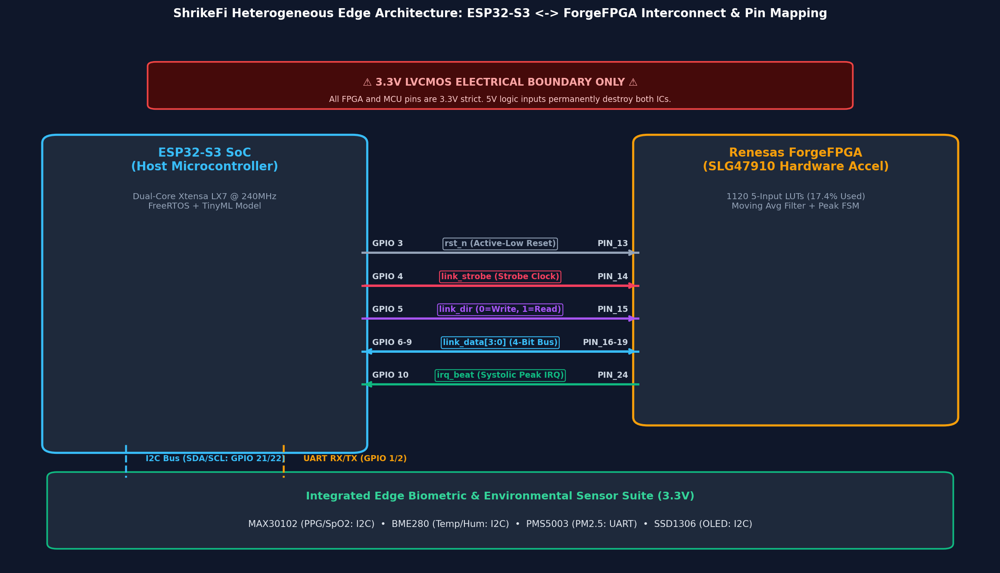

# ShrikeFi Migration Roadmap

## Rationale
The primary goal of the ShrikeFi migration is cost accessibility beyond the hackathon prototype. While the Xilinx Zynq-7000 (`xc7z020`) served as a powerful heterogeneous SoC platform for initial prototyping and cycle-accurate verification, its high board cost ($100–$250+) prevents scaling to affordable, distributed disaster-relief edge deployments.

The **ShrikeFi** platform combines an **ESP32-S3** microcontroller with a low-cost **Renesas ForgeFPGA** (1120 5-input LUTs) and on-chip WiFi/BLE connectivity at a fraction of the cost, making edge health monitoring practically deployable.

For interface-level physical and framing details of the FPGA↔MCU link, see [`docs/SHRIKEFI_LINK_PROTOCOL.md`](SHRIKEFI_LINK_PROTOCOL.md). For real-world sensor pinouts and breadboard wiring guides, see [`docs/SHRIKEFI_HARDWARE_CONNECTIONS.md`](SHRIKEFI_HARDWARE_CONNECTIONS.md).

---

## Platform Comparison Matrix

| Component | Zynq-7000 (baseline) | ShrikeFi | Status |
|---|---|---|---|
| **Filter + peak detector RTL** | Verified, 0 DSP/BRAM | Taken from `hardware/common/` via a **generated** flat source set (`gen_flat_source.py`) | **Shared source, single copy.** The ForgeFPGA top instantiates the same two modules the Zynq path does; the vendor-facing flat file is derived, not hand-maintained. Verified by differential simulation against the pre-refactor RTL (30,000 samples, 0 mismatches) |
| **FPGA↔host interface** | AXI4-Lite (memory-mapped registers) | 8-bit SPI, mode 0, one transfer per sample | **Implemented & Verified:** `tb_forgefpga_system.v`, 5 test groups / 10 checks passing |
| **Application code (HRV, SpO2, NN, risk engine)** | Runs on ARM Cortex-A9 (Zynq PS) | Runs on ESP32-S3 (ESP-IDF / FreeRTOS) | **Implemented & Verified:** Dual-core FreeRTOS `main_shrikefi.c` |
| **Toolchain** | Vivado ML 2022.2 | Renesas ForgeFPGA design software (free, HDL mode) | **Configured:** `forgefpga_pins.pcf` + simulation flow |
| **Connectivity** | None | WiFi 4 + BLE 5 (onboard ESP32-S3) | **Supported:** Native on ESP32-S3 SoC |
| **Timing figures** | 50 MHz clock, 20 ns IBI resolution, 69.45 MHz Fmax | 50 MHz clock, 20 ns IBI resolution | **Verified in Simulation:** Cycle-accurate IBI timestamping |

---

## Verified Zynq Baseline Reference
The Zynq-7000 design remains permanently preserved as the verified reference implementation:
* **Target Part:** `xc7z020clg400-1`, Vivado ML 2022.2
* **Timing Closure:** WNS +5.603 ns, WHS +0.184 ns, Fmax 69.45 MHz
* **Resource Utilization:** 185 LUTs (0.35%), 16 LUTRAMs (0.09%), 266 FFs (0.25%), 0 DSP48, 0 BRAM
* **Verification:** `tb_ppg_system.v`, 6/6 self-checking tests passing

---

## Verified Renesas ForgeFPGA (ShrikeFi) Implementation

Measured post-synthesis results from **Renesas ForgeFPGA Workshop v6.55**:

* **Target Part:** `SLG47910C` (WLCSP20 package, 1120 5-input LUTs)
* **Resource Utilization** (current fitter run of the SPI design,
  `synthesis_evidence/resource_utilization_spi_link.log`):
  * **CLB LUT5s:** **363 / 1120 (32.41%)** (all Lut5; 0 as shift-register)
  * **Total Flip-Flops:** **202** (198 CLB FFs [17.68%] + 4 IOB FFs [0.54%])
  * **CLB Blocks:** **75 / 140 (53.57%)**
  * **4k BRAMs:** **0 / 8 (0.00%)**
  * **PLLs:** **0 / 1 (0.00%)** — the SPI design runs from the on-chip oscillator
* **Verification:** `tb_forgefpga_system.v`, 5 test groups / 10 checks passing

> **Do not quote 443 LUT5s / 353 FFs / 85 CLBs.** That is the superseded 4-bit
> parallel-link build, committed before the SPI rewrite; it roughly doubles the
> real figure and its "consumes the part's only PLL" caveat no longer applies.
> See [`../hardware/shrikefi/synthesis_evidence/README.md`](../hardware/shrikefi/synthesis_evidence/README.md)
> for the comparison and the port signature that distinguishes the two logs.
>
> **These figures are current as of the 2026-09-21 fit**, which is the first run
> to include the H-01 slope gate in the peak detector. That gate is what moved the
> SPI design from 342 to 363 LUT5s; the fit history is tabulated in the evidence
> README. Two numbers appeared for the SPI design before this (222 and 342) and
> both are real measurements of earlier netlists — the prose quoting 222 was
> simply never updated when the 342 log replaced it.
>
> **On timing:** the same run's `PNR_TIMING.log` reports WNS −10.088 ns, but
> against an auto-generated 500 MHz constraint (no clock constraint exists in the
> design). Achievable period is 12,087 ps (82.73 MHz), so at the documented 50 MHz
> the margin is +7.913 ns. Do not quote the −10.088 ns figure as a real result.
> See the timing section of the evidence README.

### Renesas ForgeFPGA Workshop GUI Synthesis Evidence & Project Tree:

### Renesas SLG47910C Top-Level FPGA Core Schematic:

### Fabric Utilization Chart:

---

## Hardware Interconnect & Link Verification

### 1. Interconnect Architecture & Pinout

### 2. SPI Link Framing

The ShrikeFi link is **8-bit SPI**, not a parallel nibble bus: one full-duplex
transaction per optical sample, with the beat flag in bit 7 of the returned byte.
The frame, the pin table and the timing are in
[`SHRIKEFI_LINK_PROTOCOL.md`](SHRIKEFI_LINK_PROTOCOL.md).

The figure that used to sit here — "4-Bit Parallel Link Protocol Timing
Waveform" — shows the retired design and is deliberately not reproduced. It
cannot be verified from the repository (a raster with no searchable labels), so
treat the tables in the protocol document as authoritative and regenerate the
figure from them before reuse.

